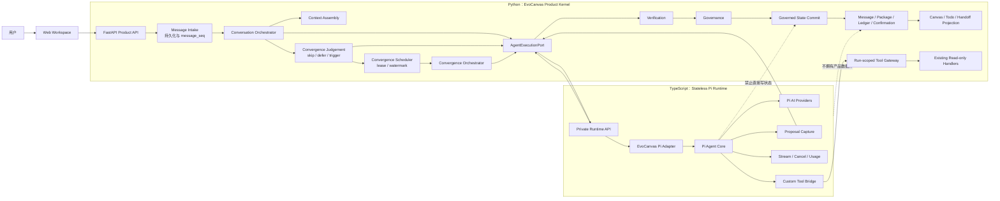
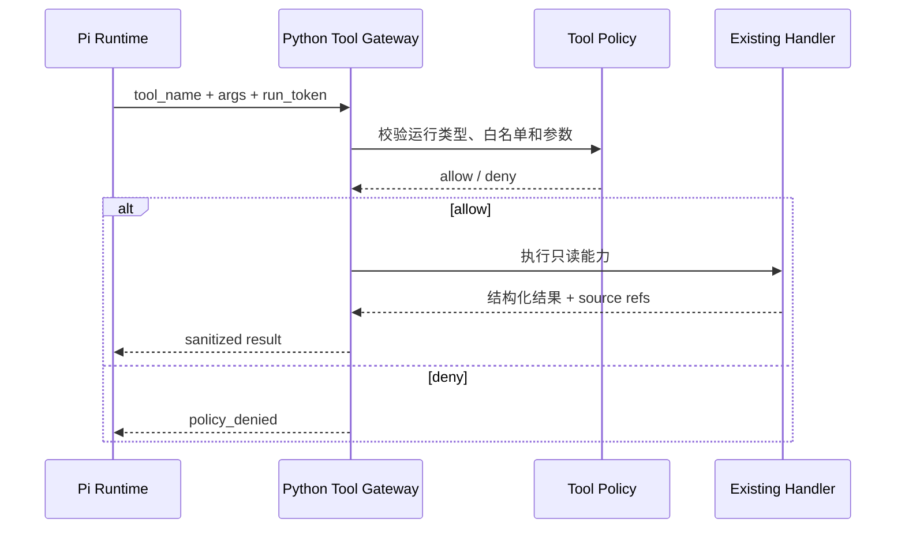
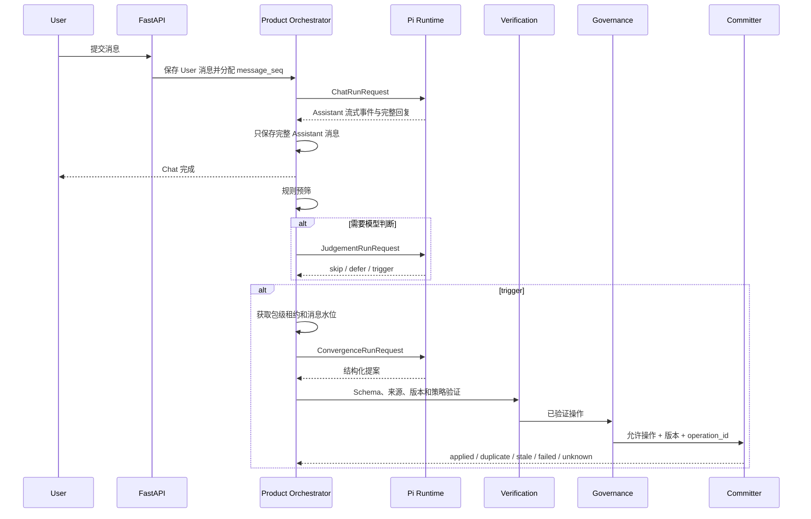

# EvoCanvas Pi Runtime 内核一步到位重构设计

> 状态：第四轮修订已确认，待切专用分支实施
> 日期：2026-08-13
> 推荐分支：`codex/pi-runtime-core-refactor`
> 最终决策：不建设双引擎、兼容层、Shadow 对照或运行时回退；直接以“Python 产品内核 + 独立 TypeScript Pi Runtime”替换当前未联调的执行链
> 产品真相源：`docs/vision/EvoCanvas1.0-PRD.md`
> 实现规格：以达到 L3 的 Harness 文档为准

---

## 0. 执行摘要

本次重构不再把现有模型调用、AgentRuntime 或 WorkflowEngine 当作需要保护的在线基线。当前系统尚未完成正式联调，没有生产流量、稳定用户数据和必须无损迁移的运行合同，因此最合适的策略不是维持两套内核逐步切流，而是在一个专用分支内直接建立目标架构，完成后整体替换。

最终只保留一条 Agent 执行路径：

```text
EvoCanvas Product Kernel
    -> AgentExecutionPort
    -> PiRuntimeClient
    -> Private Pi Runtime
    -> Pi Agent Core / Pi AI
```

硬边界：

- Pi 负责模型调用、Provider 适配、工具循环、流式事件、取消、技术重试和用量统计。
- EvoCanvas 负责上下文装配、对话目标、收敛判断、来源验证、治理、确认、版本检查、原子提交、状态账本和画布投影。
- Pi 只能返回 Assistant 回复、判断结果或结构化变更提案，不能直接修改 Canvas、Package、Card、Relation、Handoff 或 ConfirmationRecord。
- `Governed State Commit` 是唯一稳定事实写入口。
- 不保留旧引擎开关，不提供旧执行路径回退，不建设双跑或 Shadow 数据结构。
- 重构失败的处理方式是不合并该分支，而不是在新架构里长期保存旧内核。

“一步到位”指最终架构和运行链路一次切换，不代表把所有修改压成一个不可审查的大提交。实施仍按可验证的提交顺序推进，但专用分支合并时必须已经是单引擎终态。

---

## 1. 决策依据

### 1.1 已确认事实

1. 当前项目本身尚未完成正式联调。
2. 当前执行相关代码分散在 `CanvasService`、`OpenAILLM`、`AgentRuntime` 和 `WorkflowEngine`，但没有形成必须兼容的稳定在线合同。
3. EvoCanvas 的长期资产是 Vibe Shaping、上下文、来源、治理、确认、结构化包与显影，不是自研 Provider 和工具循环。
4. Harness 已经给出 Chat、判断、收敛、提交、消息顺序、包级租约与 stale 的 L3 目标语义。

### 1.2 因此不做的事情

- 不为现有模型执行代码再包装一层正式 Runner。
- 不为旧行为补齐流式、取消、工具循环或 Provider 能力。
- 不建设多引擎三态路由。
- 不做双引擎语义盲评。
- 不迁移本地开发期的旧运行记录、`active_turn` 或长期等待确认状态。
- 不用旧接口逐字输出作为验收基线。

### 1.3 真正的验收基线

新内核只对以下内容负责：

1. 主 PRD 中的产品闭环和用户价值。
2. L3 Harness 中已经稳定的状态、原因码、并发、确认和提交规则。
3. 当前领域对象、来源、治理与提交不变量。
4. 前后端真正需要的产品 API，而不是旧执行器的内部形状。

---

## 2. 目标与非目标

### 2.1 目标

1. 建立唯一的 Pi Agent 执行内核。
2. 把 Chat、Judgement、Convergence 与 Commit 分责落到真实代码结构。
3. 让 Python 保持唯一产品控制面和事实源。
4. 让 TypeScript Pi Runtime 保持无业务状态、私有、可重启。
5. 一次落地 L3 消息顺序、非阻塞输入、包级租约、待重判水位、stale 与恢复。
6. 通过窄合同隔离 Pi 类型，未来升级 Pi 不需要改 Domain、Governance 和 Repository。
7. 删除当前在线主链中重复的 Provider、工具循环和旧工作流执行路径。

### 2.2 非目标

- 不把整个 Python 后端改写为 TypeScript。
- 不让 Pi 持久化产品消息、结构化包或确认记录。
- 不开放 Shell、文件编辑、任意 HTTP、MCP 写操作或代码执行工具。
- 不新增自由白板、项目管理、多人协作或旧产品流程。
- 不承诺兼容未联调的旧内部接口、开发期存储或测试夹具。
- 不在本次重构中重做前端视觉和交互。

---

## 3. 方案比较与最终选择

### 3.1 方案 A：直接替换为独立 Pi Runtime

收益：

- 最终只有一个执行内核，没有历史包袱。
- Pi 原生 TypeScript SDK、类型、事件和 Provider 能力完整。
- Python 与 Pi 之间形成清晰的产品边界。
- 失败时只需放弃或重做未合并分支，不需要维护运行时双轨。

代价：

- 分支合并前必须一次完成后端主链和联调。
- 新增 Node 进程、跨语言合同和本地启动编排。
- 不能依赖旧执行链兜底，错误处理必须从第一天成立。

结论：采用。

### 3.2 方案 B：先兼容旧引擎，再逐步切换

收益：

- 适合已经生产运行、必须持续服务的系统。

代价：

- 会产生两套执行实现、模式开关、对照测试和删除债务。
- 当前没有稳定联调基线，维护兼容层没有实际保护对象。

结论：否决。

### 3.3 方案 C：整个后端迁移到 TypeScript

收益：

- 单一语言。

代价：

- 会重写领域、仓储、治理、确认、提交和投影。
- 风险远高于替换 Agent 内核，且容易产生事实源漂移。

结论：否决。

---

## 4. 最终总体架构



一句话边界：

> Pi 负责“如何可靠运行模型”，EvoCanvas 负责“运行什么、允许看到什么、什么可以成为事实”。

---

## 5. 权威状态归属

| 状态 | 唯一拥有者 | Pi 是否持久化 |
| --- | --- | --- |
| User / Assistant 原始消息 | Python Message Store | 否 |
| ChatTurn / Judgement / ConvergenceRun | Python Runtime Store | 否 |
| Context Manifest | Python Context Assembly | 否，只消费副本 |
| Package / PackageVersion | Python CanvasRepository | 否 |
| Card / Relation / Handoff | Python Domain + Repository | 否 |
| ConfirmationRecord | Python Governance | 否 |
| State Ledger / CommitAttempt / Outbox | Python Runtime State | 否 |
| Canvas / Todo / Handoff 视图 | Python Projection | 否 |
| 单次模型运行中间态 | Pi Runtime | 仅运行期内存 |
| 模型用量和技术事件 | Pi Runtime 产生，Python 汇总 | 不作为产品事实 |

禁止出现：

- Pi 直接读取工作区存储。
- Pi 直接创建 PackageVersion。
- 工具绕过 Verification、Governance 或 Commit 写状态。
- Canvas、Toast、Todo 或流式事件成为独立事实源。

---

## 6. 目标目录结构

### 6.1 Python 产品内核

```text
app/
  canvas/
    application/
      conversation_orchestrator.py
      convergence_judgement.py
      convergence_scheduler.py
      convergence_orchestrator.py
      state_committer.py
    agent_execution/
      port.py
      contracts.py
      pi_client.py
      event_mapper.py
      errors.py
    tools/
      gateway.py
      registry.py
      policies.py
    domain/
    governance.py
    verification.py
    repository.py
    runtime_state.py
    projections/
  api/
    canvas_routes.py
    internal_agent_tools.py
```

说明：

- `AgentExecutionPort` 是产品侧的窄接口，不是多引擎插件系统。
- 生产代码只有一个实现：`PiRuntimeClient`。
- 测试可以使用 `FakeAgentExecutionPort`，但不得存在第二个真实模型执行器。
- Pi 的事件、类型和包名只能出现在 `agent_execution/pi_client.py` 与 TypeScript 服务中。

### 6.2 TypeScript Pi Runtime

```text
pi-runtime/
  package.json
  tsconfig.json
  src/
    server.ts
    config.ts
    contracts/
      run.ts
      events.ts
      tools.ts
    runtime/
      pi-runtime.ts
      agent-factory.ts
      provider-registry.ts
      run-registry.ts
      cancellation.ts
    adapters/
      chat.ts
      judgement.ts
      convergence.ts
    tools/
      bridge.ts
      proposal-capture.ts
      validation.ts
    telemetry/
      logger.ts
      usage.ts
  tests/
```

---

## 7. Pi 包与运行要求

在 2026-08-13 核对的实现基线：

- `@earendil-works/pi-agent-core`：`0.84.1`
- `@earendil-works/pi-ai`：`0.84.1`
- Node.js：`>=22.19.0`

实施规则：

1. 切分支当天再次核对包名、稳定版本、Node 要求和变更日志。
2. `package.json` 使用精确版本，不使用 `^` 或 `latest`。
3. 提交 lockfile。
4. 升级 Pi 必须经过合同测试和产品关键场景测试。
5. 不把 Pi Coding Agent 的默认 Shell、Read、Write、Edit 工具带入 EvoCanvas。

---

## 8. AgentExecutionPort 合同

产品层需要的是三类明确能力，不使用一个无限扩张的通用 `run(dict)`：

```python
class AgentExecutionPort(Protocol):
    async def run_chat(self, request: ChatRunRequest) -> ChatRunResult: ...
    async def run_judgement(
        self, request: JudgementRunRequest
    ) -> JudgementRunResult: ...
    async def run_convergence(
        self, request: ConvergenceRunRequest
    ) -> ConvergenceRunResult: ...
    async def cancel(self, run_id: str) -> CancelResult: ...
```

### 8.1 公共请求字段

| 字段 | 含义 |
| --- | --- |
| `run_id` | Python 生成的全局运行 ID |
| `workspace_id` | 仅用于关联日志，不授权直接读存储 |
| `conversation_id` | 对话边界 |
| `from_message_seq` / `through_message_seq` | 本次语义消息范围 |
| `context_manifest` | Python 装配的只读上下文 |
| `instructions` | 当前运行类型的受治理指令 |
| `model_policy` | 允许的 Provider、模型和技术预算 |
| `tool_profile` | 运行类型对应的工具白名单 |
| `deadline_ms` | 整次运行截止时间 |
| `trace_context` | request_id、trace_id、父运行关系 |

### 8.2 ChatRunResult

```text
run_id
assistant_message
finish_reason
events_summary
usage
model_identity
```

Chat 结果不能包含可自动提交的领域操作。

### 8.3 JudgementRunResult

```text
decision: skip | defer | trigger
reason_code
through_message_seq
confidence
usage
```

规则预筛可以在 Python 内直接返回，不调用模型。只有规则无法确定时才调用 Pi。

### 8.4 ConvergenceRunResult

```text
run_id
proposal
finish_reason
tool_trace
usage
model_identity
```

`proposal` 必须来自 `submit_convergence_proposal` 捕获工具，不能从自然语言正文猜测生成。

### 8.5 合同稳定性

- 合同只表达 EvoCanvas 需要的产品能力。
- 不暴露 Pi 的内部消息类、事件枚举和 Provider 对象。
- 未知事件可以记录但不能破坏主链。
- 新增运行类型必须先证明产品必要性，不能为了映射 Pi API 扩张接口。

---

## 9. Python 与 Pi Runtime 通信

### 9.1 传输

- 私有 HTTP。
- 运行事件使用 NDJSON 流。
- 默认监听 `127.0.0.1:8790`。
- 不对浏览器或公网暴露。
- 生产环境可使用同 Pod / 私有 Service 网络，但仍禁止公网入口。

### 9.2 接口

```text
POST /v1/chat-runs
POST /v1/judgement-runs
POST /v1/convergence-runs
POST /v1/runs/{run_id}/cancel
GET  /healthz
GET  /readyz
GET  /v1/capabilities
```

### 9.3 标准事件

```text
run.started
assistant.delta
assistant.completed
tool.requested
tool.completed
proposal.captured
usage.updated
run.completed
run.cancelled
run.failed
```

每个事件至少包含：

```text
event_id
run_id
sequence
timestamp
type
payload
```

### 9.4 幂等与断流

- 同一 `run_id` 重复创建必须返回原运行状态或明确冲突，不能启动第二次模型执行。
- Python 持久化最后接收的事件序号，用于诊断，不把流事件当产品事实。
- 连接中断时，Python 将运行标记为技术失败或未知，不拼接半条 Assistant 消息成为正式回复。
- Convergence 断流后即使 Pi 曾捕获提案，也必须由 Python 根据 `run_id` 查询完整终态；不能用不完整提案提交。

---

## 10. Pi Runtime 内部设计

### 10.1 无业务状态

Pi Runtime 只在单次运行期间保存：

- 当前 Agent 会话内存。
- 工具调用状态。
- 取消控制器。
- 流式事件序号。
- 捕获但尚未返回的结构化提案。

进程重启后不恢复产品事实。Python 根据运行记录决定失败、stale 或重新判断。

### 10.2 Agent 工厂

按运行类型创建受限 Agent：

| 运行类型 | 输出 | 工具 |
| --- | --- | --- |
| Chat | 一条 Assistant 回复 | 只读来源、材料、知识检索工具 |
| Judgement | `skip / defer / trigger` | 默认无工具 |
| Convergence | 一个结构化提案 | 只读工具 + `submit_convergence_proposal` |

每次创建都显式传入：

- Provider 与模型。
- System / Developer instructions。
- Context Manifest。
- 最大迭代次数。
- Token 和时间预算。
- 允许的工具列表。
- 取消信号。

### 10.3 Provider Registry

Pi Runtime 拥有技术 Provider 注册和能力检测，Python 只传产品级策略：

```text
quality_tier
latency_tier
structured_output_required
tool_calling_required
max_cost
```

Pi Runtime 在启动时检查：

- Provider 凭证是否存在。
- 模型是否支持所需能力。
- 配置的模型是否可用。
- 结构化输出和工具调用能力是否满足运行类型。

不满足时 readiness 失败，不让应用带病启动。

### 10.4 运行注册表

`RunRegistry` 只保存活动运行：

```text
run_id -> status / abort_controller / last_event_seq / captured_proposal
```

终态输出完成后按短 TTL 清理，只用于重试查询和诊断，不成为 Session Store。

---

## 11. 工具边界

### 11.1 首版白名单

只开放：

- `source.resolve`
- `material.read`
- `knowledge.retrieve`
- `structure.validate`
- `submit_convergence_proposal`，仅 Convergence 可用

明确禁止：

- Shell 和代码执行。
- 任意文件读写。
- 任意网络请求。
- 任意 MCP 工具透传。
- 直接修改 Package、Card、Relation、Handoff、Confirmation 或 Ledger。

### 11.2 工具调用链



### 11.3 Run-scoped Token

Python 为每次运行签发短时令牌，绑定：

- `run_id`
- 允许的工具列表
- workspace / conversation 范围
- 到期时间
- 最大调用次数

Pi 不能自行扩大工具权限。日志中不得记录完整令牌和 Provider 凭证。

### 11.4 提案捕获不是事实写入

`submit_convergence_proposal` 只在 Pi Runtime 内存中捕获并校验提案 Schema：

- 不调用 Repository。
- 不调用 Governance。
- 不创建 PackageVersion。
- 不写 proposal history。

Pi 返回后，Python 才进入 Verification、Governance 和 Commit。

---

## 12. Chat、判断、收敛与提交主链



### 12.1 Chat

Chat 负责：

- 接住、理解和命名用户的 Vibe。
- 提问、比较、建议。
- 使用只读工具。
- 承接用户确认、否定和修正。

Chat 不直接修改结构化包，也不在后台收敛后追加第二条 Assistant 回复。

### 12.2 Judgement

每个完成的 Chat 逻辑上进入判断，但不等于每次调用模型：

1. Python 规则能明确判断时直接 `skip / defer / trigger`。
2. 规则不足时调用 Pi Judgement。
3. 判断只决定是否启动收敛，不生成领域对象。

### 12.3 Convergence

Convergence：

- 读取确定的消息范围和当前 PackageVersion。
- 只形成候选操作。
- 必须保留来源、冲突、未知和确认引用。
- 确认不足时保留候选或返回 `not_ready`。
- 不自行提交，不追加第二条主回复。

### 12.4 Commit

只有 Python 统一提交器可以：

- 检查 `state_version`、`package_version` 和消息范围。
- 检查 `operation_id` 幂等性。
- 应用治理放行的操作。
- 原子写入 PackageVersion、Ledger 和 Outbox。
- 触发 Canvas、Todo 和 Handoff 投影。

---

## 13. L3 运行时一步落地

本次重构直接删除旧工作区同步锁模型，按 Harness L3 实现目标生命周期。

### 13.1 四类运行记录

1. `ChatTurn`
2. `ConvergenceJudgement`
3. `ConvergenceRun`
4. `CommitAttempt`

### 13.2 消息边界

- 每条消息拥有会话内单调递增的 `message_seq`。
- ChatTurn 记录输入范围并最多产生一条主 Assistant 回复。
- Judgement 和 Convergence 都记录 `from_message_seq`、`through_message_seq`。
- 新 User 消息总是先持久化，不因后台运行返回工作区级 `409`。

### 13.3 包级租约

- 并发键为 `(workspace_id, package_id)`。
- 同一包最多一个具有写资格的 ConvergenceRun。
- Chat 不持有收敛租约，用户可以继续输入。
- 租约记录 holder、obtained_at、expires_at 和 heartbeat。
- 默认租约 30 秒、每 10 秒续租、恢复器每 15 秒扫描，实际参数写入 trace。

### 13.4 待重判水位

收敛期间到达新消息时：

1. 正常保存新消息。
2. 推进包的待重判水位。
3. 当前回合提交前检查消息范围和版本。
4. 语义范围或版本变化时整次 `stale`，不得部分提交。
5. 释放租约后由最新水位重新判断，不盲目重放旧提案。

### 13.5 确认

- 普通 ChatTurn 没有长期 `awaiting_confirmation` 状态。
- 用户确认发生在正常 Chat 中，并通过消息引用进入后续收敛。
- 未确认的高影响信息只保持候选或未决。
- 正式外发、外部副作用或不可逆动作的独立审批不在本次普通包更新范围内。

### 13.6 恢复

- 过期租约恢复前先按 `operation_id` 查询提交结果。
- 已提交但 Outbox 未完成：补跑 Outbox。
- 未提交：运行标记为 `stale` 并释放租约。
- 提交结果未知：进入 `unknown`，禁止自动重复写入，等待幂等查询收敛。

---

## 14. Verification、Governance 与 Commit

Pi 提案返回后依次执行：

1. Schema 验证。
2. 对象和字段白名单验证。
3. 来源引用存在性验证。
4. 消息范围验证。
5. 当前状态和 PackageVersion 验证。
6. 冲突与未知显性化验证。
7. 信息地位升级所需确认引用验证。
8. Governance 策略裁决。
9. `operation_id` 幂等检查。
10. 提交前重新检查版本。
11. 原子写入 PackageVersion、Ledger 和 Outbox。
12. 由投影器刷新 Canvas、Todo 和 Handoff。

部分放行遵循 Harness：

- 无原子依赖的低风险候选整理可以单独放行。
- 缺少确认的信息地位升级必须拒绝或降级。
- 存在原子依赖的操作作为一组处理。
- 没有可提交变化时返回 `no_change` 或 `not_ready`。

---

## 15. 错误处理与回滚

### 15.1 不提供旧引擎回退

生产配置中没有引擎模式选择。Pi Runtime 不可用时：

- 新 User 消息已经保存。
- ChatRun 标记为 `failed` 或 `engine_unavailable`。
- 前端展示可重试的明确错误。
- 不伪造 Assistant 回复。
- 不启动 Convergence，不产生 PackageVersion。
- 恢复后由用户重试 Chat，或由安全的恢复入口继续未完成运行。

### 15.2 分支级回滚

在正式合并前：

- 任一硬门失败，修复当前分支或放弃该分支。
- 不把半完成状态合入主分支。

合并后发现严重问题：

- 回滚整个发布版本或对应提交。
- 不在新架构内部重新启用被删除的旧执行代码。

### 15.3 Pi Runtime 故障

| 故障 | 产品行为 |
| --- | --- |
| 启动失败 | readiness 失败，应用不接 Agent 流量 |
| Provider 不可用 | 明确失败，不切换到未验证模型 |
| 流中断 | 丢弃不完整正式输出，保留技术事件 |
| 工具超时 | 按预算重试或结束为工具失败 |
| 取消 | Pi 停止模型和工具循环，Python 记录 cancelled |
| Convergence 超时 | 不提交，释放或等待租约恢复 |
| 提交结果未知 | 按 operation_id 查询，禁止重复写 |

---

## 16. 配置、启动与可观测性

### 16.1 配置

Python：

```text
PI_RUNTIME_URL=http://127.0.0.1:8790
PI_RUNTIME_TIMEOUT_MS=...
PI_RUNTIME_INTERNAL_SECRET=...
```

Pi Runtime：

```text
PI_RUNTIME_HOST=127.0.0.1
PI_RUNTIME_PORT=8790
PI_PROVIDER=...
PI_MODEL_CHAT=...
PI_MODEL_JUDGEMENT=...
PI_MODEL_CONVERGENCE=...
PI_MAX_ITERATIONS=...
PI_TOOL_TIMEOUT_MS=...
```

Provider 凭证只进入 Pi Runtime 进程，不进入请求、事件、Trace 或 Python 状态存储。

### 16.2 本地启动

必须提供一个统一开发入口，同时启动：

1. Pi Runtime。
2. FastAPI。
3. 前端开发服务器。

启动顺序：

```text
Pi Runtime 配置与 capability 检查
    -> Pi ready
    -> FastAPI ready
    -> Frontend ready
```

### 16.3 日志关联

Python 和 Pi 统一携带：

- `trace_id`
- `request_id`
- `run_id`
- `workspace_id`
- `conversation_id`
- `chat_turn_id` / `convergence_run_id`
- `operation_id`

日志禁止记录：

- Provider 密钥。
- Run-scoped Tool Token。
- 未脱敏的完整上下文。
- 用户材料全文。

### 16.4 指标

- Chat 首字和总耗时。
- Judgement 决策分布。
- Convergence 触发率与有效提案率。
- Schema 验证失败率。
- Governance 拒绝与降级原因。
- `applied / no_change / not_ready / stale / duplicate / failed / unknown` 分布。
- 工具调用次数、延迟和拒绝率。
- Provider 错误、取消和 Token 用量。

---

## 17. 旧执行链清理范围

本次分支不是在旧代码旁边新增 Pi，而是替换并清理。

### 17.1 必须移除的在线依赖

- `app/api/server.py` 对 `OpenAILLM` 的直接构造。
- `CanvasService` 对旧 LLM 请求、角色路由和模型输出解析的直接依赖。
- EvoCanvas 在线主链对 `AgentRuntime` 的依赖。
- EvoCanvas 应用启动对 `WorkflowEngine` 的依赖。
- 工作区级 `active_turn`、新消息 `409` 和长期 `awaiting_confirmation` 路径。
- 旧 Provider 降级、旧工具循环和旧 Schema 修复逻辑。

### 17.2 文件处理原则

实施时对每个旧模块做可达性核对：

1. 仍属于 EvoCanvas 1.0 且有价值：迁入新的产品内核或改由 Pi 执行。
2. 仅被旧页面、旧 CLI 或旧产品流程使用：删除消费者和实现。
3. 属于可独立成立的通用基础设施：可以保留，但不得参与 EvoCanvas Agent 执行，也不得构成第二个模型执行器。
4. 无真实消费者：删除。

重点检查：

```text
app/services/llm.py
app/services/agent_runtime/
app/workflows/engine.py
app/workflows/executors.py
app/core/session.py 中仅服务旧运行时的类型
app/services/subagent_service.py
app/cli/commands.py
app/api/server.py
```

如果 `SubagentService` 或 CLI 仍属于 1.0 必需能力，必须在同一分支改走 Pi；如果不属于 1.0，则从生产入口移除，不能为了保留旧执行器而扩大范围。

### 17.3 测试清理

删除或重写以下“保护旧实现”的测试：

- `OpenAILLM` Prompt 拼装和 Provider 降级测试。
- `AgentRuntime` 工具循环测试。
- `WorkflowEngine` 初始化即代表 Canvas 主链可用的测试。
- 工作区 active turn 返回 409 的测试。
- 普通包更新进入长期等待确认的测试。

替换为：

- Pi 合同、事件、取消、工具策略和结构化提案测试。
- Chat / Judgement / Convergence / Commit 分责测试。
- L3 并发、stale、恢复和事实治理测试。

### 17.4 开发数据

当前没有需要迁移的正式联调数据：

- 删除旧 `active_turn` 字段和相关开发期状态。
- 更新 FakeStorage、fixtures 和示例数据到新 Schema。
- 不写兼容读取器和一次性迁移脚本。
- 如果实施前发现已有必须保留的真实数据，本条假设失效，需暂停并单独确认数据处理方案。

---

## 18. 单分支实施计划

只创建一个分支：

```text
codex/pi-runtime-core-refactor
```

不拆前置兼容分支，不把半成品合并进主分支。

### 阶段 0：冻结产品合同

1. 从主 PRD 与 L3 Harness 提取必须成立的产品场景。
2. 标记现有测试中哪些保护产品不变量，哪些只保护旧实现。
3. 建立失败样本：模糊感觉、冲突来源、确认不足、明确确认、新消息导致 stale、工具失败。
4. 冻结 AgentExecutionPort 和 Pi 服务 Schema。

出口门：验收依据只指向 PRD、L3 Harness 和领域不变量。

### 阶段 1：建立 Pi Runtime

1. 创建 `pi-runtime/`。
2. 固定 Node 与 Pi 包版本。
3. 实现配置、health、readiness 和 capabilities。
4. 实现 RunRegistry、取消和事件流。
5. 实现 Chat、Judgement、Convergence 三类适配器。
6. 默认关闭全部内置编程工具。

出口门：TypeScript 单测通过，三类运行均可用 Fake Provider 完整执行。

### 阶段 2：建立 Python 执行边界

1. 定义三类强类型请求与结果。
2. 建立唯一 `PiRuntimeClient`。
3. 实现 NDJSON、超时、取消、事件映射和错误分类。
4. 建立 Python 与 TypeScript 合同测试。
5. 从应用依赖注入中移除旧 LLM 构造。

出口门：Python 可以启动 Pi Runtime 并完成三类合同测试。

### 阶段 3：重构产品控制面

1. 从 `CanvasService` 提取 ConversationOrchestrator。
2. 建立 ConvergenceJudgement 与 Scheduler。
3. 提取 ConvergenceOrchestrator。
4. 保持 Verification、Governance 和 Commit 唯一链。
5. Chat、Judgement 和 Convergence 的模型执行全部调用 AgentExecutionPort。

出口门：Chat 测试中不会生成 PackageVersion；Convergence 可独立走到统一提交器。

### 阶段 4：落地 L3 生命周期

1. 实现 `conversation_id`、`message_seq` 和四类运行记录。
2. 删除工作区级新消息阻塞和 409。
3. 实现 skip / defer / trigger。
4. 实现包级租约、待重判水位和短合并窗口。
5. 实现 state / package / message range / operation_id 检查。
6. 实现租约恢复、提交查询和 Outbox 恢复。
7. 删除长期等待确认状态。

出口门：L3 Harness 的运行时验收场景全部通过。

### 阶段 5：接入受控工具与提案捕获

1. 建立内部 Tool Gateway。
2. 实现 Run-scoped Token。
3. 接入只读工具白名单。
4. 实现 `submit_convergence_proposal`。
5. 对工具参数、结果大小、来源引用和超时做验证。
6. 完成工具越权与提示注入测试。

出口门：Pi 无法调用任何未授权写能力，提案只能回到 Python 验证链。

### 阶段 6：替换 API 与完成联调

1. FastAPI 只装配 Product Kernel 和 PiRuntimeClient。
2. 更新 Chat、状态查询、取消和错误响应接口。
3. 更新前端 API 适配，但不重做页面。
4. 提供统一本地启动命令。
5. 完成真实 Provider 下的产品场景联调。

出口门：前端到 Pi 再到 Governed State Commit 的完整闭环通过。

### 阶段 7：删除旧链并封口

1. 删除旧 Provider 与模型调用路径。
2. 删除旧 Agent 工具循环。
3. 删除旧工作流执行器在生产入口的依赖及无消费者代码。
4. 删除 active turn、长期等待确认和相关测试夹具。
5. 清除旧环境变量、文案、Docstring 和启动说明。
6. 执行全仓引用扫描和死代码检查。

出口门：仓库只有一个真实 Agent 执行实现，应用启动不引用旧执行代码。

### 阶段 8：最终验收

1. Python 单元、集成和 E2E。
2. TypeScript 单元和合同测试。
3. 前端构建与相邻逻辑测试。
4. 真实模型故障注入。
5. 工具安全和事实治理测试。
6. 全新环境启动演练。
7. 文档、架构图和开发指南同步。

所有硬门通过后，才允许合并专用分支。

---

## 19. 建议提交拆分

在同一个专用分支内使用以下可审查提交：

1. `test: freeze Pi runtime product contracts and L3 scenarios`
2. `feat: add stateless Pi runtime service`
3. `feat: add typed Python Pi execution client`
4. `refactor: separate chat judgement convergence and commit`
5. `feat: implement ordered messages and convergence scheduling`
6. `feat: add package lease stale checks and recovery`
7. `feat: add read-only tool gateway and proposal capture`
8. `refactor: switch canvas APIs to the Pi product kernel`
9. `test: add Pi end-to-end and governance hard gates`
10. `chore: remove replaced execution paths and old runtime state`
11. `docs: align runtime architecture and development guide`

每个提交必须：

- 只完成一个可说明的结构变化。
- 不混入无关格式化。
- 更新相邻测试和说明。
- 保持事实治理不变量。

分支中间提交允许依赖后续工作才能形成完整产品，但最终合并点必须满足全部硬门，不做部分合并。

---

## 20. 测试方案

### 20.1 Pi Runtime 单元测试

- Agent 创建和模型策略。
- 三类运行输出。
- 事件顺序和终态唯一性。
- 取消、超时和技术重试。
- 工具白名单和参数验证。
- Proposal Capture 单次提交与 Schema 校验。
- Provider capability 与 readiness。
- RunRegistry TTL 和重复 run_id。

### 20.2 跨语言合同测试

- Python 请求可被 TypeScript Schema 接受。
- TypeScript 事件可被 Python 完整解析。
- 未知字段向前兼容，缺失必填字段明确失败。
- NDJSON 分片、粘包、断流和错误事件。
- 取消后两侧终态一致。
- `run_id`、trace 和 usage 完整关联。

### 20.3 产品硬门测试

1. Chat 只产生一条主 Assistant 回复，不修改 Package。
2. 普通讨论可以 skip / defer，不创建 PackageVersion。
3. Convergence 只能产生提案，不能直接写状态。
4. 冲突信息不能被静默合并。
5. 来源不足不能伪装成结论。
6. 未确认的高影响信息不能升级为已生效或已确认。
7. Chat 中已有明确且带范围的确认时，不要求重复确认。
8. 提交前版本变化使整次回合 stale，不部分写入。
9. 重复 operation_id 不产生重复版本。
10. 投影失败不改变已提交事实，Outbox 可恢复。
11. Pi 失败不伪造消息、提案或画布变化。
12. 工具结果保留来源，不直接成为事实。

### 20.4 并发与恢复测试

- Chat 运行中可以继续接收 User 消息。
- 同会话 Assistant 回复顺序正确。
- 同包最多一个写收敛运行。
- 新消息推进待重判水位。
- 租约过期后安全恢复。
- Commit unknown 通过 operation_id 查询收敛。
- Outbox 可重复投递而不重复提交。

### 20.5 安全测试

- Pi 端口不对公网监听。
- 无有效内部密钥不能调用 Runtime。
- Run-scoped Token 不能跨运行或跨工具使用。
- Prompt injection 不能扩大工具权限。
- 路径穿越、任意 URL、超大结果和敏感日志被拒绝。
- Provider 密钥不出现在 Python 状态、事件和错误响应中。

### 20.6 E2E 场景

至少覆盖：

1. 一句模糊感觉进入 Chat，AI 正确承接和追问，不急于写卡。
2. 多源输入存在冲突，冲突被保留并形成待澄清。
3. 用户明确确认约束及范围，收敛后形成可追溯 PackageVersion。
4. 用户只说试探性表达，结构保持候选而非已确认。
5. 收敛运行中到达新消息，旧提案 stale。
6. 只读工具失败，Chat 解释失败且不伪造来源。
7. Pi Runtime 中断，用户消息保留、结构状态不变。
8. 结构化交接草稿保留未解决问题和待确认决策。

---

## 21. 完成定义与硬门

只有同时满足以下条件，才能宣称“Pi 内核重构完成”：

### 21.1 架构

- [ ] 生产路径只有 `AgentExecutionPort -> PiRuntimeClient -> Pi Runtime`。
- [ ] 不存在第二个真实模型执行器、运行时模式开关或双跑逻辑。
- [ ] Pi 类型没有进入 Domain、Governance、Repository 和 Commit。
- [ ] Python 仍是唯一产品控制面和事实源。
- [ ] `Governed State Commit` 是唯一稳定写入口。

### 21.2 产品

- [ ] Chat、Judgement、Convergence 与 Commit 已分责。
- [ ] Vibe、冲突、未知、来源和确认边界通过产品场景测试。
- [ ] Chat 不直接改包，收敛不追加第二条主回复。
- [ ] Canvas、Todo 和 Handoff 只显影已提交状态。

### 21.3 L3 运行时

- [ ] `message_seq`、四类运行记录、包级租约和待重判水位已落地。
- [ ] 新 User 消息不再被工作区级运行锁拒绝。
- [ ] 长期等待确认状态已删除。
- [ ] stale、duplicate、unknown 和 Outbox 恢复已验证。

### 21.4 清理

- [ ] API 和 Canvas 主链不再引用 `OpenAILLM`。
- [ ] EvoCanvas 主链不再引用旧 `AgentRuntime` 或 `WorkflowEngine`。
- [ ] 旧 Provider、工具循环、active turn 与相关配置测试已删除。
- [ ] 全仓扫描没有被替换执行路径的活跃引用。
- [ ] 开发文档只描述新的启动和调试方式。

### 21.5 质量与安全

- [ ] Python、TypeScript、前端和 E2E 验证全部通过。
- [ ] 真实 Provider 完成至少一次完整 Chat 与 Convergence 闭环。
- [ ] Pi 不具备任何产品状态直接写权限。
- [ ] 工具越权、断流、取消、超时和提交未知均有确定行为。
- [ ] 全新环境可以用统一入口启动并通过 readiness。

任一项未满足：分支不得合并，不能以“后续再删旧代码”作为完成结论。

---

## 22. 主要风险与处理

### 风险 1：跨语言边界增加调试成本

处理：窄合同、统一 trace_id、统一启动入口、合同测试和结构化事件日志。

### 风险 2：直接替换导致分支长时间不可合并

处理：单分支内小提交推进，冻结产品合同，优先打通最小完整闭环，再扩展工具和恢复；不把半成品合入主分支。

### 风险 3：删除旧模块时误伤通用底座

处理：按真实消费者逐项核对；通用模块可以保留，但必须与 Agent 执行解耦，不能保留第二个真实模型调用入口。

### 风险 4：Pi 能力反向污染产品语义

处理：三类强类型 Product Port、Pi 类型隔离、所有状态变化回到 Verification、Governance 和 Commit。

### 风险 5：Pi 不可用时产品没有运行时回退

处理：接受这一取舍。保存 User 消息、明确失败、支持安全重试；用部署回滚处理系统性故障，不在代码里维护旧内核。

### 风险 6：当前“没有重要数据”的假设发生变化

处理：实施开始前再次检查工作区和部署状态；如果发现必须保留的真实数据，暂停删除 Schema，单独确认数据迁移，不静默丢弃。

---

## 23. 最终裁决

本方案支持一步到位采用 Pi，并据此取消此前全部迁移型设计：

```text
不建设旧引擎包装
不建设双引擎路由
不建设 Shadow
不设置运行时回退
不迁移未联调的开发期运行状态
```

重构后的稳定分层是：

```text
Pi Runtime = 唯一通用 Agent 执行引擎
EvoCanvas Harness = 产品控制规则
EvoCanvas Domain = 权威业务语义
Governed State Commit = 唯一事实写入口
Canvas = 已提交状态的显影层
```

真正需要长期自研的是 Vibe 理解、上下文装配、冲突与未知显性化、信息地位治理、结构化交接和用户可理解的变化，而不是 Provider、工具循环和流式执行。

最终实施方式：在 `codex/pi-runtime-core-refactor` 单一专用分支中直接建立目标架构，完成 Pi 服务、产品控制面、L3 运行时、工具安全和端到端联调后，删除被替换的执行链；只有仓库达到“单引擎、无兼容层、无旧链活跃引用”的终态，才允许合并。
