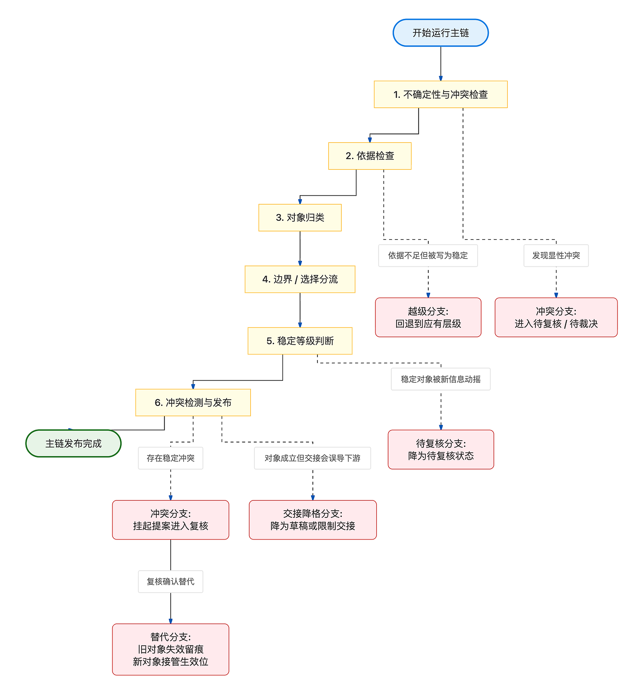

# L 层：生命周期与编排（Lifecycle Orchestration）

> 当前成熟度层级：`L3 可指导实现的治理规格层`
> 编码门槛：`已达到 L3，可直接指导第一批主流程实现；后续仍应继续向 L4 收紧`

L 层回答的不是“系统怎么多说几句”，而是“EvoCanvas 如何按收敛顺序推进一张画布”。

EvoCanvas 1.0 的最小闭环是：

`输入编译 -> 待澄清问题 -> 约束 / 待决策 -> 结构化交接物`

因此，L 层本质上是 `收敛编排层`。它负责决定：

- 一轮输入进入后先做什么、后做什么
- 当前内容何时允许继续推进，何时必须停留
- 哪些动作只需阶段内重判，哪些动作必须升级到门禁裁决
- 结构化交接物（structured handoff）应在什么条件下被收束生成

L 层不负责这些事：

- 不负责把当前实现倒推成产品事实
- 不负责界面展示、卡片布局或对话措辞优化
- 不负责替代 G 层定义事实生效权
- 不负责把所有异常一次性做成复杂状态系统

一句话：L 层不是生成层，也不是事实生效层，它是 `按产品收敛顺序推进的编排层`。

## 1. L 层的基本立场

L 层默认遵守以下主线：

- 先暴露不确定性，再推动结论
- 编排围绕阶段推进，不围绕话术组织
- 高影响动作必须允许中断，不得一路自动滑过
- 交接物（handoff）是阶段产物，不是聊天附赠品
- 低置信度时先保护真实性，再允许带风险推进

这意味着：

- 系统可以帮助推进，但不能因为“对话顺畅”就跳过真实收敛
- 当前内容若仍存在关键冲突、关键缺口或未确认前提，默认应先显性化
- 当用户要求继续推进时，系统可以给出可推进草稿，但必须显式披露未决问题、冲突边界、未确认前提与当前收敛置信度

## 2. L 层的四个一级模块

L 层当前先按四个一级模块收主干：

- `阶段推进器`
  - 决定当前位于哪个阶段节点、是否进入阶段内检查点、下一步允许往哪推进
- `门禁裁决器`
  - 处理高影响动作、判定是否允许越过事实边界、是否需要用户确认
- `状态账本`
  - 保存当前阶段状态、检查点判定结果、关键判定原因与尾项提醒
- `交接编排器`
  - 基于已有结构化对象收束结构化交接物（structured handoff）

它们之间的主次关系先收成一句话：

`阶段推进器负责决定往哪走，门禁裁决器负责决定能不能走，状态账本负责记住走到哪里，交接编排器负责在合适时机收束成交接物。`

阶段推进器是 L 层的主调度中心。

模块级骨架与阶段推进主干的展开见 [01 Stage Progression（阶段推进）.md](</Users/apple/Desktop/evocanvas/docs/harness/L-lifecycle-orchestration/01 Stage Progression（阶段推进）.md>)。

## 3. 主生命周期与推进单位

EvoCanvas 的主生命周期不是“用户说一句，AI 回一句”，而是：

- 从混乱输入
- 到显性问题
- 到约束与待决策
- 到结构化交接

当前主生命周期仍采用五段主流程：

1. 输入接入（intake）
2. 输入编译（compilation）
3. 待澄清显影（clarification）
4. 约束 / 决策收敛（constraint / decision convergence）
5. 结构化交接（handoff）

但 L 层不把“阶段”理解成一步到位的大块切换，也不把主链理解成可任意穿梭的网状系统。

当前阶段推进主干先收成为：

`线性主链 + 相邻阶段回流`

也就是说：

- 默认推进方向仍沿五段主流程往前走
- 默认最常见回流是“待澄清 -> 输入编译”，用于先回流修正解释对象（interpretation），再判断是否继续升级
- 默认局部回流只允许发生在相邻阶段之间，不默认支持跨两段以上跳回

在这个主干下，五段主流程的首要职责分别是：

- 输入接入：接住输入，确定主题与范围，完成进入主链前的最小归口
- 输入编译：双职责，但以维护解释层为主；既形成初始解释对象，也持续吸收新输入和澄清回答
- 待澄清显影：双职责，但以暴露关键未知为主；既组织问题，也优先显性化冲突、歧义、缺口和未确认前提
- 约束 / 决策收敛：双职责，但以分流收敛为主；先区分“已成立边界”与“仍待拍板事项”，再继续收敛
- 结构化交接：双职责，但以下游继续推进为主；既打包当前较稳定内容，也显式保留未决边界

在当前 L3 基线下，还应明确保留以下阶段边界：

- 输入编译不应直接产出约束、待决策或正式交接物（formal handoff）
- 待澄清不应直接关闭关键问题、直接压成约束，或绕过收敛段直接推动交接
- 约束 / 待决策段不应把边界和选择混写，也不应把仍待拍板事项偷换成已成立边界

当前推进单位先收成：

`阶段节点 + 阶段内检查点`

这样既能守住阶段主线，也能容纳补证据、显影冲突、回到原检查点重判等真实推进过程。

从状态机角度看，L 层当前先只建立轻量主状态机，不提前长成对象全状态机或执行编排引擎。

这套轻量主状态机当前只覆盖：

- 阶段节点
- 阶段内检查点
- 前进迁移
- 回流迁移
- 门禁切出条件
- 迁移阻塞状态

其中：

- 主状态粒度默认采用“阶段 + 检查点”
- 门禁先作为迁移切出条件存在，不先独立成主状态
- 主状态机默认单活动运行，任一时刻只有一个当前阶段 / 检查点
- 并行只允许留在对象层或辅助处理层，不抬到主状态机主链

因此，L 层主状态机默认回答的是：

- 现在走到哪一个阶段 / 检查点
- 这一跳是否允许前进
- 如果不能前进，是停留、回流，还是待门禁放行

在检查点类型上，轻量主状态机默认只分两类：

- 推进检查点
- 交接检查点

其中：

- 每个阶段默认都有推进检查点，但不同阶段的检查口径可以不同
- 门禁继续作为迁移切出条件存在，不先升成第三类检查点
- 交接检查点默认设在进入结构化交接之前，而不是复制到交接阶段内部再做一轮同类判断

交接检查点的默认入口逻辑当前先收成：

- 以阶段结论为主输入
- 只有必要时，才补关键对象和最小状态账本摘要
- 先看阶段结论是否可成立
- 再看未决是否会污染交接
- 结构够不够用放在后面

如果阶段结论可成立，但未决会污染交接，默认不按正式交接进入。

当前基线是：

- 可以条件进入交接编排
- 但必须显式降格
- 并挂出污染未决

交接检查点通过后，主状态机默认不直接产出交接包，而是迁移到结构化交接阶段的首个推进检查点，由交接阶段继续完成编排。

轻量主状态机图建议单独作为配图资产维护，不在总文档正文里展开成厚规则表。

五段主流程与阶段切换条件的展开见 [01 Stage Progression（阶段推进）.md](</Users/apple/Desktop/evocanvas/docs/harness/L-lifecycle-orchestration/01 Stage Progression（阶段推进）.md>)。

## 4. 默认推进闭环

L 层当前最重要的默认闭环先收成四步：

1. 阶段推进器进入当前阶段的检查点
2. 检查点判断当前内容是否具备升级条件
3. 若未通过，默认停留当前阶段，并优先补充不确定性显影
4. 补充一轮后，回到当前检查点重新判定

这条闭环要保护的是“先收敛真实度，再收敛阶段进度”，因此它默认服务于上面的线性主链，而不是替代主链另起一套流程。

检查点的综合判定口径先固定为：

- 先看不确定性处理状态
- 再看信息充分性
- 最后看对象完备度

也就是说，对象看起来“已经长出来”并不等于可以升级；若关键冲突、歧义、缺口仍未处理，默认仍不可升级。

与阶段推进主干配套时，这条闭环还应额外满足两点：

- 当澄清回答进入系统后，默认先回到输入编译阶段的解释层维护，再进入当前检查点重判
- 当某一阶段的检查点未通过时，默认先在该阶段或其相邻前序阶段内回流修正，不直接跳成跨段大回退

在当前 L3 基线下，阶段推进器所挂载的默认推进检查主链直接收成为 6 步：

1. 先检查当前内容中是否仍有会污染推进的关键不确定性、关键缺口或显性冲突；若存在，优先显式挂出，而不是直接继续升格或交接。
2. 对准备继续推进的内容做依据检查；依据不足的，不得升格为稳定对象，只能保留在更保守层级，或回流补充。
3. 在通过不确定性与依据检查后，系统先完成对象归类，明确它当前属于解释对象（interpretation）、待澄清项（clarification）、约束（constraint）路径、待决策候选（decision candidate）路径，还是其他已定义对象层级。
4. 对进入判断收敛阶段的内容，优先区分“已成立边界”与“仍待选择”；前者进入约束（constraint）路径，后者进入待决策候选（decision candidate）路径。
5. 对象完成路径分流后，再判断其当前稳定等级，至少区分为已确认、高置信未确认、未决三类，并以此约束其可被引用、可被交接、可被下游继续依赖的范围。
6. 任何准备进入正式事实层或结构化交接物（structured handoff）的内容，都必须先经过与已有稳定对象的冲突检测；若存在冲突，立即切回当前链路的异常处理位，而不是继续前推。

这 6 步不是另一条独立大流程，而是挂在主阶段链上的默认检查顺序。

映射到轻量主状态机时，当前迁移口径先收成：

- 前进迁移默认由检查点通过触发
- 如果这次前进涉及高影响动作，再额外要求门禁放行
- 回流迁移采用显式特殊迁移，不与普通前进迁移混写
- 回流通常由检查点未通过触发，但不限制为唯一触发源

当检查点通过、但门禁尚未放行时，主状态机默认不直接迁移。

当前基线是：

- 仍停留在当前阶段 / 检查点
- 但显式挂出“已通过检查、待门禁放行”的迁移阻塞状态

也就是说，L 层要分清“逻辑上已经够继续走”与“治理上已经允许生效”。

当前还应显式防止三类跳步：

- 从来源片段（source fragment）直接跳到约束（constraint）或已确认决策（confirmed decision）
- 从待澄清项（clarification）的回答直接跳到正式事实层
- 从高置信解释直接写进正式交接物（formal handoff）

如果系统无法完成上述某一步，默认不硬凑结论，而是保留在更保守层级，或显式生成待澄清项。默认处理顺序是：

1. 先停留在当前阶段或回流到相邻前序阶段
2. 优先补充不确定性显影、依据或解释层修正
3. 再回到对应检查点重判

也就是说，这条检查主链服务的是“保守推进”，不是“快速跳步”。

其中，检查点未通过后的默认去向也需要在主状态机中单独说清：

- 默认先停留在当前检查点
- 只有当失败已经说明本阶段内无法继续修正时，才触发显式回流

这里所说的“本阶段内无法继续修正”，当前至少包括三类：

- 当前阶段缺少必要输入
- 当前主判断需要被重写
- 当前失败已经会改写上游解释基础

只要满足其一，就允许触发显式回流，并要求回流原因显式挂到账本和迁移记录中。

待澄清回答后的回流、有限直升、低风险回答与部分回答处理规则，统一展开见 [01 Stage Progression（阶段推进）.md](</Users/apple/Desktop/evocanvas/docs/harness/L-lifecycle-orchestration/01 Stage Progression（阶段推进）.md>)。

检查点、停留规则与重判闭环的展开也见 [01 Stage Progression（阶段推进）.md](</Users/apple/Desktop/evocanvas/docs/harness/L-lifecycle-orchestration/01 Stage Progression（阶段推进）.md>)。

## 5. 高影响动作与门禁位置

L 层不要求所有失败都立刻升级门禁。

当前默认规则是：

- 阶段内问题先在当前阶段重判
- 只有高影响动作才从重判升级到门禁裁决

高影响动作在主链中的挂载方式先收成：

`事件触发为主 + 正式交接前固定门禁位`

也就是说：

- `正式交接物（formal handoff）` 进入前，默认经过唯一固定门禁位
- `改变事实边界` 继续作为最强事件触发条件独立切出
- `关闭关键未决` 只有在会改写事实边界，或会改变交接主表达时，才条件触发门禁

其中，`改变事实边界` 是最强门禁触发条件，其最强判定依据是对象或判断从未确认 / 可挑战 / 候选态，进入已确认 / 已生效 / 可作为下游事实使用的状态。

门禁触发条件、确认请求最小内容与确认后处理顺序的展开见 [02 Gate Adjudication（门禁裁决）.md](</Users/apple/Desktop/evocanvas/docs/harness/L-lifecycle-orchestration/02 Gate Adjudication（门禁裁决）.md>)。

## 6. 状态账本在 L 层的位置

L 层不应把状态散在聊天、卡片外观或临时解释中。

状态账本当前最小记录范围先收成：

- 阶段状态
- 判定结果
- 关键判定原因

状态账本的主记录单位先收成：

- 阶段为主
- 对象状态与推进事件为辅

也就是说，状态账本主视图默认先回答三件事：

- 现在推进停留在哪个阶段
- 为什么停留在这里
- 下一步默认准备怎么推进

其中，“下一步默认准备怎么推进”默认只写下一阶段，不默认展开成执行计划。

只有当前推进已经卡住时，才补一条轻动作，用来说明当前默认如何解卡。

对象状态与推进事件不单独抢主位，而是作为阶段视图下的解释挂件存在，用来回答“是哪一个对象导致卡住”以及“是哪一次推进转折改变了方向”。

与状态账本直接配套的阶段结论（stage conclusion）也先收成轻量对象：

- 默认表示当前阶段可成立的收敛结论
- 不默认自带完整交接语义
- 只有在交接或卡住时，才补下一阶段入口判断

阶段结论默认由阶段推进器产出，状态账本负责记录，交接编排器按需引用。

在产出时机上，阶段结论默认不在进入阶段的瞬间空挂，而是在该阶段内首次形成可成立结论时产出。

产出之后，默认只在以下两类情况更新：

- 发生阶段切换或相邻阶段回流
- 虽仍停留在当前阶段，但本段主判断已经变化

除此之外，只有当其他事件已经改写阶段结论含义时，才触发更新。

在内部结构上，阶段结论默认只保留一个主判断。

只有当其他判断已经开始影响当前阶段去向时，才允许条件升格为辅助判断。

主判断的选取默认采用以下顺序：

1. 优先选择最能决定下一步去向的对象
2. 再用稳定性做校正

也就是说，阶段结论优先回答“当前是谁在带路”，而不是优先回答“谁最新”或“谁最静态稳定”。

如果最能决定下一步去向的对象当前还不够稳定，阶段结论默认仍可以让它作为主判断，但必须显式带未确认语境。

只有当它已经不足以支撑当前阶段去向时，才退回更稳定对象承接主判断。

其中，关键判定原因默认记录到：

- 原因类别
- 对应对象
- 简短说明

状态账本还应保留两类与推进直接相关的信息：

- 仍存未决
- 非阻塞提醒摘要

在事件记录口径上，状态账本默认不做操作流水账，而是做推进转折账本。

当前基线是：

- 默认只记录状态改变事件
- 只有当某次判定直接改写推进方向时，才补记为关键事件

这里所说的关键事件，当前至少包括：

- 升级
- 回流
- 门禁拦截
- 回撤
- 发布
- 直接改写阶段去向的未通过判定

在阶段粒度上，状态账本默认按阶段节点更新，不默认持续展开到检查点。

只有发生以下情况时，才补充检查点层记录：

- 当前阶段停留
- 回流到相邻前序阶段
- 当前检查点未通过

在对象挂靠口径上，状态账本默认不做阶段内对象总表。

当前基线是：

- 默认只挂当前阶段直接阻塞推进的对象
- 只有当某个对象虽然不直接阻塞当前一步，但已经构成高风险误判源时，才补挂为高风险非阻塞对象

当前规则是：

- 仍存未决默认采用分级落位
- 若其影响事实成立、下游推进或范围边界，则继续作为升级阻塞条件
- 不属于上述三类的未决，默认降为非阻塞提醒
- 非阻塞提醒采用双挂靠：主要挂在对应对象上，状态账本保留摘要

当状态账本中的最新判定与阶段结论发生轻微不一致时，L 层默认采用以下优先关系：

- 默认状态账本优先
- 但如果最新判定尚未过门禁，或仍属于中间判定，则不自动覆盖阶段结论

也就是说，L 层承认“最新推进状态”可以比旧结论更新，但不允许未生效判断偷渡成稳定口径。

状态账本的最小记录范围、未决治理、提醒摘要职责与待复核对象继续推进口径，见 [03 State Ledger（状态账本）.md](</Users/apple/Desktop/evocanvas/docs/harness/L-lifecycle-orchestration/03 State Ledger（状态账本）.md>)。

## 7. 交接物在 L 层的位置

交接物（handoff）在 L 层中的位置很明确：

- 它是阶段产物，不是任意时刻都能顺手生成的总结
- 它依赖已有结构化对象，而不是直接重写聊天原文
- 它必须同时包含已知与未知，而不是把未决问题压平
- 它先服务于继续推进，再服务于快速读懂

handoff 在编排上至少要显式区分三层内容：

- 已确认内容
- 高置信但未确认内容
- 未决问题 / 待拍板事项

当待拍板事项已经成为当前推进主轴时，handoff 应将其从普通未决问题中抬升为独立槽位。

交接阶段内部的推进检查点、条目编排、包层组装、与状态账本的关系、主对象选择、拆条规则与草稿 / 正式边界，统一展开见 [04 Handoff Orchestration（交接编排）.md](</Users/apple/Desktop/evocanvas/docs/harness/L-lifecycle-orchestration/04 Handoff Orchestration（交接编排）.md>)。

## 8. 复杂回合的三角编排

对低复杂度回合，EvoCanvas 可以采用简单单轮编排；只有在高冲突、多候选方向、准备交接但未决仍多、或存在过早收敛风险时，才建议启用三角编排。

复杂回合的启用条件、默认顺序、角色权限边界与循环约束，统一展开见 [05 Complex Turn Orchestration（复杂回合编排）.md](</Users/apple/Desktop/evocanvas/docs/harness/L-lifecycle-orchestration/05 Complex Turn Orchestration（复杂回合编排）.md>)。

## 9. 设计禁令与 L3 基线

L 层主文档负责建立框架、主干关系、运行主链与展开入口，不继续把设计禁令、最小落地要求和可直接引用的 L3 主干摘要堆叠在同一正文中。

这些当前已收稳的实现边界、设计禁令与跨层引用口径，统一见 [06 L3 Baseline（L3 基线）.md](</Users/apple/Desktop/evocanvas/docs/harness/L-lifecycle-orchestration/06 L3 Baseline（L3 基线）.md>)。
