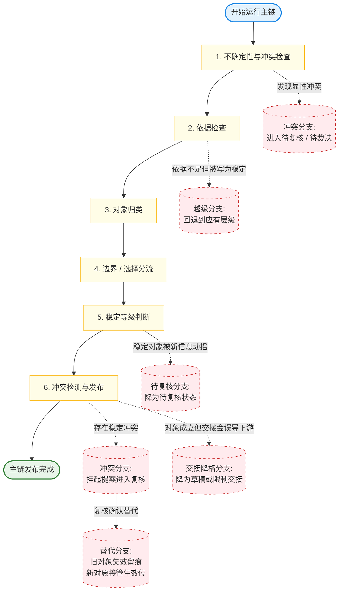

# 运行基线（Runtime Baseline）

> 当前成熟度层级：`L3 可指导实现的治理规格层`
> 编码门槛：`已达到 L3，可直接指导第一批实现、接口设计与最小验证`

本文件用于展开治理层总览中的“运行骨架”，集中保存治理目标、总原则、最小运行规则集与实现视角摘要。

## 这一层回答什么问题

G 层回答：

- 什么能做，什么不能做
- 哪些对象只是建议，哪些对象可以生效
- 谁有建议权，谁有裁决权
- 高风险动作如何被拦截

对于 EvoCanvas，G 层是七层中的第一优先级。

## 治理目标

EvoCanvas 要解决的是产品工作中的失真问题，因此治理层的首要任务不是限制 AI 的创造力，而是限制 AI 对事实边界的越权。

G 层要保证：

- AI 不能把自己的猜测伪装成稳定结论
- 冲突不能被静默合并
- 高影响动作不能自动生效
- 所有稳定事实都有明确来源和确认路径

## 治理总原则

### AI 有建议权，没有天然生效权

AI 可以提案，但提案不是事实。

### 生效权来自规则与裁决

一个对象能否生效，取决于：

- 是否满足生效条件
- 是否经过必要确认
- 是否通过验证

### 不确定性优先被治理，而不是被掩盖

当输入存在冲突、缺失、歧义时，系统的优先动作应该是显性化问题，而不是弥合问题。

### 治理对象是状态变化，不只是文本内容

G 层关心的不是某句话写得好不好，而是：

- 某个对象是否被创建
- 是否被提升状态
- 是否被标记为已解决 / 已确认 / 已生效（resolved / confirmed / effective）
- 是否被发布为交接物（handoff）

在 EvoCanvas 中，还应额外区分：

- 对话流不是事实层
- 卡片不是事实来源
- 交接物（handoff）不是原始事实来源

治理真正作用的对象，是从输入中映射出的结构化对象及其状态变化。

### 收敛式选项服务于收敛，不服务于框死答案

系统给出的收敛式选项（guided options），默认只是帮助用户更快收口的最小比较集，而不是合法答案全集。

因此：

- 选项是收敛辅助，不是强制枚举完备集
- 用户自定义口径优先于系统给出的临时选项面板
- 系统不得把“帮助收敛”做成“偷偷框定答案”

当前建议采用以下基线：

- 如果用户提出的新口径本质上是在重写问题边界或判断标准，系统应改写当前选项面板
- 如果只是对现有选项做小修正或补充，可以保留原面板并吸收修改
- 在高风险、易误导、或问题空间明显尚未收稳时，系统应显式说明“这只是当前最小比较集，不是穷尽集”
- 在低风险、低分歧、只是帮助快速收敛的小问题上，可以不每次重复这句说明
- 如果用户没有直接选择现有选项，而是给出自然语言修正，只要该修正已经足够明确，系统就应直接吸收并重写当前基线
- 只有在用户修正仍不够明确时，系统才应把它重新整理成一组更贴近用户表述的新选项

### 易混概念的统一消歧规则

随着对象与状态逐渐增多，系统应显式区分一些容易互相打架的概念，避免把不同层级的判断混成一套。

当前至少保留以下三组统一消歧规则：

- 高置信（high confidence）与较高稳定度（elevated stability）不是同一个概念：
  - 高置信回答对象当前看起来有多稳
  - 较高稳定度回答它是否已经稳到可以推动更高一级对象升级
  - 因此，高置信是对象内部状态，较高稳定度是升级判定状态

- 低风险回答（low-risk answer）与有限直升（limited promotion）不是同一个概念：
  - 低风险回答负责风险门禁
  - 有限直升负责升级门禁
  - 因此，低风险回答是有限直升的必要前提，但不是充分条件

- 待复核状态（under review）与带保留继续使用（continued use with review reservation）不是同一个概念：
  - 待复核状态回答对象当前是否正在被重新审视、稳定性是否受挑战
  - 带保留继续使用回答在这种状态下，下游是否仍被允许临时继续依赖它
  - 因此，待复核是对象状态，带保留继续使用是该状态下的一种使用模式

## 治理层最小运行规则集

为避免条件爆炸与上下文爆炸，治理层规则默认分为三层：

- 主路径必跑规则：进入默认运行时判断，数量必须严格受控
- 异常兜底规则：只在冲突、回退、替代、越级等异常场景触发
- 解释性规则：保留在文档中帮助理解，不默认参与每轮执行

当前最小运行规则集可先收敛为以下两组：

#### 主路径必跑规则

1. 先检查是否存在会污染推进的不确定性、冲突或关键缺口；若存在，优先显式化，而不是直接继续升格对象或输出稳定结论。
2. 任何准备升格为稳定对象的内容，都必须先过依据门槛；没有足够依据，不得写成已成立边界、已确认决策（confirmed decision）或正式交接事实。
3. 在不确定性与依据门槛检查之后，系统应先完成对象归类，再进入稳定等级判断与后续编排；不要先写状态，再倒推对象类型。
4. 当内容进入判断收敛阶段时，系统必须优先区分“已成立边界”与“仍待选择”；前者优先进入约束（constraint）路径，后者优先进入待决策候选（decision candidate）路径。
5. 对象完成归类与边界 / 选择分流后，系统再判断其当前稳定等级，至少区分为已确认、高置信未确认、未决三类，并以此决定后续可用范围。
6. 任何准备进入正式事实层或结构化交接包（handoff package）的对象，都必须先经过与已有稳定对象的冲突检测；若存在冲突，不得静默并存或静默覆盖。

#### 异常兜底规则

1. 当新对象与已有稳定对象发生冲突时，系统不得静默覆盖、静默并存或静默合并；必须显式进入待复核 / 待裁决路径。
2. 当已成立对象被更强依据、更高优先级边界，或用户明确推翻所动摇时，默认先进入待复核状态，而不是立刻删除、降回未决，或被新信息直接替代。
3. 当复核完成并确认旧对象已被新事实替代时，系统不得直接抹除旧对象；应保留其历史记录并标记失效，再由新对象接管当前生效位，同时保留清楚的替代追溯关系。
4. 系统不得允许来源片段（source fragment）或待澄清项（clarification）越过必要中间层，直接升成约束（constraint）、已确认决策（confirmed decision）或正式交接事实；若出现这类情况，默认按越级异常处理并回退到应有层级。
5. 当对象本体虽然成立，但进入结构化交接包（handoff package）后会因为语境污染、关键未决、待复核边界或层级混写而误导下游时，系统应执行交接降格，不得继续按正式稳定内容输出。

#### 实现视角摘要

为便于后续实现编排、状态机与对象流转，治理层最小运行规则集可进一步压缩为“一条主链 + 一组异常切出点”。

默认前提：

- 输入编译已经完成
- 这里从结构化对象治理开始，不再重复输入编译阶段

主链默认采用以下 6 步：

1. 先检查当前对象集里是否存在会污染推进的关键不确定性、关键缺口或显性冲突；若存在，优先显式挂出，而不是直接继续升格或交接。
2. 对准备继续推进的内容做依据检查；依据不足的，不得升格为稳定对象，只能保留在更保守层级，或回流补充。
3. 在通过不确定性与依据检查后，系统先完成对象归类，明确它当前属于解释对象（interpretation）、待澄清项（clarification）、约束（constraint）路径、待决策候选（decision candidate）路径，还是其他已定义对象层级。
4. 对进入判断收敛阶段的对象，优先区分“已成立边界”与“仍待选择”；前者进入约束（constraint）路径，后者进入待决策候选（decision candidate）路径。
5. 对象完成路径分流后，再判断其当前稳定等级，至少区分为已确认、高置信未确认、未决三类，并以此约束其可被引用、可被交接、可被下游继续依赖的范围。
6. 任何准备进入正式事实层或结构化交接包（handoff package）的对象，都必须先经过与已有稳定对象的冲突检测；若存在冲突，立即切入异常治理路径，而不是继续主链。

异常分支当前先保留最小五类：

- 冲突分支：新对象与已有稳定对象冲突时，进入待复核 / 待裁决
- 待复核分支：稳定对象被动摇时，先降到待复核，不直接抹除
- 替代分支：复核确认替代后，旧对象失效留痕，新对象接管生效位
- 越级分支：来源片段（source fragment）或待澄清项（clarification）不得越级直升为稳定对象
- 交接降格分支：对象本体可成立，不代表能按同等级进入结构化交接包（handoff package）

异常切出点默认采用以下基线：

- 第 1 步如果发现显性冲突，直接切入冲突分支
- 第 2 步如果发现依据不足，但对象已被错误写成稳定对象，切入越级分支或误升格修正
- 第 5 步如果稳定对象被新信息动摇，切入待复核分支
- 第 6 步如果确认存在稳定对象冲突，切入冲突分支；若复核后确认旧对象被替代，再转入替代分支
- 第 6 步如果对象本体成立，但放入结构化交接包（handoff package）会误导下游，则不继续主链发布，而是切入交接降格分支
