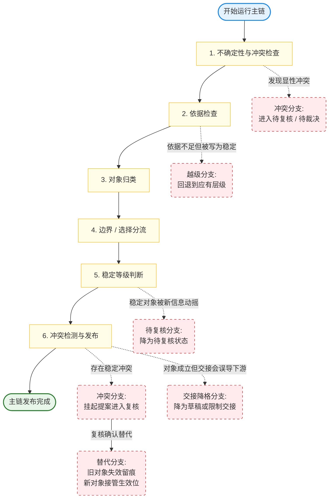
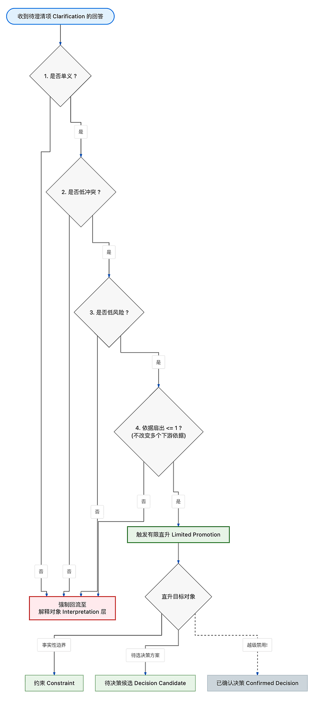
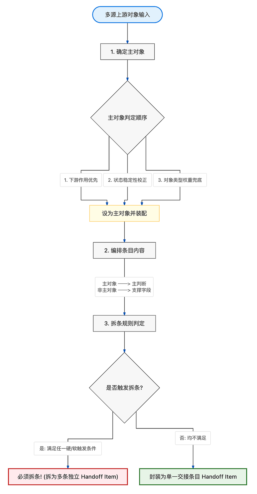
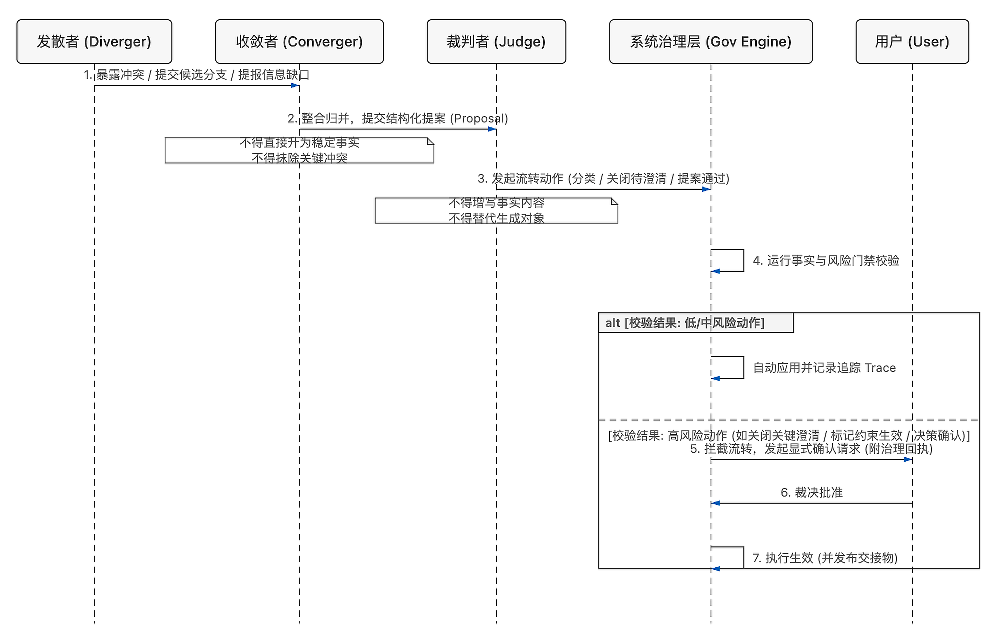

# L 层：生命周期与编排（Lifecycle Orchestration）

> 当前成熟度层级：`L3 可指导实现的治理规格层`
> 编码门槛：`已达到 L3，可直接指导第一批主流程实现；后续仍应继续向 L4 收紧`

L 层回答的不是“系统怎么多说几句”，而是“EvoCanvas 如何按收敛顺序推进一张画布”。

EvoCanvas 1.0 的最小闭环是：

`输入编译 -> 待澄清问题 -> 约束 / 待决策 -> 结构化交接物`

因此，L 层本质上是 `收敛编排层`。它负责决定：

- 一轮输入进入后先做什么、后做什么
- 当前内容何时允许继续推进，何时必须停留
- 哪些动作只需阶段内重判，哪些动作必须升级到门禁裁决
- 结构化交接物（structured handoff）应在什么条件下被收束生成

L 层不负责这些事：

- 不负责把当前实现倒推成产品事实
- 不负责界面展示、卡片布局或对话措辞优化
- 不负责替代 G 层定义事实生效权
- 不负责把所有异常一次性做成复杂状态系统

一句话：L 层不是生成层，也不是事实生效层，它是 `按产品收敛顺序推进的编排层`。

## 1. L 层的基本立场

L 层默认遵守以下主线：

- 先暴露不确定性，再推动结论
- 编排围绕阶段推进，不围绕话术组织
- 高影响动作必须允许中断，不得一路自动滑过
- 交接物（handoff）是阶段产物，不是聊天附赠品
- 低置信度时先保护真实性，再允许带风险推进

这意味着：

- 系统可以帮助推进，但不能因为“对话顺畅”就跳过真实收敛
- 当前内容若仍存在关键冲突、关键缺口或未确认前提，默认应先显性化
- 当用户要求继续推进时，系统可以给出可推进草稿，但必须显式披露未决问题、冲突边界、未确认前提与当前收敛置信度

## 2. L 层的四个一级模块

L 层当前先按四个一级模块收主干：

- `阶段推进器`
  - 决定当前位于哪个阶段节点、是否进入阶段内检查点、下一步允许往哪推进
- `门禁裁决器`
  - 处理高影响动作、判定是否允许越过事实边界、是否需要用户确认
- `状态账本`
  - 保存当前阶段状态、检查点判定结果、关键判定原因与尾项提醒
- `交接编排器`
  - 基于已有结构化对象收束结构化交接物（structured handoff）

它们之间的主次关系先收成一句话：

`阶段推进器负责决定往哪走，门禁裁决器负责决定能不能走，状态账本负责记住走到哪里，交接编排器负责在合适时机收束成交接物。`

阶段推进器是 L 层的主调度中心。

模块级骨架与阶段推进主干的展开见 [01 Stage Progression（阶段推进）.md](</Users/apple/Desktop/evocanvas/docs/harness/L-lifecycle-orchestration/01 Stage Progression（阶段推进）.md>)。

## 3. 主生命周期与推进单位

EvoCanvas 的主生命周期不是“用户说一句，AI 回一句”，而是：

- 从混乱输入
- 到显性问题
- 到约束与待决策
- 到结构化交接

当前主生命周期仍采用五段主流程：

1. 输入接入（intake）
2. 输入编译（compilation）
3. 待澄清显影（clarification）
4. 约束 / 决策收敛（constraint / decision convergence）
5. 结构化交接（handoff）

但 L 层不把“阶段”理解成一步到位的大块切换，也不把主链理解成可任意穿梭的网状系统。

当前阶段推进主干先收成为：

`线性主链 + 相邻阶段回流`

也就是说：

- 默认推进方向仍沿五段主流程往前走
- 默认最常见回流是“待澄清 -> 输入编译”，用于先回流修正解释对象（interpretation），再判断是否继续升级
- 默认局部回流只允许发生在相邻阶段之间，不默认支持跨两段以上跳回

在这个主干下，五段主流程的首要职责分别是：

- 输入接入：接住输入，确定主题与范围，完成进入主链前的最小归口
- 输入编译：双职责，但以维护解释层为主；既形成初始解释对象，也持续吸收新输入和澄清回答
- 待澄清显影：双职责，但以暴露关键未知为主；既组织问题，也优先显性化冲突、歧义、缺口和未确认前提
- 约束 / 决策收敛：双职责，但以分流收敛为主；先区分“已成立边界”与“仍待拍板事项”，再继续收敛
- 结构化交接：双职责，但以下游继续推进为主；既打包当前较稳定内容，也显式保留未决边界

在当前 L3 基线下，还应明确保留以下阶段边界：

- 输入编译不应直接产出约束、待决策或正式交接物（formal handoff）
- 待澄清不应直接关闭关键问题、直接压成约束，或绕过收敛段直接推动交接
- 约束 / 待决策段不应把边界和选择混写，也不应把仍待拍板事项偷换成已成立边界

当前推进单位先收成：

`阶段节点 + 阶段内检查点`

这样既能守住阶段主线，也能容纳补证据、显影冲突、回到原检查点重判等真实推进过程。

从状态机角度看，L 层当前先只建立轻量主状态机，不提前长成对象全状态机或执行编排引擎。

这套轻量主状态机当前只覆盖：

- 阶段节点
- 阶段内检查点
- 前进迁移
- 回流迁移
- 门禁切出条件
- 迁移阻塞状态

其中：

- 主状态粒度默认采用“阶段 + 检查点”
- 门禁先作为迁移切出条件存在，不先独立成主状态
- 主状态机默认单活动运行，任一时刻只有一个当前阶段 / 检查点
- 并行只允许留在对象层或辅助处理层，不抬到主状态机主链

因此，L 层主状态机默认回答的是：

- 现在走到哪一个阶段 / 检查点
- 这一跳是否允许前进
- 如果不能前进，是停留、回流，还是待门禁放行

在检查点类型上，轻量主状态机默认只分两类：

- 推进检查点
- 交接检查点

其中：

- 每个阶段默认都有推进检查点，但不同阶段的检查口径可以不同
- 门禁继续作为迁移切出条件存在，不先升成第三类检查点
- 交接检查点默认设在进入结构化交接之前，而不是复制到交接阶段内部再做一轮同类判断

交接检查点的默认入口逻辑当前先收成：

- 以阶段结论为主输入
- 只有必要时，才补关键对象和最小状态账本摘要
- 先看阶段结论是否可成立
- 再看未决是否会污染交接
- 结构够不够用放在后面

如果阶段结论可成立，但未决会污染交接，默认不按正式交接进入。

当前基线是：

- 可以条件进入交接编排
- 但必须显式降格
- 并挂出污染未决

交接检查点通过后，主状态机默认不直接产出交接包，而是迁移到结构化交接阶段的首个推进检查点，由交接阶段继续完成编排。

轻量主状态机图建议单独作为配图资产维护，不在总文档正文里展开成厚规则表。

五段主流程与阶段切换条件的展开见 [01 Stage Progression（阶段推进）.md](</Users/apple/Desktop/evocanvas/docs/harness/L-lifecycle-orchestration/01 Stage Progression（阶段推进）.md>)。

## 4. 默认推进闭环

L 层当前最重要的默认闭环先收成四步：

1. 阶段推进器进入当前阶段的检查点
2. 检查点判断当前内容是否具备升级条件
3. 若未通过，默认停留当前阶段，并优先补充不确定性显影
4. 补充一轮后，回到当前检查点重新判定

这条闭环要保护的是“先收敛真实度，再收敛阶段进度”，因此它默认服务于上面的线性主链，而不是替代主链另起一套流程。

检查点的综合判定口径先固定为：

- 先看不确定性处理状态
- 再看信息充分性
- 最后看对象完备度

也就是说，对象看起来“已经长出来”并不等于可以升级；若关键冲突、歧义、缺口仍未处理，默认仍不可升级。

与阶段推进主干配套时，这条闭环还应额外满足两点：

- 当澄清回答进入系统后，默认先回到输入编译阶段的解释层维护，再进入当前检查点重判
- 当某一阶段的检查点未通过时，默认先在该阶段或其相邻前序阶段内回流修正，不直接跳成跨段大回退

在当前 L3 基线下，阶段推进器所挂载的默认推进检查主链直接收成为 6 步：

1. 先检查当前内容中是否仍有会污染推进的关键不确定性、关键缺口或显性冲突；若存在，优先显式挂出，而不是直接继续升格或交接。
2. 对准备继续推进的内容做依据检查；依据不足的，不得升格为稳定对象，只能保留在更保守层级，或回流补充。
3. 在通过不确定性与依据检查后，系统先完成对象归类，明确它当前属于解释对象（interpretation）、待澄清项（clarification）、约束（constraint）路径、待决策候选（decision candidate）路径，还是其他已定义对象层级。
4. 对进入判断收敛阶段的内容，优先区分“已成立边界”与“仍待选择”；前者进入约束（constraint）路径，后者进入待决策候选（decision candidate）路径。
5. 对象完成路径分流后，再判断其当前稳定等级，至少区分为已确认、高置信未确认、未决三类，并以此约束其可被引用、可被交接、可被下游继续依赖的范围。
6. 任何准备进入正式事实层或结构化交接物（structured handoff）的内容，都必须先经过与已有稳定对象的冲突检测；若存在冲突，立即切回当前链路的异常处理位，而不是继续前推。

这 6 步不是另一条独立大流程，而是挂在主阶段链上的默认检查顺序。

映射到轻量主状态机时，当前迁移口径先收成：

- 前进迁移默认由检查点通过触发
- 如果这次前进涉及高影响动作，再额外要求门禁放行
- 回流迁移采用显式特殊迁移，不与普通前进迁移混写
- 回流通常由检查点未通过触发，但不限制为唯一触发源

当检查点通过、但门禁尚未放行时，主状态机默认不直接迁移。

当前基线是：

- 仍停留在当前阶段 / 检查点
- 但显式挂出“已通过检查、待门禁放行”的迁移阻塞状态

也就是说，L 层要分清“逻辑上已经够继续走”与“治理上已经允许生效”。

当前还应显式防止三类跳步：

- 从来源片段（source fragment）直接跳到约束（constraint）或已确认决策（confirmed decision）
- 从待澄清项（clarification）的回答直接跳到正式事实层
- 从高置信解释直接写进正式交接物（formal handoff）

如果系统无法完成上述某一步，默认不硬凑结论，而是保留在更保守层级，或显式生成待澄清项。默认处理顺序是：

1. 先停留在当前阶段或回流到相邻前序阶段
2. 优先补充不确定性显影、依据或解释层修正
3. 再回到对应检查点重判

也就是说，这条检查主链服务的是“保守推进”，不是“快速跳步”。

其中，检查点未通过后的默认去向也需要在主状态机中单独说清：

- 默认先停留在当前检查点
- 只有当失败已经说明本阶段内无法继续修正时，才触发显式回流

这里所说的“本阶段内无法继续修正”，当前至少包括三类：

- 当前阶段缺少必要输入
- 当前主判断需要被重写
- 当前失败已经会改写上游解释基础

只要满足其一，就允许触发显式回流，并要求回流原因显式挂到账本和迁移记录中。

### 待澄清回答后的默认路径

待澄清项（clarification）被回答后，默认不直接越级进入正式事实层，而应先回流更新解释对象（interpretation）。

只有在以下条件同时满足时，才允许有限直升（limited promotion）：

- 回答内容基本单义
- 当前冲突较低
- 风险较低
- 不会改变多个下游依据

这里所说的“单义”，默认采用更严格口径：

- 语义上基本只有一种合理解释
- 指向唯一主下游对象
- 不会顺带重写已有边界，也不会引出新的核心歧义

有限直升的上限默认是：

- 约束（constraint）
- 待决策候选（decision candidate）

它不允许直接形成已确认决策（confirmed decision）。

这里所说的“不会改变多个下游依据”，默认采用“依据扇出”口径：

- 重点不是表面上改动了几个对象
- 而是这条回答会不会成为多个核心判断的共同新前提
- 即使表面上只更新一个对象，只要这个对象会反过来重写多条核心判断的依据链，也应视为“改变多个下游依据”

这里所说的“低风险回答”，默认不按内容类型粗略判定，而按是否改变事实边界与下游依据来判定。

也就是说：

- 内容类型只能作为辅助参考
- 真正关键的是，这条回答是否会改变事实边界
- 或是否会重写下游判断所依赖的依据链

只要满足其一，就不应被视为低风险回答。

如果某个回答本身不改变事实边界，但会明显改变推荐倾向，则默认采用条件看待：

- 若只是局部排序微调，且不改变正式边界，仍可视为低风险
- 但只要它会实质改变待决策候选（decision candidate）的推荐方向，就不再视为低风险

如果某个回答同时具备“消解旧冲突”与“引入新边界”两种效果，则默认采用分段处理：

- “消解旧冲突”可以计为收敛收益
- “引入新边界”必须单独评估是否改写事实边界与下游依据
- 系统不应只看净效果来粗略判定风险，也不应因为存在收敛收益，就自动放松对新边界的治理要求

如果只是把模糊说法压成更精确表达，只有在不改变事实边界与下游依据时，才可视为低风险精化。

如果某个解释对象（interpretation）从低置信变成高置信，但仍未形成正式边界，可以条件参与下游推进；一旦足以触发高风险对象生效，仍需补治理或确认动作。

如果一个回答同时影响多个解释对象（interpretation），只有在它们共享同一语义核且不会分叉出不同下游路径时，才允许条件并行更新。

如果旧待澄清项（clarification）可以关闭，但又自然暴露出下一层新的待澄清项，允许条件闭环；若新项其实说明旧项并未真正解决，则旧项不应关闭。

如果一个回答只解决了旧待澄清项的一部分，应优先判断旧项是否本来混入了多个缺口。若是，则拆分处理；若不是，则不关闭，只更新进度或置信状态。

检查点、停留规则与重判闭环的展开见 [01 Stage Progression（阶段推进）.md](</Users/apple/Desktop/evocanvas/docs/harness/L-lifecycle-orchestration/01 Stage Progression（阶段推进）.md>)。

## 5. 高影响动作与门禁位置

L 层不要求所有失败都立刻升级门禁。

当前默认规则是：

- 阶段内问题先在当前阶段重判
- 只有高影响动作才从重判升级到门禁裁决

高影响动作当前至少包括三类：

- 改变事实边界
- 关闭关键未决
- 生成正式交接物（formal handoff）

其中，`改变事实边界` 是最强门禁触发条件。

它的最强判定依据先收成：

- 某个对象或判断的状态，从未确认 / 可挑战 / 候选态，进入已确认 / 已生效 / 可作为下游事实使用的状态

门禁触发条件、确认请求最小内容与确认后处理顺序的展开见 [02 Gate Adjudication（门禁裁决）.md](</Users/apple/Desktop/evocanvas/docs/harness/L-lifecycle-orchestration/02 Gate Adjudication（门禁裁决）.md>)。

## 6. 状态账本在 L 层的位置

L 层不应把状态散在聊天、卡片外观或临时解释中。

状态账本当前最小记录范围先收成：

- 阶段状态
- 判定结果
- 关键判定原因

状态账本的主记录单位先收成：

- 阶段为主
- 对象状态与推进事件为辅

也就是说，状态账本主视图默认先回答三件事：

- 现在推进停留在哪个阶段
- 为什么停留在这里
- 下一步默认准备怎么推进

其中，“下一步默认准备怎么推进”默认只写下一阶段，不默认展开成执行计划。

只有当前推进已经卡住时，才补一条轻动作，用来说明当前默认如何解卡。

对象状态与推进事件不单独抢主位，而是作为阶段视图下的解释挂件存在，用来回答“是哪一个对象导致卡住”以及“是哪一次推进转折改变了方向”。

与状态账本直接配套的阶段结论（stage conclusion）也先收成轻量对象：

- 默认表示当前阶段可成立的收敛结论
- 不默认自带完整交接语义
- 只有在交接或卡住时，才补下一阶段入口判断

阶段结论默认由阶段推进器产出，状态账本负责记录，交接编排器按需引用。

在产出时机上，阶段结论默认不在进入阶段的瞬间空挂，而是在该阶段内首次形成可成立结论时产出。

产出之后，默认只在以下两类情况更新：

- 发生阶段切换或相邻阶段回流
- 虽仍停留在当前阶段，但本段主判断已经变化

除此之外，只有当其他事件已经改写阶段结论含义时，才触发更新。

在内部结构上，阶段结论默认只保留一个主判断。

只有当其他判断已经开始影响当前阶段去向时，才允许条件升格为辅助判断。

主判断的选取默认采用以下顺序：

1. 优先选择最能决定下一步去向的对象
2. 再用稳定性做校正

也就是说，阶段结论优先回答“当前是谁在带路”，而不是优先回答“谁最新”或“谁最静态稳定”。

如果最能决定下一步去向的对象当前还不够稳定，阶段结论默认仍可以让它作为主判断，但必须显式带未确认语境。

只有当它已经不足以支撑当前阶段去向时，才退回更稳定对象承接主判断。

其中，关键判定原因默认记录到：

- 原因类别
- 对应对象
- 简短说明

状态账本还应保留两类与推进直接相关的信息：

- 仍存未决
- 非阻塞提醒摘要

在事件记录口径上，状态账本默认不做操作流水账，而是做推进转折账本。

当前基线是：

- 默认只记录状态改变事件
- 只有当某次判定直接改写推进方向时，才补记为关键事件

这里所说的关键事件，当前至少包括：

- 升级
- 回流
- 门禁拦截
- 回撤
- 发布
- 直接改写阶段去向的未通过判定

在阶段粒度上，状态账本默认按阶段节点更新，不默认持续展开到检查点。

只有发生以下情况时，才补充检查点层记录：

- 当前阶段停留
- 回流到相邻前序阶段
- 当前检查点未通过

在对象挂靠口径上，状态账本默认不做阶段内对象总表。

当前基线是：

- 默认只挂当前阶段直接阻塞推进的对象
- 只有当某个对象虽然不直接阻塞当前一步，但已经构成高风险误判源时，才补挂为高风险非阻塞对象

当前规则是：

- 仍存未决默认保留在原阶段语境中
- 若其影响事实成立、下游推进或范围边界，则继续作为升级阻塞条件
- 不属于上述三类的未决，默认降为非阻塞提醒
- 非阻塞提醒采用双挂靠：主要挂在对应对象上，状态账本保留摘要

当状态账本中的最新判定与阶段结论发生轻微不一致时，L 层默认采用以下优先关系：

- 默认状态账本优先
- 但如果最新判定尚未过门禁，或仍属于中间判定，则不自动覆盖阶段结论

也就是说，L 层承认“最新推进状态”可以比旧结论更新，但不允许未生效判断偷渡成稳定口径。

### 待复核对象的继续推进

当已确认决策（confirmed decision）或约束（constraint）进入待复核状态后，L 层负责决定它在推进链中如何被继续使用。

默认规则是：

- 如果复核触及核心边界、核心依据或下游主要动作，阶段推进器不得继续把它当作完全稳定前提使用
- 如果复核只触及外围说明、适用范围微调或局部影响，可以带复核保留继续推进
- 如果用户明确要求“先按原结论继续推进”，系统可以继续推进，但必须显式标记为“带复核保留的继续使用”
- 带复核保留的继续使用不能重新伪装成完全稳定的已确认决策（confirmed decision）

状态账本的最小记录范围、未决治理与提醒摘要职责见 [03 State Ledger（状态账本）.md](</Users/apple/Desktop/evocanvas/docs/harness/L-lifecycle-orchestration/03 State Ledger（状态账本）.md>)。

## 7. 交接物在 L 层的位置

交接物（handoff）在 L 层中的位置很明确：

- 它是阶段产物，不是任意时刻都能顺手生成的总结
- 它依赖已有结构化对象，而不是直接重写聊天原文
- 它必须同时包含已知与未知，而不是把未决问题压平
- 它先服务于继续推进，再服务于快速读懂

handoff 在编排上至少要显式区分三层内容：

- 已确认内容
- 高置信但未确认内容
- 未决问题 / 待拍板事项

当待拍板事项已经成为当前推进主轴时，handoff 应将其从普通未决问题中抬升为独立槽位。

### 与状态账本的关系

交接物（handoff）不复制整份状态账本，而是条件吸收最小可继续推进状态上下文。

当前基线是：

- 默认只吸收阶段结论
- 只有当前推进卡住时，才补阻塞原因和下一步方向

这里所说的“下一步方向”默认不展开成执行清单，而只保留下一阶段或一条轻动作提示。

当阶段结论尚未被最新判定覆盖时，交接物默认保留旧阶段结论，同时补一条“最新判定未生效”的轻提示。

只有当这条未生效更新已经影响下游主要动作时，才将其升为独立槽位。

这类“最新判定未生效”提示默认挂在对应条目上。

只有在它已经影响多个条目或整包使用时，才升级到包层提醒。

### 进入交接阶段后的首个推进检查点

进入结构化交接阶段后，首个推进检查点默认不先看包装是否完整，而先看交接分层是否已经成立。

当前顺序是：

- 先看已确认内容、高置信未确认内容、未决问题是否已经能够分开
- 再看条目主对象是否已经可选
- 再看包层最小结构是否可成立

如果三层状态暂时还分不开，默认先停留在交接阶段的首个推进检查点，并优先在交接阶段内整理分层。

只有当这类混写已经说明上游阶段结论本身不成立时，才从交接阶段显式回流。

当前至少有以下三类情况可触发这类回流：

- 主判断已被未决污染
- 已确认 / 高置信未确认 / 未决根本无法分层
- 交接编排时连主对象都选不出来

一旦触发回流，回流原因应同时挂回：

- 阶段结论
- 状态账本

### 交接阶段的主链次序

当首个推进检查点通过后，交接阶段默认不先组包，而先进入条目编排。

当前主链次序是：

1. 先做条目编排
2. 再由条目结果反推包层组装

条目编排的第一个默认动作是先选主对象，再围绕主对象决定是否分条，以及如何承接已确认 / 高置信未确认 / 未决分层。

在主对象竞争口径上，默认采用以下顺序：

- 先从已确认内容与高置信未确认内容里选
- 只有当未决本身已经成为当前推进主轴时，才允许未决进入主对象竞争

如果已确认与高置信未确认中都没有合适主对象，默认先判断未决是否已经成为推进主轴：

- 若是，可以允许未决主对象
- 若不是，不强行造主对象，而是先停留整理，必要时再回流

条目编排阶段默认先停留整理主对象、分层和条目边界。

只有当条目编排失败已经反证上游阶段结论不成立时，才触发显式回流。

条目编排完成后，默认进入包层组装，但条目结果仍继续服从三层分层，不再在交接阶段内部另起一套条目级主检查点。

### 包层组装主骨架

包层组装拿到条目结果后，默认不先定整体状态或主题边界，而先判断这些条目是否已经足以支撑整包成立。

这里所说的“足以支撑整包成立”，当前至少要求：

- 已经形成能承接整包主轴的主条目
- 三层分层已经成立
- 没有会污染整包的关键冲突或关键未决

它不要求所有条目都已经完美，只要求已经形成可继续推进的最小整包骨架。

如果条目暂时还不足以支撑整包成立，默认先判断缺口位于哪一层：

- 如果只是包层问题，留在包层组装继续补
- 如果已经说明条目骨架不成立，则退回条目编排

当条目足以支撑整包成立后，整体状态默认先定收敛成熟度，再据此约束草稿 / 正式形态。

当前顺序是：

1. 先判断是否达到可交接
2. 未达到则为进行中
3. 达到后再单独判断是否已发布

其中，“可交接”默认先看结构门槛，再看关键冲突 / 关键未决是否已经污染整包。

结构门槛当前最低要求至少包括：

- 条目列表
- 整体状态
- 主题边界
- 整体未决提醒

这里同样只要求形成最小可继续推进表达，不要求在进入包层时就把每个条目和提醒都写满。

如果结构门槛已过，但整包仍被关键未决污染，成熟度默认仍回到“进行中”，形态可以保留草稿，但不得挂成正式可交接。

当整包已经达到“可交接”后，“已发布”还需要额外满足：

- 存在明确发布动作
- 当前整包已足以作为下游稳定引用依据

它不要求零未决，但要求剩余未决已经不再污染整包使用。

### 主题边界与整体未决汇总

包层主题边界默认不从全部条目机械并集反推，而是先从主条目反推，再用其他条目做边界校正。

默认规则是：

- 先保主条目边界
- 只有当其他条目已经说明主边界会误导整包使用时，才显式改写或降格

整体未决提醒默认也不直接收所有条目未决，而是先收会影响整包使用的未决，再用主条目未决与跨条目未决做补强。

### 上游承接对象

交接物（handoff）的主要上游不是原始对话，而是已经形成的结构化对象：

- 解释对象（interpretation）
- 约束（constraint）
- 待决策候选（decision candidate）
- 已确认决策（confirmed decision）

来源片段（source fragment）主要作为追溯依据，不是交接物的主要写作单位。

### 包层最小结构

结构化交接包（handoff package）默认至少包含：

- 当前目标
- 整体状态
- 适用范围 / 主题边界
- 条目列表
- 整体未决提醒

其中：

- 整体状态采用轻量双轴
- 交接形态为草稿 / 正式（draft / formal）
- 收敛成熟度为进行中 / 可交接 / 已发布
- 主题边界默认写“适用于什么 + 不包含什么”
- 整体未决提醒默认只收包层级未决；只有在跨条目风险已经影响整包可交接性时，才条件吸收

其中，“可交接”默认采用混合门槛：先过结构门槛，再检查是否仍存在会污染整包的关键冲突或关键未决。

“已发布”必须经过明确发布动作，不能只因为“内容看起来已经够完整”而自动升级。

这里所说的“整包污染”默认采用条件升级规则：

- 默认看某个关键冲突或关键未决是否影响多个核心条目、整体主题边界或包层目标
- 即使它只直接影响单条，只要会导致下游对整包作出错误使用，也应升级视为整包污染

### 条目层最小结构

每个交接物（handoff）条目默认至少包含：

- 主判断
- 状态层级
- 草稿（draft）标记（可选）
- 下游方向
- 依据
- 未决 / 风险提示

其中：

- 主判断默认采用判断句，必要时可附对象标签
- 状态层级固定三值：已确认、高置信未确认、未决
- 草稿（draft）标记默认以包层为主，条目层只在局部例外时挂出
- 下游方向默认采用“推进目标 + 轻动作提示”
- 依据默认采用“依据摘要 + 追溯指针”
- 未决 / 风险提示默认同槽承载，必要时再拆成两个显式子槽位

### 映射与编排规范

交接物（handoff）条目采用对象编排，不采用机械对象镜像。

每条条目必须存在且只存在一个主对象，其余对象只能作为非主对象附着其上。非主对象默认只承担以下四类基线语义：

- 依据
- 边界
- 风险
- 未决

主对象判定默认采用以下顺序：

1. 下游作用优先
2. 状态稳定性校正
3. 对象类型兜底

约束（constraint）是否成为条目的唯一主判断，不只看它是否稳定，关键看这次条目的主交代任务是不是要把这条边界本身带出去。

如果条目的主交代任务就是交代这条边界本身，约束（constraint）可以成为主判断。如果条目的主交代任务是在讲别的对象，例如已确认决策（confirmed decision）或待决策候选（decision candidate），则约束即使很重要，也应优先作为边界支撑附着。

约束（constraint）更适合作为边界支撑的典型情况包括：

- 它主要在说明某个已确认决策（confirmed decision）是在什么边界内成立
- 它主要在说明某个待决策候选（decision candidate）为什么被这样框定
- 它主要在说明某个交接物（handoff）条目为什么不能越过某条线

进一步说：

- 即使约束（constraint）影响面很大，只要这次条目的主交代任务仍然是某个已确认决策（confirmed decision），它也不自动抢主位
- 只有当这次真正要交接的核心已经变成“这条边界本身”，它才应升为主判断
- 如果一个条目里同时有“约束（constraint）主判断”和“已确认决策（confirmed decision）主判断”的冲动，则默认采用条件拆条
- 只要这两个判断都足以独立触发下游动作，或都足以独立成为下一位继续推进时的引用前提，就不应在同一条里硬选一个压另一个，而应优先拆成两条

当约束（constraint）与已确认决策（confirmed decision）围绕同一主题同时存在时，L 层按下游主前提来选择交接主位：

- 如果当前真正要被下游执行的是某个具体选择，且该选择并未改写上位边界，则可优先承接已确认决策（confirmed decision）
- 如果当前真正要交代的是边界本身，或该边界正在决定下游可否继续推进，则应优先承接约束（constraint）
- 若复核完成后发生替代关系，默认先展示当前生效结果，同时保留清楚的“由谁替代谁”的追溯入口
- 若属于高风险替代场景，可前置显示替代提示，避免下游误用旧边界

### 已确认决策进入交接物的门槛

为便于实现与后续引用，一个刚形成的已确认决策（confirmed decision）进入结构化交接包（handoff package）的“已确认内容”时，可先采用以下基线：

- 默认不要求机械地先等一轮
- 但必须先检查：
  - 这次确认本身是否足够明确
  - 影响范围是否已经清楚
  - 是否仍存在会污染这次确认含义的关键未决或关键冲突

其中：

- 对“确认本身是否足够明确”，默认采用条件沿用：
  - 默认先沿用已确认决策（confirmed decision）在对象层已经过的确认门槛
  - 只有当这次进入交接物（handoff）会显著扩大下游引用范围时，才额外抬高检查强度

- 对“影响范围是否清楚”，默认采用条件清楚：
  - 至少要知道它影响哪些对象、往哪个方向影响
  - 如果这次进入交接物（handoff）后会成为下游广泛引用前提，还要额外确认它不会在适用范围上产生歧义

- 如果该已确认决策（confirmed decision）仍然依赖一个带待复核标记的约束（constraint），默认采用条件降格：
  - 如果该约束（constraint）触及的是决策的核心含义或适用范围，就不应直接进入“已确认内容”
  - 如果只触及外围边界说明，可以进入，但应带保留语境或降到更保守层级

- 如果已确认决策（confirmed decision）已经进入“已确认内容”，但同一轮里又暴露出新的关键未决，则默认采用条件回撤：
  - 如果该未决会污染确认含义、适用范围或下游主要动作，就应从“已确认内容”回撤
  - 如果它只影响外围说明，可以保留，但要补标记或补未决关联

- 如果一个已确认决策（confirmed decision）因此被降到更保守层级，默认采用条件回落：
  - 如果被动摇的是确认含义或适用范围，但核心选择仍然大概率成立，先降到“高置信但未确认内容”
  - 只有当“到底选哪条”本身也重新打开了，才退回待决策候选（decision candidate）

### 共存、复用与拆条规范

已确认内容与高置信未确认内容允许条件共存，但未确认部分只能作为边界补充、风险说明或小范围保留项。

一旦未确认部分会触发独立下游动作，就必须拆条，不能因为它只是“补充说明”而继续挂在同一条里。

拆条触发采用硬软分层：

- 硬触发：出现第二主判断、第二主对象或独立下游动作时，必须拆条
- 软触发：条目过载、状态过杂、阅读负担明显上升时，强提示拆条

同一个上游对象允许条件复用，但默认只服务一个主条目。若进入其他条目，必须显式呈现其角色差异。

这里的“角色差异”至少要说明：

- 它在主条目中承担什么作用
- 它在复用条目中只是依据、边界、风险还是未决支撑
- 复用是否会让下游误以为它又形成了第二个独立主判断

### 标题、字段与复杂度控制

对于条目标题、命名或展示主句，L 层只保留最小要求：

- 能表达主判断
- 能表达下游方向

除非这些展示写法已经影响事实边界判断，否则不应在 1.0 阶段引入过细规则。

同样地，交接物（handoff）条目字段只保留最小要求，不鼓励在 1.0 阶段提前扩成重结构：

- 主判断必须存在
- 状态层级必须清楚
- 下游方向必须可见
- 依据必须至少能回答“为什么当前可以这样交接”
- 未决与风险必须至少以轻量方式显性化

是否把边界、例外、追溯、风险、未决进一步拆成更多显式字段，应以后续真实复杂度为依据，而不是在基线阶段预设齐全。

复杂度控制默认遵守：

- 先治理事实边界，再优化命名细则
- 先保证主对象唯一，再讨论标题是否优雅
- 先保证可继续推进，再优化展示一致性

因此，1.0 阶段默认不把过多 harness 复杂度投入在标题算法、细粒度并列命名或展示修辞规则上。

交接编排规则、条目拆分原则与草稿 / 正式边界见 [04 Handoff Orchestration（交接编排）.md](</Users/apple/Desktop/evocanvas/docs/harness/L-lifecycle-orchestration/04 Handoff Orchestration（交接编排）.md>)。

## 8. 复杂回合的三角编排

对低复杂度回合，EvoCanvas 可以采用简单单轮编排。

但遇到以下情况，建议启用“发散者 - 收敛者 - 裁判者”三角编排：

- 输入信息明显冲突
- 同时存在多个候选方案方向
- 当前主题边界模糊，无法直接形成稳定对象
- 准备生成交接物（handoff），但待澄清项仍较多
- 系统判断当前回合存在过早收敛风险

当前三角编排的默认顺序仍是：

1. 发散者读取输入、现有对象和未决问题
2. 发散者提出冲突、缺口和候选分支
3. 收敛者把可保留结果映射为结构化提案
4. 裁判者判断是否允许继续收敛、要求确认或回退

对应到角色权限，默认保留以下边界：

- 发散者可以打开问题、暴露冲突、提出候选分支、提出需要补证据的点
- 发散者不可以关闭待澄清项（clarification）、标记已确认 / 已生效，或直接发布交接物（handoff）
- 收敛者可以形成结构化提案、做候选归并、形成最小可推进结构
- 收敛者不可以删除关键未决冲突、直接把提案升为稳定事实，或用压缩摘要掩盖来源断裂
- 裁判者可以判定提案是否进入下一步、是否需要更多证据、是否应回退到待澄清阶段、是否必须触发确认
- 裁判者不可以自己增写新的事实内容、替收敛者完成对象生成，或越过确认直接让高风险对象生效

这套编排不应无限循环。当前建议约束为：

- 单回合最多 1 次主发散
- 单回合最多 1 次主收敛
- 单回合最多 1 次裁判

三角编排只是一种复杂回合模式，不替代 L 层的主阶段骨架。

## 9. 设计禁令

L 层当前至少保留以下禁令：

- 不允许在存在明显缺口时直接输出稳定结论
- 不允许把交接物（handoff）当作任何阶段都能随手生成的总结
- 不允许把大量未确认内容堆叠后仍包装成正式交接物（formal handoff）
- 不允许在单条交接内容中混写多个可独立成立的主判断
- 不允许让高影响动作一路自动推进到底
- 不允许用“对话顺畅”替代“状态正确”

## 10. 1.0 最小落地要求

EvoCanvas 1.0 的 L 层至少要做到：

- 明确的五段主流程
- 阶段推进器作为主调度中心
- 以“阶段节点 + 阶段内检查点”作为推进单位
- 检查点未通过时，默认停留当前阶段并优先补充不确定性显影
- 高影响动作通过门禁裁决器拦截，而不是只靠阶段内重判
- 状态账本保存最小可解释推进状态，而不是只保留阶段标签
- 交接物（handoff）依赖已有对象结构生成，而不是自由总结
- 复杂回合可选启用三角编排，但不替代主阶段骨架
