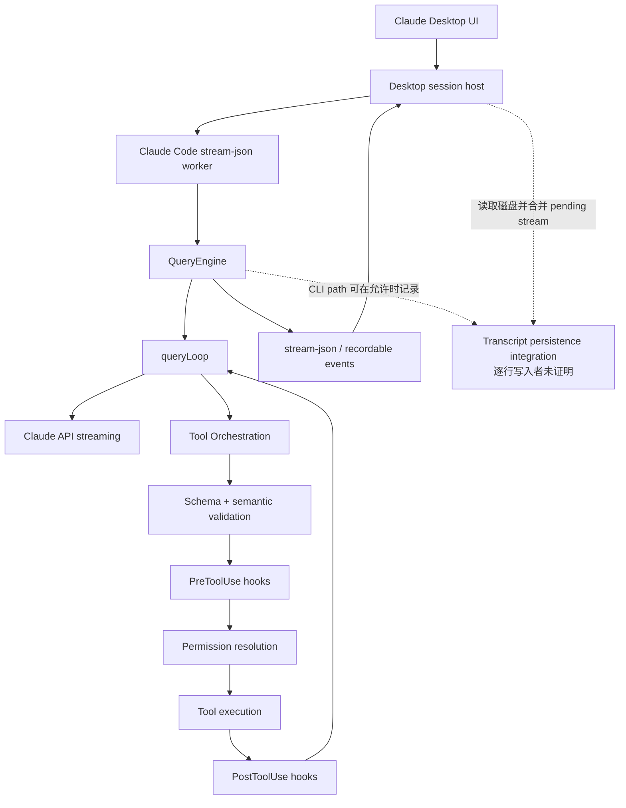

# Claude Code Harness 深度逆向分析

> 初版取证：2026-07-18  
> 深度修订：2026-07-21  
> 研究方法：本机运行现场 + 本地 session + 当前官方文档 + 固定非官方 source-map 源码快照交叉验证  
> 本报告主体：Claude Code 自身；EvoCanvas 只在第 15 节保留短附录

## 0. 结论摘要

Claude Code 不是“模型 + 一组工具”的薄壳。它更接近一个多层控制系统：

```text
Desktop / CLI / IDE host
→ QueryEngine 输入输出适配与 session 协调
→ queryLoop 迭代事件状态机
→ 模型流式响应装配
→ Tool schema / Hook / Permission / Execution 管线
→ tool result 回灌
→ Stop / Recovery / Compaction / Queue 控制
→ JSONL 追加事件日志与消息 DAG
```

对 Claude 本身最重要的十个判断是：

1. **主循环是显式迭代状态机。** 它携带消息、工具上下文、回合数、压缩状态、stop-hook 状态和恢复 transition，不是简单递归问答。
2. **模型响应与工具执行可以流式重叠。** `tool_use` block 到达后即可启动工具，不能假设模型完整结束后才执行。
3. **工具错误是下一轮输入。** schema、语义和权限失败会被转成 `tool_result`，让模型观察后改路。
4. **并发是运行时裁决，不是模型一句“并行”。** 只有明确 `isConcurrencySafe` 的连续工具才并发，其他工具串行。
5. **上下文有不同角色、权威和缓存层。** system prompt、system context、CLAUDE.md/meta user context、历史消息、attachments 不是一块平面字符串。
6. **JSONL 是追加事件日志和消息 DAG。** `parentUuid`、`logicalParentUuid`、`tool_use_id` 与叶节点共同决定恢复链。
7. **Compaction 是控制与恢复子系统。** 它有阈值、递归保护、失败熔断和多种前置裁剪，不只是“总结一下聊天”。
8. **Subagent 是隔离执行上下文。** 普通子 Agent、fork 子 Agent、同步、异步和 worktree 隔离有不同的上下文、权限、取消和缓存语义。
9. **Think 视图是可持久化的带签名内容块，但不是硬状态。** 它保存了可观测规划，却不能替代决定记录或执行结果。
10. **Claude 的真实强项是递推式自我修正。** 真实会话前三题全部在重读一手证据后推翻初始推荐；弱项是这些改判、确认与执行状态仍依赖自然语言恢复。

## 1. 证据模型与版本边界

### 1.1 四类证据

| 等级 | 证据 | 能证明什么 | 不能证明什么 |
| --- | --- | --- | --- |
| `L1` | 本机 CLI、bundle、help、进程 | 本机有哪些入口、实际进程如何启动 | 不能外推所有版本实现 |
| `O1` | Anthropic 当前官方文档 | 当前公开契约和用户可见行为 | 文档可能晚于被观察 session |
| `S1` | 固定 commit 的非官方 source-map 提取 | 2.1.88 的控制流形状、函数关系和防御逻辑 | 不是 Anthropic 发布的当前源码 |
| `R1` | 本机 Claude JSONL session | 真实事件、工具、thinking、恢复与写回现场 | 只代表这条会话和对应版本 |

### 1.2 多版本现场必须分开解释

| 对象 | 版本/模型 | 用途 |
| --- | --- | --- |
| 固定公开提取源码 | Claude Code 2.1.88 | 解释结构和控制流 |
| 证据包捕获的 `/usr/local/bin/claude` | 2.1.112 | 证明当时本机 CLI 入口 |
| rewind 前 CLI 分支 `c1f...` | Claude Code 2.1.197 | 解释旧分支的原始执行记录 |
| rewind 后 CLI 分支 `0eef...` | Claude Code 2.1.209 | 解释当前分支；共享旧节点在新文件中也被重写为当前 version，不能倒推原执行版本 |
| 目标模型 | Claude Opus 4.8 | 解释该 session 的模型输出 |
| 当前官方文档 | 持续更新 | 校验公开契约和版本差异 |

例如 2.1.88 快照中普通 subagent 默认关闭 extended thinking，而[官方 subagent 文档](https://code.claude.com/docs/en/sub-agents)说明从 2.1.198 起 subagent 继承主会话 thinking 配置。目标 worker 是 2.1.209，因此会话解释应以 2.1.209 现场和当前官方版本说明为准，2.1.88 只用于解释控制流骨架。

## 2. 从 Desktop 到模型的运行拓扑

2026-07-18 的进程观察记录显示：Claude Desktop 曾为目标任务启动一个 Claude Code worker，参数包括：

```text
--output-format stream-json
--input-format stream-json
--verbose
--effort xhigh
--model claude-opus-4-8[1m]
--resume 0eef04e9-7dcc-46f3-8f0b-8833dca85fdd
--fork-session
--no-session-persistence
```

可抽象为：



截至 2026-07-21 该历史 worker 已退出，无法再次从 argv 独立复核。此前观察到 worker 同时带 `--resume 0eef...`、`--fork-session` 与 `--no-session-persistence`，但这是 `0eef...` 已存在后的另一次 worker 启动；`c1f... → 0eef...` 的创建来自更早的 Desktop rewind + resume-at + fork，不能把二者混为同一事件。规范项目路径中的原 session JSONL 仍持续增长。结合源码中 `shouldSkipPersistence()` 对 `--no-session-persistence` 的硬抑制，可以提出“双层持久化”解释，但不能把它写成逐行写入者的确定事实：

> Desktop 保存稳定任务身份、标题和当前 CLI 分支映射；CLI 风格 JSONL 保存消息图；Desktop 还会把磁盘 transcript 与 pending stream 合并。究竟由哪个进程写入每一行，需要 worker 存活时做 syscall 跟踪才能严格确定。

这是推断，不是官方公开组件命名。

### 2.1 Desktop 任务 ID、CLI session ID 和消息 UUID 是三层身份

当前可直接读取的 Desktop 元数据给出：

| 层 | 身份 | 含义 |
| --- | --- | --- |
| Desktop 任务 | `local_ca59dd82-...` | UI 中稳定的“Harness文档收敛”任务 |
| 当前 CLI 分支 | `0eef04e9-...` | 当前消息 transcript 分支 |
| 旧 CLI 分支 | `c1f7a69d-...` | rewind 前的 transcript 分支 |
| 图节点 | `uuid/parentUuid` | 分支内部消息与控制事件的因果节点 |

Desktop 元数据还同时保存 `permissionMode=acceptEdits` 和 transcript 的 `mode=normal`。两者并存直接说明“对话运行模式”和“工具权限模式”不是同一字段。

### 2.2 当前 session 是 rewind 后 fork，不是原文件续写

旧分支 `c1f7a69d-...` 有 106 条记录，版本 2.1.197；当前分支 `0eef04e9-...` 有 623 条记录，版本 2.1.209。两者共享 61 个历史 UUID。完整指纹和集合计数见 [desktop-session-topology.json](./evidence/sessions/desktop-session-topology.json)。

共享节点在新文件中保留原 UUID、时间、message ID 和内容，但 sessionId 与 version 会按新分支重新 stamp。这与 `sessionStorage.ts:1049-1063` 的 fork/resume 防泄漏逻辑一致：新 session 不是旧 JSONL 的字节复制或原文件截断，而是“重序列化选定历史前缀 + 从指定父节点继续建立新分支”。

## 3. QueryEngine：Host 协议与 Agent 循环之间的适配层

固定快照的 `src/QueryEngine.ts` 展示了 headless/Desktop/SDK 入口如何包裹核心 query：

1. 处理用户输入和 slash command；
2. 在进入模型循环前先持久化用户消息；
3. 生成 SDK `system/init` 消息；
4. 调用 `query()`；
5. 把内部 assistant/user/progress/attachment/stream event 归一化为 stream-json；
6. 记录 transcript；
7. 统计 usage、turn、stop reason、permission denial；
8. 产出最终 result 消息。

一个很有工程意味的细节是：用户消息会在模型 API 返回前写入 transcript。源码注释明确解释了原因——如果用户发出请求后立刻 Stop，只有 queue-operation 而没有用户消息，resume 会认为“没有会话”。这说明 session 可恢复性不是事后日志功能，而是输入接收路径的一部分。

QueryEngine 还显式处理 tombstone：tombstone 是“删除旧临时消息”的控制信号，不作为普通消息继续输出。

## 4. queryLoop：Claude Code 的真正主控制器

### 4.1 状态不是只有 messages

`src/query.ts:181-217` 的 `QueryParams` 和 `State` 分开了不可变输入与跨迭代状态。

不可变部分包括：

- system prompt；
- user/system context；
- tool permission callback；
- fallback model；
- query source；
- max turns / task budget。

跨迭代状态包括：

- messages；
- ToolUseContext；
- auto-compact tracking；
- max-output recovery count；
- reactive compact 是否已尝试；
- pending tool-use summary；
- stop hook 是否激活；
- turn count；
- 上一轮为何继续的 transition。

`queryLoop` 使用 `while (true)`，每个 continue 点都生成下一份 state。这比“模型调工具，结果再调模型”的概括更精确：它是带恢复原因与控制子状态的离散事件循环。

### 4.2 单次迭代的真实顺序

综合 `query.ts`，单次迭代大致是：

```text
1. 恢复跨轮 State
2. 启动 skill / memory 预取
3. 建立 query chainId 与 depth
4. 截取 compact boundary 后的有效消息
5. 对 tool result 做预算替换
6. history snip / microcompact / context collapse / autocompact
7. 装配 system + user context + tools + model options
8. 调用模型并消费 stream
9. 对 thinking/text/tool_use 分块
10. 流式启动可执行工具
11. 决定是否恢复、停止或继续
12. 注入 tool result / queue / attachments
13. 刷新 MCP tools
14. 构造 next_turn State
```

这条顺序说明 context 管理、工具执行、用户队列和停止控制都在同一主链里，而不是若干互不相干的插件。

### 4.3 Queue 与 attachment 被安排在工具批次之后

`query.ts:1535-1657` 把 queued command、task notification、memory prefetch 和 skill discovery 结果放在工具批次之后注入。这样做有两个目的：

1. 不把任意 attachment 插进 assistant `tool_use` 与 user `tool_result` 之间，破坏 API 邻接不变量；
2. 根据 agentId 做作用域隔离：主线程可接收用户 prompt 和通用通知，subagent 主要接收明确发给自己的任务通知。

所以 attachment 不是“随时拼到 prompt 的附件”，而是受主循环相位和 Agent 作用域约束的上下文事件。

## 5. Context：不是一块 Prompt，而是多条权威与缓存通道

### 5.1 system prompt 与 system context

`appendSystemContext()` 把 system prompt 与 system context 合成 system 前缀。固定快照中的 system context 主要含：

- 会话开始时的 Git branch/status/recent commits/user 快照；
- 可选的 cache breaker。

源码特意把 Git 状态标注为“conversation start snapshot”，不会随会话自动刷新。这是稳定前缀和实时事实之间的明确取舍。

### 5.2 CLAUDE.md 属于 meta user context

`getUserContext()` 发现 CLAUDE.md 并加入当前日期；`prependUserContext()` 再把它们包进 meta user 的 `<system-reminder>`，还提示模型“上下文可能相关也可能不相关”。

因此至少存在三种不同语义：

| 输入 | 消息角色/位置 | 典型用途 |
| --- | --- | --- |
| 核心 system prompt | system 前缀 | 稳定行为与工具规则 |
| system context | system 前缀 | Git 起点、环境级上下文 |
| CLAUDE.md / current date | meta user 前置消息 | 项目规则、记忆和日期 |
| conversation/tool results | 历史消息链 | 当前任务、动作和观察 |
| attachments/queue | 迭代间追加 | 通知、异步任务、技能/记忆结果 |

Claude Code 的上下文工程不是简单“把所有材料拼起来”，而是按角色、缓存稳定性、是否会更新和来源权威分层。

### 5.3 Prefix byte-stability 是隐藏的设计轴

源码多处为了 prompt cache 保持字节稳定：

- 给 UI/hooks 补 observable tool input 时复制消息，不修改回传 API 的原消息；
- fork subagent 尽量复用父 Agent 完全相同的 system prompt 与 tool array；
- transcript 中某些路径保持模型原始输入字符串，避免 VCR/hash 改变。

这说明 Claude Code 的 Harness 不仅管理“语义是否相同”，还管理“序列化字节是否相同”。缓存命中、签名有效性和恢复正确性都依赖这种细节。

## 6. Thinking 与流式消息装配

### 6.1 一次模型响应会产生多个事件

官方 [Agent loop 文档](https://code.claude.com/docs/en/agent-sdk/agent-loop)把循环概括为 prompt → assistant/tool calls → tool results → repeat。源码进一步显示 assistant 响应按 content block 到达：thinking、text、tool_use 可各自形成消息事件。

所以本地看到：

```text
同一 message.id
→ thinking 记录
→ text 记录
→ tool_use 记录
```

不是模型调用了三次，而是一个 stream 的三个内容块。

### 6.2 工具可以在模型流未结束时启动

`query.ts:826-863` 一旦发现 tool-use block，就交给 streaming executor；同时轮询已完成结果并 yield。这样能隐藏部分工具延迟，但也使时序分析更复杂：

- tool A 可能已经运行；
- 模型 stream 仍在输出另一个 block；
- UI、transcript 和 API 历史还在分别组装。

### 6.3 fallback 会撤销不再有效的 thinking

当 streaming fallback 发生，旧尝试的部分 assistant messages 会被 tombstone。源码特别指出 thinking block 的签名可能无效，如果保留会触发“thinking blocks cannot be modified”一类 API 错误。运行时会：

1. tombstone 旧 assistant 片段；
2. 清空旧 tool-use/result 数组；
3. discard 原 streaming executor；
4. 用新 executor 处理 fallback 响应。

因此 transcript 中“仍存在的 signed thinking”是经过 Harness 事件链认可的版本，不能把流式过程里的每个临时块都视为永久记录。

## 7. Tool Pipeline：从模型意图到真实副作用

### 7.1 完整管线

固定快照显示的工具管线是：

```text
tool_use block
→ Zod schema 校验
→ tool.validateInput 语义校验
→ 可选 speculative classifier
→ observable input clone/backfill
→ PreToolUse hooks
→ hook + permission rule 综合裁决
→ tool.call
→ 结果归一化 / attachment
→ PostToolUse 或 PostToolUseFailure hooks
→ tool_result 回灌模型
```

### 7.2 校验失败仍保持协议闭合

schema 或语义校验失败时，运行时生成：

```json
{
  "type": "tool_result",
  "is_error": true,
  "tool_use_id": "原工具调用 ID",
  "content": "InputValidationError ..."
}
```

这样满足“每个 tool_use 都有配对 tool_result”的 API 不变量，也让错误进入下一轮上下文。目标会话中 `TaskCreate` 参数被截断后，Claude 能观察错误并改用直接 Edit，正是这个机制的实例。

### 7.3 权限拒绝也会变成模型可见数据

权限裁决不是只有 allow/throw：拒绝会形成 error tool result，必要时再执行 PermissionDenied hooks。模型可以解释拒绝、换工具、缩小动作或向用户请求批准。

### 7.4 PreToolUse 和 Permission 是两层不同控制

官方[权限文档](https://code.claude.com/docs/en/permissions)明确：PreToolUse hook 可以拒绝、要求询问或建议允许，但不能绕过 deny/ask 规则；deny-first 优先级仍成立。源码也先收集 hook 决定和可能的 input 更新，再进入统一 permission resolution。

这两层分别解决：

- Hook：动态组织策略、外部检查、输入修改、附加上下文；
- Permission：用户/组织授权边界和最终执行许可。

### 7.5 Permission 与 Sandbox 是正交控制面

报告初版漏掉了 Sandbox。官方[沙箱文档](https://code.claude.com/docs/en/sandboxing)与固定源码共同表明：

- Permission 决定某个工具动作是否被授权发起；
- Sandbox 决定获准的 Bash 进程实际拥有怎样的文件、网络和系统调用能力；
- `shouldUseSandbox` 根据配置、平台能力和命令条件选择沙箱路径；
- BashTool 再通过 Shell wrapper 和 sandbox adapter 执行受限命令，并处理沙箱不可用或执行失败。

因此“用户点了允许”不等于“进程拥有无限 OS 权限”；反过来，沙箱也不替代用户/组织层的 deny/ask 规则。二者分别约束授权意图与实际能力。

## 8. 工具并发：安全属性优先于模型叙述

固定快照中存在两条相关但不能混写的调度路径：

1. 主流式路径 `StreamingToolExecutor`：安全工具可以在 content block 到达后启动；不安全工具形成 barrier，必须与前后批次隔开。当前证据没有显示它受“最大 10”这一同样上限约束。
2. fallback/非流式 `runTools` 路径：`toolOrchestration.ts` 把连续且 `isConcurrencySafe(parsedInput)` 的调用组成 batch，非安全工具逐个串行；解析失败或安全判断抛错都保守按不安全处理；这个路径用 `all(..., maxConcurrency)`，默认最大并发 10。

非流式并发批次的 context modifier 不按完成时序直接应用，而按原 tool block 顺序提交；流式执行器同样用 safe/unsafe barrier 维护可预测的结果顺序。

这个设计同时追求：

1. I/O 吞吐；
2. 副作用安全；
3. Context mutation 的确定性。

因此判断“Claude 是否并行”必须看工具安全分类和事件时间，而不是看 assistant 文本写了“我会并行处理”。目标会话最后 17 次 Edit 的事件是串行交替，不支持“并行写回”的字面说法。

## 9. Hook 与 Stop：可编程的控制面

官方 [Hooks reference](https://code.claude.com/docs/en/hooks)表明 Hook 不只围绕工具：UserPromptSubmit、Stop、SubagentStop、TaskCompleted、PreCompact 等事件都可影响控制流。

关键区别：

- `PreToolUse` 可在执行前阻止工具；
- `PostToolUse` 发生在工具执行后，不能撤销既成副作用，但可向 Claude 回灌信息；
- `Stop` 可以阻止 Claude 结束，把 reason 作为下一条输入继续循环；
- `SubagentStop` 可以让子 Agent 继续；
- `PreCompact` 在被检查的 2.1.88 快照中可补充摘要指令和用户显示信息，但不会形成阻止压缩的 blocking decision；
- `TaskCompleted` 可以拒绝“已完成”状态。

当前官方 Hooks 文档已把 `PreCompact` 标为可阻止压缩，这与 2.1.88 快照不同，属于需要保留的版本差异，不能反向改写旧源码行为。

源码中的 `stopHookActive` 用于防止 stop hook 无控制重复，并与 compact/recovery 状态一起跨轮携带。停止因此不是一个简单 boolean，而是可被 Hook 驳回、重新进入模型的状态迁移。

## 10. Session：追加日志、消息 DAG 与恢复

### 10.1 持久化抑制与延迟 materialize

`sessionStorage.ts:953-990` 在以下情况跳过写入：

- test 环境；
- `cleanupPeriodDays=0`；
- `--no-session-persistence`；
- `CLAUDE_CODE_SKIP_PROMPT_HISTORY`。

session 文件只在第一条 user/assistant 消息出现时 materialize；此前 hook/metadata 可先缓冲。这避免只有元数据没有对话的空 session 污染 resume 列表。

### 10.2 JSONL 不是数组，而是图

带 UUID 的消息图节点具有 UUID，`parentUuid` 可以为空；title/mode/queue/last-prompt 等无 UUID 控制元数据不进入消息 DAG：

- 普通消息沿 `parentUuid` 前进；
- tool result 优先指向发起该 tool use 的 assistant UUID；
- compact boundary 的物理 `parentUuid` 置空；
- 同时保存 `logicalParentUuid` 连接压缩前逻辑历史；
- fork/resume 时重新 stamp 当前 sessionId/cwd/version/gitBranch，防止源 session 身份泄漏。

加载时不是把全部行原样塞回模型，而是：

1. 构建 message map 和叶节点集合；
2. 找最新 user/assistant 叶；
3. 沿 parent 链恢复有效 transcript；
4. 再合并 title/tag/mode/file history/content replacement/context collapse 元数据。

官方[会话文档](https://code.claude.com/docs/en/sessions)也确认 transcript 位于 `~/.claude/projects/<project>/<session-id>.jsonl`，每行可以是消息、工具或元数据，并支持 resume/fork/compact。

### 10.3 元数据会被重追加到尾部

标题、last-prompt、mode 等元数据不只在开头写一次。源码会在 compaction 或退出时重追加，使渐进式 tail reader 能看到最新状态；对可能被外部 SDK 更新的标题/标签，还会先读尾部避免旧 CLI cache 覆盖新值。

这解释了目标 session 中 custom-title、ai-title、mode、last-prompt 多次出现：它们不是几十个独立标题或模式，而是追加式元数据更新和尾部可发现性策略。`queue-operation` 必须另算：当前是 35 次 enqueue + 35 次 dequeue，属于真实输入队列日志，不是标题/模式快照的重追加。

### 10.4 Checkpoint、Resume 与 Fork 是三种不同恢复语义

固定源码中的 QueryEngine 会在文件历史功能开启时，围绕用户 prompt 建立文件快照；`conversationRecovery.ts` 负责恢复消息、文件历史并修复被中断的 tool-use 链，resume 还会触发对应的 SessionStart 生命周期。官方[Checkpointing 文档](https://code.claude.com/docs/en/checkpointing)进一步明确：

- 每个用户 prompt 建立一个 checkpoint；
- restore code、restore conversation、targeted summarize 是不同动作；
- fork/branch 保留原 session 并建立新分支，不等于 rewind；
- checkpoint 只跟踪 Claude 文件编辑工具的改动，不跟踪 Bash 修改；
- 手工改动、并发 session 的外部改动和其他外部副作用也不保证可回滚；
- checkpoint 是 session 级 local undo，不替代 Git。

所以“Session 可恢复”必须拆成：消息链恢复、文件编辑恢复、上下文摘要和分支复制。它们不能被统称为一个 rollback。

## 11. Compaction：上下文压力下的多级恢复系统

官方 agent loop 文档把自动 compact 描述为接近上下文上限时用摘要替换旧历史。固定源码显示实际复杂得多。

### 11.1 阈值与预留

- 为 compact summary 输出最多预留 20k token；
- 默认 auto-compact buffer 13k；
- warning/error buffer 20k；
- 手动 blocking buffer 3k。

### 11.2 不是只有一种删减

在 auto compact 前，query loop 还可能运行：

- tool result budget replacement；
- history snip；
- cached microcompact；
- context collapse；
- session-memory compaction。

这些机制有明确顺序和互斥/抑制规则，避免两个压缩系统竞争同一份上下文。

### 11.3 递归保护与熔断

- compact/session-memory fork 自己不能再 auto compact，避免递归死锁；
- context-collapse 开启时可抑制 proactive autocompact，避免相互“清空”对方的细粒度状态；
- 连续失败 3 次后熔断，避免每轮继续发起注定失败的 compact 请求。

源码注释给出过历史事故量级：大量 session 出现几十到几千次连续失败，浪费大量 API 调用。这说明 compaction 是必须治理的运行时控制问题，不是纯体验优化。

## 12. Subagent：隔离、继承、缓存与生命周期

### 12.1 普通子 Agent 与 fork 子 Agent 不同

普通子 Agent：

- 从委派 prompt 开始；
- 使用自己的 agent system prompt；
- 重新解析自己的工具池和权限；
- 只有声明 `agentDefinition.omitClaudeMd` 的 Agent 才省略 CLAUDE.md；只有 Explore/Plan 省略 Git snapshot，这些是条件性瘦身，不是所有普通子 Agent 的默认行为；
- 有独立 transcript sidechain。

fork 子 Agent：

- 继承经过修复的父消息；
- 尽量复用父 system prompt 与 exact tools；
- 目标是让 API request prefix 字节一致以命中 prompt cache；
- 可以继承 parent thinking config 和 non-interactive 配置。

官方[子 Agent 文档](https://code.claude.com/docs/en/sub-agents)也区分 fresh isolated context 与 fork inheritance，并说明新版本的后台执行、thinking 继承和 worktree isolation 行为。

### 12.2 同步和异步的控制差异

固定源码中：

- 同步 Agent 通常共享父 abort controller；
- 异步 Agent 使用独立 abort controller，用户取消主线程时不自动终止；
- 异步 Agent 不能随意弹自己的权限 UI，需要 auto-deny 或 bubble 到主会话；
- async task 完成后通过 notification/attachment 回到主循环；
- worktree isolation 可以给 Agent 独立 cwd，若没有改动可自动清理。

### 12.3 目标会话的五 Agent 是“并行感知，集中裁决”

五个 Agent 按文档域扫描，累计返回 55 个 finding；主 Agent 再做 55→13 聚类。没有 Agent 间投票或结构化共享状态，最终判断仍集中在主 Agent。这种架构扩大了覆盖面，却没有消除主 Agent 的综合偏差。阶段与计数见 [convergence-process-index.json](./evidence/sessions/convergence-process-index.json)。

## 13. 真实收敛会话揭示的 Claude 认知模式

完整专项见 [03-claude-thinking-process-analysis.md](./03-claude-thinking-process-analysis.md)。这里保留与 Harness 机制直接相关的结论。

### 13.1 Claude 是迭代式事件控制器

主 Agent 并未在 55→13 后一次确定所有答案，而是每题：

```text
恢复上轮决定
→ 选择直接证据
→ 重读
→ 更新判断
→ 只问当前 fork
→ 接受用户选择
→ 重建下一轮
```

### 13.2 子 Agent 汇总不能直接作为最终推荐

前三题最初推荐为 A/A/A，回读直接证据后变为 C/B/B。对应记录和改判依据见 [convergence-process-index.json](./evidence/sessions/convergence-process-index.json)。改判分别来自：

- 拆开风险和确认两个正交维度；
- 分开对象状态与交接包状态的语义权威；
- 用跨文档多数规则修正孤立例外。

### 13.3 长上下文能恢复，但不是硬状态

Claude 在 46 小时后能理解孤立的 `C`，依赖 parent chain 和 200k+ cache context。写回准备时又曾短暂把 Q1 取回初始 A，随后自纠正为 confirmed C。

### 13.4 内部思考完成不等于系统完成

两次超长 thinking 没有 text/tool use；直到 Harness 提醒和用户“继续啊”后才执行。之后 `TaskCreate` 校验失败，再降级直接 Edit。这里至少存在三种不同完成：

1. 模型内部已形成计划；
2. Harness 收到可见/可执行输出；
3. 外部工具实际完成并验证。

Claude 在这条 session 里只对第 3 层做了工具成功回执汇总，没有独立 read-back/diff 验证。

## 14. Claude Code 这套 Harness 的强项与结构性弱点

### 14.1 强项

- **协议闭合。** tool-use/result 配对、abort 时合成结果、fallback tombstone 都在维护 API 不变量。
- **恢复路径丰富。** fallback、reactive compact、context collapse、stop hook、max-turn/budget 都能形成明确 transition。
- **错误可观测。** 工具校验、权限拒绝、Hook 信息都能回灌模型。
- **吞吐与确定性平衡。** 安全工具并发，但 context modifier 按原序提交。
- **缓存意识深入。** 系统前缀、tool input、fork agent 都考虑 byte stability。
- **Session 可恢复。** 追加日志、DAG、compact logical parent 和元数据重追加共同支撑 resume。
- **多执行形态统一。** CLI、Desktop、SDK、subagent 大体复用同一 query loop。

### 14.2 结构性弱点

- **运行状态很强，业务决定状态很弱。** Harness 能恢复 tool-use 链，却不会自动把“用户选择 C”提升为 typed DecisionRecord。
- **可见 thinking 容易被误当事实。** 它混合语义判断、恢复、格式规划和错误解释。
- **复杂性高度依赖隐式顺序。** 多种 compact、queue、hook、attachment 和 sidechain 一旦顺序错误，会产生孤儿消息或缓存破坏。
- **版本差异显著。** subagent thinking、后台行为、settings 加载和 session 细节在 2.1.x 内持续变化。
- **模型叙述与运行事实会分离。** “并行”“修改 N 个文件”“已完成”需要事件/文件终态独立验证。
- **多文件动作不天然原子。** 工具逐个成功不等于批次事务成功。
- **高质量仍依赖主 Agent 回读。** 并行 Agent 提高召回率，但无法自动保证最终裁决正确。

## 15. 附录：EvoCanvas 可以借鉴什么

本节刻意压缩，不再主导报告。

Claude Code 最值得 EvoCanvas 借鉴的是运行控制思想：显式 query transition、tool-use/result 闭环、Hook 与 Permission 分层、session DAG、错误回灌和有熔断的 context 管理。

不应直接照搬的是把 raw thinking 当产品状态。目标 session 已证明：自然语言“决策锁定”可以短暂漂移，计划计数可以和执行不一致，内部思考也可能没有外显动作。若 EvoCanvas 吸收这套机制，真正需要稳定化的是 finding 谱系、证据引用、confirmed decision、writeback transaction 和 verification result，而不是灰色思考文本。

## 16. 复核入口

- Claude 收敛过程专项：[03-claude-thinking-process-analysis.md](./03-claude-thinking-process-analysis.md)
- 证据台账：[01-evidence-ledger.md](./01-evidence-ledger.md)
- 复现方法：[02-reproduction.md](./02-reproduction.md)
- 源码控制流索引：[evidence/public-source/deep-control-flow-index.json](./evidence/public-source/deep-control-flow-index.json)
- 会话过程索引：[evidence/sessions/convergence-process-index.json](./evidence/sessions/convergence-process-index.json)
- Desktop/CLI session 拓扑：[evidence/sessions/desktop-session-topology.json](./evidence/sessions/desktop-session-topology.json)
- 本机 runtime：[evidence/local-runtime/README.md](./evidence/local-runtime/README.md)
- 官方资料：[evidence/official-docs/README.md](./evidence/official-docs/README.md)
- 固定源码快照：[evidence/public-source/README.md](./evidence/public-source/README.md)
- Session 证据：[evidence/sessions/README.md](./evidence/sessions/README.md)
