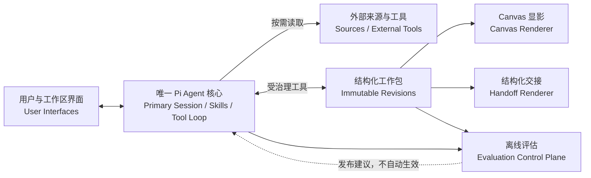

# System Architecture（系统总架构）

> 文档状态：`与 Harness L3 对齐的目标架构`
> 当前实现状态：`原生主链已接入，兼容入口待验证`
> 产品真相源：[`EvoCanvas1.0-PRD.md`](../vision/EvoCanvas1.0-PRD.md)
> Harness 规格：[`docs/harness/README.md`](../harness/README.md)

## 1. 文档定位

本文定义 EvoCanvas 1.0 的目标系统边界、权威记录和依赖方向。跨进程 DTO 与历史字段只在输入转换或只读边界中出现，不构成产品事实源。

## 2. 架构目标

EvoCanvas 通过一个长期 Pi Agent，把模糊感觉和多源材料推进为经确认的稳定结构，再由 Canvas 显影并形成可交接版本。架构首要优化需求失真，而不是运行组件数量或文档生成速度。

## 3. 核心原则

1. **Pi 是唯一 Agent 核心**：Session、模型、Tool Loop、Skills、上下文、压缩、取消、恢复和技术 Trace 全部由 Pi 承载。
2. **EvoCanvas 给 Pi 装能力**：产品 Instructions、Skills、结构化工作包工具、治理 Hooks 和 Renderer 不构成第二 Agent Kernel；Canvas API 只承接身份、绑定、入口幂等和事件转发。
3. **过程与稳定状态分开**：Primary Pi Session 保存原始过程；不可变工作包 Revision 保存稳定业务状态。
4. **用户拥有产品裁决权**：Pi 提议和解释，用户确认含义、范围、交接和风险；工具执行确定性门禁。
5. **Canvas 只显影**：正式卡片和关系只来自已提交 Revision，布局不是事实源。
6. **交接是派生视图**：交接内容从已确认 Revision 确定性生成，不另存可漂移正文。
7. **线上和评估分离**：离线评估可提出版本发布建议，不能自动修改线上 Prompt、Skill 或 Policy。

## 4. 目标架构



## 5. 子系统职责

### 5.1 User Interfaces（用户界面）

Landing Page 承接低压力感觉输入；Workspace 提供 Primary Pi Session、Canvas、来源入口、活跃缺口和交接入口。界面可以把直接编辑转换为语义操作，但不能绕过统一提交器。

### 5.2 Pi Agent Core（核心运行层）

空 Workspace 可以没有 Session；第一条真实用户消息到达后，每个 Workspace 绑定一个 Primary Pi Session。Pi 负责：

- 原始 User / Assistant / Tool Entry；
- 模型与 Provider；
- Instructions、Skills 和工具循环；
- `transformContext`、按需读取和压缩；
- 流式、取消、队列、重试和恢复；
- 技术 Trace、用量和运行终态。

Pi 自主决定下一步是回答、追问、读取、比较、请求确认或调用工具；EvoCanvas 不设置阶段路由器。

首版使用同一 `0.85.1` Pi 依赖族、官方 SQLite Session Backend、一个 Session 一个文件和宿主级独占写锁。Binding 以 `binding / ready / unavailable / archived` 显式表达创建与恢复状态。

### 5.3 Workspace Artifact / Structured Work Package（工作区制品 / 结构化工作包）

一个 Workspace 对应一个逻辑工作包。每次稳定提交创建完整不可变 Revision，保存稳定对象、关系、来源引用、确认、交接状态和提交元数据。

`Workspace Artifact` 与“结构化工作包”是同一个架构对象的中英文称呼，不允许分别建表或维护两条版本链。

`workspace.commit` 是 Pi 与用户直接编辑共享的唯一稳定写入入口。它执行身份、能力、基础 Revision、Schema、来源、确认、状态转换、依赖和幂等检查。

### 5.4 Canvas Projection（Canvas 投影）

Renderer 从指定 Revision 生成六类正式卡片、关系、复核标记和系统挂件。Projection Checkpoint 记录 `projected_revision_id`。投影失败不回滚 Revision，可从 Revision 重建。

### 5.5 Handoff（结构化交接）

交接 Renderer 从 Revision 生成可读或下游 AI 可消费的结构化视图。`current_revision_id` 与 `latest_confirmed_handoff_revision_id` 分开；下游默认只能读取最近有效的 confirmed 交接。

### 5.6 Sources and External Tools（来源与外部工具）

来源通过稳定引用连接对象，不复制正文。外部副作用工具独立校验动作级授权、目标、关键参数和幂等；工作包确认或交接确认不能替代外部行动授权。

### 5.7 Evaluation Control Plane（离线评估控制面）

使用脱敏 Session、Revision 和 Trace 样本评估交接失真、下游误解和零容忍护栏。评估不进入在线 Tool Loop，也不拥有发布权。

## 6. 权威记录

| 问题 | 权威记录 |
| --- | --- |
| 用户、Pi 和工具实际发生了什么 | Pi Session / Technical Trace |
| 当前稳定对象和关系是什么 | current Revision |
| 用户确认了什么 | Revision 内 Confirmation Record |
| 下游默认可使用什么 | latest confirmed handoff Revision |
| 外部动作是否成功 | 外部回执与幂等查询 |
| Canvas 显示到哪个版本 | Projection Checkpoint |

任何摘要、自然语言回复、Toast、Canvas 布局或诊断索引都不是新的事实源。

## 7. 运行主链

```text
User Submission(submission_id + content_hash)
-> create or restore Primary Pi Session
-> persisted User Entry(entry_id)
-> transformContext 读取 current Revision
-> Pi 按需使用 Skill / 读取对象与来源
-> 对话中形成候选
-> 展示待固定含义、范围、依据和影响
-> 用户确认
-> workspace.commit
-> 原子 Revision + 依赖/交接影响
-> Tool Result 回到同一 Pi Session
-> Canvas / Handoff 从 Revision 派生
```

候选只在 Session。来源事实可在完整性检查通过后自动收录；Pi 推断的问题、待澄清、约束、方案和决定必须经用户确认。用户直接编辑使用同一提交器，不自动唤起 Pi。

## 8. 一致性与恢复

- Pi Main Lane 控制技术并发；工作包用 `base_revision_id` 控制稳定状态并发。
- 提交和外部副作用分别使用幂等键。
- `submission_id / entry_id / operation_id / invocation_id` 分别表达入口、来源、稳定业务操作和工具技术调用。
- 提交成功后即使回复或投影失败，Revision 仍有效。
- 结果未知时先查询权威结果，不盲目重试。
- Session 故障从 Pi Session Store 恢复；投影从 Revision 重建。
- 上游变化确定性标记下游复核，不调用第二模型自动改写。
- 工具恢复只接受 `replay: safe | never`；执行结果未知不代表允许重放。
- 历史数据按 Workspace 短暂停写、导入、哈希校验和原子切换，不长期双写。

## 9. 明确排除

目标架构不包含：

- Python Product Kernel 包装 Pi；
- `run_chat / run_judgement / run_convergence` 产品运行类型；
- `convergence_hint`、收敛水位或后台收敛任务；
- 平行 Conversation History、Context Manifest 或独立 State Ledger；
- 结构化工作包整份自由覆写；
- 未确认候选正式显影；
- Governance Agent 或独立语义验证模型。

## 10. 当前原生实现边界

当前生产画布主链已由 Python Canvas 入口接入 TypeScript Workspace Runtime，并保留少量兼容端点供既有消费者读取。兼容端点不是目标产品主链；原生实现的补齐顺序为：

1. 升级为 Pi `0.85.1` 同版本依赖族，建立首条消息触发的 Workspace–Primary Session Binding、官方 SQLite Backend、单 Session 文件和宿主锁；
2. 接入 Pi Harness 的 Skills、Session、`transformContext` 和 Hooks；
3. 注册只读工具与统一 `workspace.commit`；
4. 让用户直接编辑与 Pi 编辑持续共用同一提交能力；
5. 继续收敛判断、收敛运行和提案捕获的辅助入口；
6. 接入依赖传播、交接双指针和 Projection Outbox；
7. 以端到端证据关闭非主链路径。

兼容期间不得删除尚有消费者的数据或接口；先停止新写入，再证明读取、导入和回退路径。

## 11. 架构验收

1. 同一 Workspace 跨进程恢复为同一个 Pi Session。
2. 一次真实流程中不存在第二 Agent 或产品侧收敛运行。
3. 未确认候选不能进入 Revision 或 Canvas。
4. 用户直接编辑和 Pi 提交使用同一版本、权限、幂等和依赖规则。
5. Canvas 可仅凭 current Revision 重建。
6. 下游默认只能取得有效 confirmed handoff。
7. Entry、Tool Call、Commit、Revision 和 Projection 可双向追溯。
8. 非主链运行端点关闭后完整回归仍通过。
9. 第一条消息重试不会创建重复 Session / Entry，Session 锁竞争不会出现第二写者。
10. 归档恢复原 Session；协调删除对 `partial / retention_held` 如实报告。

## 12. 相关文档

- [`Harness Overview`](../harness/00-overview/00%20Overview%EF%BC%88%E6%80%BB%E8%A7%88%EF%BC%89.md)
- [`Main Runtime Loop`](../harness/00-overview/03%20Main%20Runtime%20Loop%EF%BC%88%E8%BF%90%E8%A1%8C%E4%B8%BB%E9%93%BE%EF%BC%89.md)
- [`Memory and State`](../harness/02-memory-state/00%20Memory%20and%20State%EF%BC%88%E8%AE%B0%E5%BF%86%E4%B8%8E%E7%8A%B6%E6%80%81%EF%BC%89.md)
- [`Runtime and Tools`](../harness/03-runtime-tools/00%20Runtime%20and%20Tools%EF%BC%88%E8%BF%90%E8%A1%8C%E6%97%B6%E4%B8%8E%E5%B7%A5%E5%85%B7%EF%BC%89.md)
- [`Pi Runtime Contract`](./03%20Pi%20Runtime%20Contract%EF%BC%88Pi%20%E8%BF%90%E8%A1%8C%E6%97%B6%E6%8E%A5%E5%8F%A3%E5%A5%91%E7%BA%A6%EF%BC%89.md)
