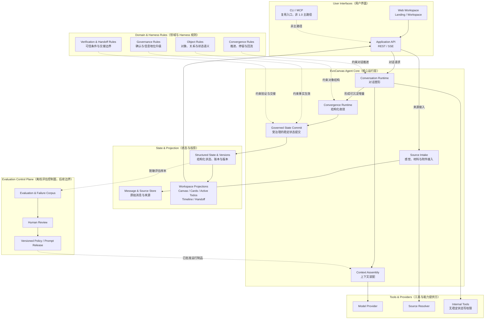

# System Architecture（系统总架构）

> 文档类型：`系统目标架构说明，包含混合成熟度节点`
> 编码门槛：`必须结合 Architecture Traceability 判断；L2 / TARGET 节点不能直接生成接口、状态机或实现任务`

## 1. 文档定位

本文定义 EvoCanvas 的系统级目标架构。线上 Agent Core、状态、工具与规则边界服务 EvoCanvas 1.0；Evaluation Control Plane 只表示后续必须保留的离线演进边界，不属于 1.0 交付承诺。

本文用来回答三个问题：

1. 系统由哪些一级子系统组成。
2. 每个子系统拥有什么职责和控制权。
3. 原始记录、结构化状态、画布投影和离线评估之间如何保持边界。

本文是架构解释与系统边界文档，不是逐文件代码地图，也不是新的产品真相源。证据优先级固定为：

1. [EvoCanvas 1.0 PRD](../vision/EvoCanvas1.0-PRD.md)：定义产品定位、1.0 范围和验收命题。
2. [Harness 文档集](../harness/README.md)：定义运行、治理、验证、状态和评估规则。
3. 本文：把已经确认的产品与 Harness 边界组织成系统级架构。
4. [Runtime Mapping（运行时映射）](./01%20Runtime%20Mapping%EF%BC%88%E8%BF%90%E8%A1%8C%E6%97%B6%E6%98%A0%E5%B0%84%EF%BC%89.md) 与 [Frontend Contract（前端工作台契约）](./02%20Frontend%20Contract%EF%BC%88%E5%89%8D%E7%AB%AF%E5%B7%A5%E4%BD%9C%E5%8F%B0%E5%A5%91%E7%BA%A6%EF%BC%89.md)：仅作为旧实现的迁移快照，用于识别历史差异，不作为当前实现规格。

架构节点和依赖的成熟度只在 [Architecture Traceability（架构可追溯矩阵）](<./04 Architecture Traceability（架构可追溯矩阵）.md>) 中维护；本文只保留系统边界摘要，避免形成第二份成熟度事实源。

若当前实现与本文中的已确认 L3 边界不一致，可将差异视为迁移缺口；L2 / TARGET 节点只能视为待收敛目标，不能自动转成实现任务。不能为了迁就旧实现而反向修改产品边界。

## 2. 产品目标与架构目标

EvoCanvas 不是 PRD 生成器、自由白板或完整项目管理系统。它是以 Vibe Shaping（感觉塑形）为核心的对话驱动收敛工作台。

外层体验旅程是：

```text
感觉接入 -> 对话塑形 -> 结构收敛 -> 画布显影 -> 结构化交接
```

1.0 必须验证的内层闭环是：

```text
输入编译 -> 待澄清问题 -> 约束 / 待决策 -> 结构化交接物
```

因此，架构的首要目标不是让模型生成更多内容，而是保证：

- 模糊输入可以被接住，不要求用户先写清楚需求。
- 原始证据、未知、冲突、候选和稳定结论不会被混写。
- 普通 Chat 不直接修改结构化包。
- 高影响信息地位升级不能绕过用户确认。
- 稳定状态只有一个受治理的提交入口。
- 画布、卡片、Active Todos、Timeline 和 Handoff View 都是可重建投影。
- 后续离线评估能力应能推动经过正常评审的 Prompt 或实现制品演进，但不能自动修改线上行为。

## 3. 架构原则

### 3.1 产品规则高于模型能力

模型负责理解、提议和生成候选；产品规则决定什么可以沉淀、什么必须保留为未知，以及什么需要用户裁决。

### 3.2 建议权、生效权和展示权分离

- Agent Core 拥有建议权和提案形成权。
- 受治理的状态提交拥有事实生效权。
- 用户界面和工作区投影拥有展示权。

三种权力不得落在同一个页面动作或模型调用中。

### 3.3 原始记录与结构化事实分离

原始 Chat、来源材料和工具结果负责保留一手依据；结构化包负责表达当前可工作的对象与关系；状态账本负责解释它们为什么变化。

### 3.4 投影可重建，不参与事实裁决

画布位置、卡片布局、Active Todos、Timeline、Toast 和交接视图都只能消费已提交状态。投影损坏时应从结构化状态重建，而不是反向修改事实。

### 3.5 工具提供能力，不拥有事实写权限

模型提供方、来源解析器和内部工具可以读取、转换、检索或验证信息，但它们的结果必须回到 Agent Core，并经过统一验证、治理和提交后才能成为稳定状态。

### 3.6 线上运行与离线评估分离

线上运行负责单次收敛是否可信、是否可生效；离线评估负责判断系统长期是否降低需求失真。Failure Corpus、正式 Human Review 发布职责和版本化发布机制都只是后续边界，不属于 1.0 已承诺能力。未来若建立该控制面，也必须经过人工审查和正常发布，不能形成自修改闭环；具体成熟度以可追溯矩阵为准。

## 4. 系统目标架构

主图展示六个一级子系统、各子系统中的关键组件及目标依赖。只有可追溯矩阵标记为 L3 的关系才是当前稳定实现依据；L2 / TARGET 节点只表达目标边界。调度器、租约、幂等、Outbox 等实现机制按需进入 L3 细节视图，不进入本图。



图中：

- 实线表示在线主调用、主状态变化或主投影依赖。
- 虚线表示规则约束、非主入口或离线评估关系。
- 主图只保留每个组件最主要的系统级依赖；上下文读取范围、工具结果回存、规则的次级约束和投影细节统一在可追溯矩阵中维护，未画线不代表不存在依赖。
- `State & Projection` 在同一子系统中表达“状态保存 + 投影生成”，不表示二者拥有相同事实地位。
- Evaluation Control Plane 保留为后续目标边界，不属于 1.0 实现承诺，也不能直接生成发布系统任务；具体成熟度只查可追溯矩阵。

## 5. 六个子系统的职责

### 5.1 User Interfaces（用户界面）

用户界面负责让用户进入、观察和操作 EvoCanvas，但不负责判定事实是否成立。

包含：

- Web Workspace：1.0 主工作面，承载 Chat、画布、卡片关系、活跃缺口、时间轴和交接状态。
- Application API：通过 REST 接收命令与查询，通过 SSE 推送运行和投影变化。
- CLI / MCP：复用现有通用底座的接入方式，不作为 1.0 产品主路径，也不获得额外事实写权限。

边界：

- 页面可以发起意图或命令，不能自行宣布约束已生效、决策已完成或交接已确认。
- 卡片拖动、布局和局部编辑不能绕过后端合法迁移与确认规则。
- API 负责鉴权、协议转换和调用路由，不承载领域治理规则。

### 5.2 EvoCanvas Agent Core（核心运行层）

Agent Core 是线上收敛的统一运行边界。它不是一个“大模型调用类”，而是一组保持分责的核心能力。

| 内部职责 | 负责什么 | 不负责什么 |
| --- | --- | --- |
| Source Intake（来源接入） | 接收消息、纪要、截图说明、文档片段和工具结果，保留来源身份 | 把来源直接升级为结论 |
| Conversation Runtime（对话运行） | 理解、命名、追问、比较、建议，并承接用户确认或否定 | 直接写结构化包 |
| Context Assembly（上下文装配） | 按当前目标、消息范围、包版本、规则和来源组装模型上下文 | 创造缺失事实或覆盖原始来源 |
| Convergence Runtime（收敛运行） | 把已经形成的语义整理为最小结构化提案 | 绕过验证、治理或统一提交器 |
| Governed State Commit（受治理状态提交） | 对通过验证与治理的操作执行版本检查和原子提交 | 接受页面或工具对稳定状态的直写 |

这五项能力属于同一个 Agent Core 契约，但不要求实现为一个巨型类。物理实现可以拆分，控制权必须统一。

### 5.3 Domain & Harness Rules（领域与 Harness 规则）

这一子系统定义“什么是合法的 EvoCanvas 行为”，是 Agent Core 的规则来源，而不是另一条运行时。

包含：

- Object Rules（对象规则）：六类正式卡片、关系、结构化包和交接模块的语义。
- Convergence Rules（收敛规则）：来源、未知、冲突、候选、约束和决策如何形成最小增量。
- Governance Rules（治理规则）：信息地位、风险、确认依据、版本和生效边界。
- Verification & Handoff Rules（验证与交接规则）：结构、来源、策略验证，以及何时可形成可依赖交接版本。

边界：

- Harness 约束运行时，但不成为一套平行事实存储。
- L1 / L2 文档只提供方向或对象边界；只有达到 L3 的规则可直接指导接口、原因码和验收测试。
- Prompt 是这些规则面向模型的版本化翻译，不是新的规则真相源。

### 5.4 State & Projection（状态与投影）

这一子系统同时承接权威记录和可重建视图，但必须保持内部地位分层。

#### 权威记录

1. Message & Source Store（消息与来源存储）
   - 保存原始 `user / assistant / tool` 消息、来源材料、工具结果和确认原文。
   - 是来源与确认依据，不直接宣布结构化结论成立。
2. Structured State & Versions（结构化状态与版本）
   - 保存结构化包、类型化对象、关系、不可变版本和当前版本指针。
   - 是 Agent 当前工作的主要事实面。
3. State Ledger（状态账本）
   - 记录对象、包版本、确认和指针为什么变化。
   - 保存变化原因，不复制完整对象正文。

#### 可重建投影

- Canvas / Cards
- Active Todos
- Timeline
- Handoff View
- Toast、变化摘要和其他低打扰提示

投影只读取已提交状态。投影失败不回滚事实提交，也不能用过期视图覆盖结构化状态。

### 5.5 Tools & Providers（工具与能力提供方）

该子系统向 Agent Core 提供外部和内部能力：

- Model Provider：生成对话回复、结构化提案或辅助判断。
- Source Resolver：解析文件、链接、截图说明和其他来源。
- Internal Tools：检索、转换、校验、文件处理或其他受控工具。

统一约束：

- 工具调用必须有明确 Schema、权限、输入范围和结果记录。
- 工具结果以来源或观察结果回到 Agent Core。
- 工具不能直接推进结构化状态版本，不能绕过用户确认制造稳定事实。
- 具有外部副作用的工具必须使用独立动作门禁，不与普通结构化提交混写。

### 5.6 Evaluation Control Plane（离线评估控制面，后续目标边界）

评估控制面与线上主链隔离，负责判断 EvoCanvas 是否长期实现了产品命题。它是后续目标边界，不属于 1.0 必须交付能力。

本节只解释子系统职责；各节点和依赖的成熟度、冲突与进入门槛统一由可追溯矩阵维护。

目标上可能包含：

- Evaluation & Failure Corpus：真实收敛样本、失败案例、回归样本和 Trace。
- Human Review：人工判断需求失真、缺口暴露、交接质量和下游可继续性。
- Versioned Policy / Prompt Release：经过审查的规则翻译、Prompt 和运行策略版本。

边界：

- 评估可以读取脱敏后的运行样本和结果。
- 评估不直接判定单次对象是否生效。
- 当前尚未定义 Failure Corpus 数据合同、正式发布审批角色、灰度或回退工作流。
- 评估结果不能自动修改线上 Prompt、Policy 或规则；未来只能通过正常 PRD / Harness / 代码评审和发布流程影响已批准运行制品。

## 6. 核心依赖与控制权

主图为了可读性没有画出所有内部调用。关键依赖固定如下：

| 发起方 | 依赖方 | 依赖内容 | 控制权边界 |
| --- | --- | --- | --- |
| Web Workspace | Application API | 命令、查询、SSE 事件 | 页面不直写稳定状态 |
| Source Intake | Message & Source Store | 原始消息、来源和工具结果持久化 | 保存来源不等于形成结论 |
| Conversation Runtime | Context Assembly | 当前对话目标和工作上下文 | Chat 不直接提交结构化包 |
| Context Assembly | Message / Source / Structured State | 原始记录、当前包版本、相关历史与规则 | 摘要和索引只用于定位 |
| Context Assembly | Model Provider | 受预算和规则约束的模型输入 | 模型输出仍是回复或提案 |
| Convergence Runtime | Domain & Harness Rules | 对象、收敛、验证和治理规则 | 不能自定义平行状态机 |
| Governed State Commit | Structured State & Versions | 通过验证与治理的结构化操作 | 唯一稳定状态写入口 |
| Workspace Projections | Structured State & Versions | 当前可见对象、状态和关系 | 投影不参与事实事务 |
| Evaluation Control Plane（后续） | 样本、Trace 与人工审查 | 离线评估和失败归因 | 不属于 1.0 实现任务，也不形成线上自修改闭环；成熟度见可追溯矩阵 |

## 7. 事实源与投影边界

EvoCanvas 不是“一个数据库就是唯一事实源”的简单系统，而是三类权威记录分工协作：

| 信息面 | 权威范围 | 不是什么 |
| --- | --- | --- |
| 原始消息与来源 | 原话、来源内容、工具结果、确认措辞 | 结构化结论的自动生效凭证 |
| 结构化包版本 | 当前主题下可工作的对象、关系、已知、未知、已决和未决 | 原始聊天的替代品 |
| 状态账本 | 变化原因、确认链、版本关系和指针变化 | 对象完整正文存储 |
| 工作区投影 | 当前状态的可视化、筛选和操作入口 | 独立事实源或确认队列 |

原始 Chat 既不是结构化包，也不是普通投影。它是来源和确认依据。稳定结论必须由收敛运行提案，并经验证、治理和统一提交后进入结构化状态。

## 8. 关键架构不变量

以下不变量用于架构审查、接口设计和测试设计：

1. 用户消息和来源先持久化，再进入 Chat 或后台收敛。
2. 普通 Chat 只追加消息，不直接创建或修改结构化包版本。
3. 后置判断只决定是否值得收敛，不生成对象、不写事实。
4. 收敛运行只形成结构化提案，不拥有最终生效权。
5. 验证回答“够不够可信”，治理回答“能不能生效”，编排回答“下一步往哪走”。
6. 高影响信息地位升级必须能回指 Chat 中清晰、带范围的确认依据。
7. 只有统一提交入口可以推进结构化状态版本和包版本。
8. 模型、工具、页面和投影均不得直接写稳定状态。
9. 卡片、Active Todos、Timeline、Toast 和 Handoff View 都可从当前状态重建。
10. 冲突、来源不足和未决必须显性保留，不能被摘要或交接物静默抹平。
11. 没有正文或治理变化时，不创建虚假版本，也不展示虚假变化提示。
12. 未来若建立离线评估控制面，只能通过正常人工审查与发布流程影响已批准运行制品，不能直接修改 Harness 规则或事实状态。

## 9. 1.0 范围、非主路径与后续目标边界

### 9.1 进入 1.0 主架构

- 单人 Web Workspace。
- 对话塑形与多源输入接入。
- 六类正式卡片及其关系。
- 受治理的结构化包、版本、状态账本和交接视图。
- 结构、来源和策略验证。
- 高影响信息地位升级的 Chat 确认依据。
- Active Todos、Timeline 等辅助投影。

### 9.2 可复用但不是 1.0 产品主路径

- CLI / MCP 接入。
- 通用工作流、事件、工具、存储、错误恢复和模型适配底座。
- 必要的内部诊断与运维入口。

这些能力可以继续存在，但不能反向塑造 1.0 的用户旅程或获得平行事实写权限。

### 9.3 暂不进入 1.0 实现范围

- 多人实时协作与复杂角色审批。
- 自由白板模式。
- 完整项目管理与任务大厅。
- 复杂交付编排和下游 AI 工具内嵌。
- Peer Agent、外部 IDE 协同和大规模多 Agent 运行。
- 离线失败语料库、正式 Human Review 发布职责和 Versioned Policy / Prompt Release 工作流。
- 自动从用户行为学习并直接改写 Memory、Skills、Prompt 或 Policy 的线上闭环。

## 10. 目标架构的代码承接边界

目标架构落到代码时应保持以下职责归属：

- `app/canvas/` 继续拥有 EvoCanvas 的领域语义、结构化状态、验证、治理、提交和投影规则。
- `app/workflows/` 与 `app/services/agent_runtime/` 作为可复用运行底座，为 Agent Core 提供调度、上下文、模型和工具能力。
- `app/api/` 只提供协议和入口，不持有领域事实裁决。
- 所有稳定状态变化最终进入同一个 Governed State Commit 契约。

物理实现可以继续拆成多个模块，但不能新增第二套运行时、事实源、确认流或稳定状态提交入口。

## 11. 迁移方向

目标架构建议按控制权收束，而不是按目录重写：

1. 固定唯一结构化状态提交契约，阻止页面、工具和旧工作流直写稳定状态。
2. 统一 Context Assembly 输入面，使 Chat 和收敛运行读取同一消息范围、包版本和规则版本。
3. 将通用 Workflow / AgentRuntime 作为 Agent Core 底座接入，不让其定义 EvoCanvas 领域状态。
4. 让 Workspace 所有视图逐步改为消费后端投影字段，移除关键词和坐标推断的事实判断。
5. 保留离线评估与线上运行的隔离边界；Failure Corpus、正式人工发布职责和版本化发布机制留待后续单独完成可实现规格收敛。

每一步都应保留已有可用能力，不以“画一张更干净的图”为理由进行全量重写。

## 12. 主图不展示的 L3 实现细节

为了让主架构稳定、可读且不暴露过多内部机制，下列组件不进入系统级主图：

- Trigger Judgement
- Scheduler / Lease
- Convergence Run Envelope
- Confirmation Evidence Extractor
- Verification Engine / Governance Gate
- Start Guard / Commit Guard
- Structured Operation
- Idempotency Log
- Transactional Outbox
- Projection Replay / Recovery
- Runtime Config Registry

它们不是不重要，而是属于更低一层的实现视图。只有出现具体实现、调试或评审需求时，才按需补充下列 L3 细节视图，不预先建设空图：

1. Runtime Governance Detail（运行时治理细节）
   - 重点表达 Chat、判断、收敛、验证、治理和提交的控制顺序。
2. State Consistency Detail（状态一致性细节）
   - 重点表达版本检查、幂等提交、状态账本、Outbox 和投影重建。

新内部机制若需要形成架构图，应进入对应的细节视图，而不是继续扩张系统级主图；没有跨模块控制关系时，代码与 L3 合同本身即可作为依据。

## 13. 架构验收原则

后续实现或重构至少应通过以下架构级检查：

- 任一稳定对象都能回到原始来源、确认依据和对应包版本。
- 普通 Chat 无法直接修改结构化状态。
- 高影响变更缺少有效确认时只能保持候选、未决或结束为 `not_ready`。
- 相同操作重试不会产生重复状态变化。
- 过期收敛结果不能覆盖更新的包版本。
- 投影删除或损坏后，可以从结构化状态和账本重建。
- 工具结果必须先进入来源链，不能直接成为稳定事实。
- CLI / MCP 即使复用同一底座，也不能获得高于 Web Workspace 的事实写权限。
- 当前实现中的旧产品流程不能形成平行的 EvoCanvas 主路径。

Failure Corpus、正式 Human Review 发布职责和 Versioned Policy / Prompt Release 不属于当前架构验收项；未来进入实现前必须先补齐可实现合同、验收场景和回退边界。

## 14. 相关文档

- [EvoCanvas 1.0 PRD](../vision/EvoCanvas1.0-PRD.md)
- [Harness 文档集](../harness/README.md)
- [Overview（Harness 总览）](../harness/00-overview/00%20Overview%EF%BC%88%E6%80%BB%E8%A7%88%EF%BC%89.md)
- [Runtime and Tools（运行时与工具）](../harness/03-runtime-tools/00%20Runtime%20and%20Tools%EF%BC%88%E8%BF%90%E8%A1%8C%E6%97%B6%E4%B8%8E%E5%B7%A5%E5%85%B7%EF%BC%89.md)
- [Orchestration and Lifecycle（编排与生命周期）](../harness/04-orchestration-lifecycle/00%20Orchestration%20and%20Lifecycle%EF%BC%88%E7%BC%96%E6%8E%92%E4%B8%8E%E7%94%9F%E5%91%BD%E5%91%A8%E6%9C%9F%EF%BC%89.md)
- [Verification（验证）](../harness/07-verification/00%20Verification%EF%BC%88%E9%AA%8C%E8%AF%81%EF%BC%89.md)
- [Evaluation（评估）](../harness/08-evaluation/00%20Evaluation%EF%BC%88%E8%AF%84%E4%BC%B0%EF%BC%89.md)
- [Technical Baseline（技术落地总览）](./00%20Technical%20Baseline%EF%BC%88%E6%8A%80%E6%9C%AF%E8%90%BD%E5%9C%B0%E6%80%BB%E8%A7%88%EF%BC%89.md)
- [Architecture Traceability（架构可追溯矩阵）](./04%20Architecture%20Traceability%EF%BC%88%E6%9E%B6%E6%9E%84%E5%8F%AF%E8%BF%BD%E6%BA%AF%E7%9F%A9%E9%98%B5%EF%BC%89.md)
- [Runtime Mapping（运行时映射，历史迁移快照）](./01%20Runtime%20Mapping%EF%BC%88%E8%BF%90%E8%A1%8C%E6%97%B6%E6%98%A0%E5%B0%84%EF%BC%89.md)
- [Frontend Contract（前端工作台契约，历史迁移快照）](./02%20Frontend%20Contract%EF%BC%88%E5%89%8D%E7%AB%AF%E5%B7%A5%E4%BD%9C%E5%8F%B0%E5%A5%91%E7%BA%A6%EF%BC%89.md)
