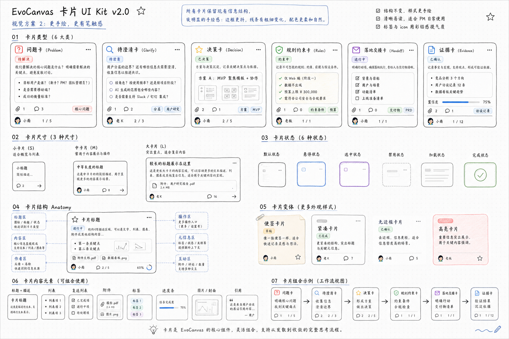
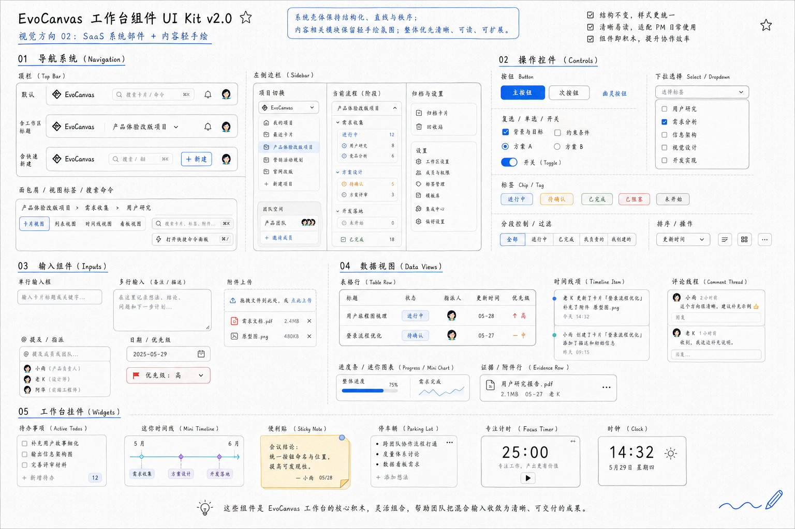

# EvoCanvas UI 风格与组件规范

## 1. 文档信息

| 项目 | 内容 |
| --- | --- |
| 文档名称 | EvoCanvas UI 风格与组件规范 |
| 文档类型 | 视觉与组件规范文档 |
| 对应产品 | EvoCanvas 1.0 |
| 对应主 PRD | [EvoCanvas1.0-PRD.md](/Users/apple/Desktop/evocanvas/docs/vision/EvoCanvas1.0-PRD.md) |
| 相关模块文档 | [cards.md](/Users/apple/Desktop/evocanvas/docs/vision/modules/cards.md)、[widgets.md](/Users/apple/Desktop/evocanvas/docs/vision/modules/widgets.md) |
| 相关前端契约 | [02 Frontend Contract（前端工作台契约）.md](/Users/apple/Desktop/evocanvas/docs/technical-specs/02%20Frontend%20Contract%EF%BC%88%E5%89%8D%E7%AB%AF%E5%B7%A5%E4%BD%9C%E5%8F%B0%E5%A5%91%E7%BA%A6%EF%BC%89.md) |
| 参考视觉稿 | `卡片 UI Kit v2.0`、`工作台组件 UI Kit v2.0` |
| 修订日期 | 2026-06-29 |

---

## 2. 参考视觉稿

以下两张图是本规范的直接视觉来源，分别对应内容对象层与工作台系统组件层。

### 2.1 卡片 UI Kit

### 2.2 工作台组件 UI Kit

这两张图在本规范中的职责分工如下：

1. `卡片 UI Kit` 负责定义卡片类型、卡面结构、状态表达与内容承接方式。
2. `工作台组件 UI Kit` 负责定义导航、控件、输入、数据视图与挂件的系统外壳。
3. 当两张图存在风格差异时，以“系统壳更 SaaS、内容对象更轻手绘”的统一原则收束。

---

## 3. 文档目标

本文件用于把当前两张 UI kit 方案图，沉淀为一套可复用、可讨论、可落地的 EvoCanvas 平台级 UI 规范。

它回答四件事：

1. EvoCanvas 整个平台看起来应该像什么。
2. 它为什么不是传统 SaaS 后台，也不是自由白板。
3. 哪些区域该偏系统化，哪些区域该带一点手绘温度。
4. 前端、设计与产品在继续扩展页面和组件时，应该遵守哪些边界。

本文件优先服务于 EvoCanvas 1.0 当前外层体验旅程：

`感觉接入 -> 对话塑形 -> 结构收敛 -> 画布显影 -> 结构化交接`

其中 `结构收敛` 的内部闭环为：

`输入编译 -> 待澄清问题 -> 约束 / 待决策 -> 结构化交接物`

因此，它不是一份“未来所有页面的大全”，而是一份围绕 1.0 真正成立范围的视觉与组件规范。

---

## 4. 平台定位

### 4.1 产品定位

EvoCanvas 不是 PRD 生成器，也不是自由白板工具，更不是完整项目管理后台。

它是一个以 `Vibe Shaping` 为核心的持续演化工作画布，首要服务产品经理，但不只服务产品经理，也服务其他需要把模糊感觉收成结构化判断的产品思考者。它先通过对话接住和塑形模糊感觉，再把相对稳定的结构显影到画布，用来暴露不确定性、沉淀约束、形成待决策，并最终收束为结构化交接物。

### 4.2 视觉定位

EvoCanvas 的 UI 也必须服务这个定位：

1. 不能做成标准“控制台后台”，否则会把产品误读成流程管理系统。
2. 不能做成过度自由、过度玩具化的白板，否则会削弱结构感与可信度。
3. 不能做成纯手绘风，否则会损失 PM 日常使用需要的清晰度、秩序感与效率感。

因此，推荐的总体视觉方向是：

`结构是 SaaS，内容有温度`

更具体地说：

1. 系统外壳保留 SaaS 的秩序、对齐、直线和可扫描性。
2. 内容对象保留一点手写式的轻松感与人味，用来表达“思考正在发生”。
3. 整体基调应让用户感到：清晰、可信、轻松、能推进，而不是压迫、冰冷或花哨。

### 4.3 关键词

EvoCanvas 的平台气质建议统一为以下关键词：

1. 收束感
2. 清晰感
3. 成形感
4. 演化感
5. 人味
6. 可交付

不建议使用的关键词：

1. 炫技
2. 监控台
3. 游戏化
4. 情绪化手账
5. 重运营工具感

---

## 5. 总体视觉策略

### 5.1 双层视觉系统

平台视觉应被明确拆成两个层次：

#### A. 系统壳层

适用对象：

1. 顶栏
2. 侧栏
3. 面包屑
4. 视图切换
5. 搜索 / 快捷命令
6. 表单壳
7. 控件壳
8. 数据行壳

设计原则：

1. 直线、规整、干净。
2. 间距有秩序。
3. 对齐和留白优先于装饰。
4. 让用户一眼理解结构。

#### B. 内容对象层

适用对象：

1. 卡片
2. 证据内容承接块
3. 便签
4. 停车区
5. 内容相关的轻提示
6. 轻量插图式说明

设计原则：

1. 保留轻微手绘感。
2. 边框可有极轻的笔触变化，但不能失控。
3. 颜色更柔和、质感更自然。
4. 目的是增加可亲近感，不是做装饰噪音。

### 5.2 核心比例关系

从整个平台看，建议控制为：

1. `70% - 80%` 系统壳层
2. `20% - 30%` 内容对象层的轻手绘表达

这意味着：

1. 导航、系统控件、表单、列表、视图切换，默认都应偏 SaaS。
2. 只有真正承接思考内容的模块，才值得加入手写感与轻笔触。
3. 手绘感是“增强识别与气质”的辅助手段，不是平台主结构。

### 5.3 视觉优先级

所有页面和组件都应服从这条优先级：

1. 清晰可读
2. 结构稳定
3. 操作可扫
4. 内容有温度
5. 风格表达

任何为了“更特别”而牺牲阅读效率的做法，都不应进入正式产品主路径。

---

## 6. 色彩系统

以下为建议值，可作为设计 token 的起点，而不是唯一死值。

### 6.1 基础中性色

| 语义 | 建议值 | 用途 |
| --- | --- | --- |
| 背景底色 | `#FCFAF5` | 页面底色、画布底色、板式底色 |
| 网格辅助点 | `#E9E3D8` | 点状纸感背景、低存在感结构纹理 |
| 主文字 | `#1E1E1B` | 标题、主要信息、重点文本 |
| 次级文字 | `#5B5B55` | 次级说明、摘要、辅助标签 |
| 弱文字 | `#8D8D86` | placeholder、空状态、弱提示 |
| 主边框 | `#262626` | 系统壳、卡片主轮廓 |
| 弱边框 | `#D8D3C8` | 分隔线、辅助轮廓、输入框默认边框 |

### 6.2 主强调色

| 语义 | 建议值 | 用途 |
| --- | --- | --- |
| 品牌蓝 | `#2F6DF6` | 主按钮、活动态、重点链接、选中态 |
| 蓝色浅底 | `#EAF2FF` | 选中背景、说明标签浅底 |
| 蓝色线框 | `#8FB4FF` | 说明框、蓝色提示轮廓、轻强调边界 |

### 6.3 辅助语义色

| 语义 | 建议值 | 用途 |
| --- | --- | --- |
| 成功绿 | `#4E9B59` | 已完成、已确认、通过态 |
| 绿色浅底 | `#EAF7EC` | 成功标签背景 |
| 警示橙 | `#E3A23B` | 待确认、需要注意、临时状态 |
| 橙色浅底 | `#FFF4E2` | 警示标签背景 |
| 风险红 | `#DF6B5D` | 阻塞、异常、需裁决 |
| 红色浅底 | `#FDECEC` | 风险标签背景 |
| 紫色辅助 | `#8B67D9` | 选中描边、时间点、弱装饰分组 |

### 6.4 用色原则

1. 平台基色应以黑、灰、米白、蓝为主。
2. 绿、橙、红、紫只用于状态和辅助区分，不应大面积铺底。
3. 避免大面积高饱和纯色。
4. 避免强对比深色背景，因为当前产品核心是“长时间工作台阅读”，而不是展示型营销页。

---

## 7. 字体与排版

### 7.1 字体角色分工

平台字体建议拆成两类角色：

#### A. 运行态字体

用于：

1. 正文
2. 按钮
3. 表单
4. 列表
5. 卡片内容
6. 导航

要求：

1. 无衬线
2. 中文显示稳定
3. 数字清晰
4. 适合长时间阅读

建议方向：

1. 中文优先现代无衬线
2. 英文与数字搭配系统无衬线

#### B. 板式说明字体

用于：

1. UI kit 标题
2. 注释说明
3. 局部手写感标签

要求：

1. 有轻微书写感
2. 不应影响可读性
3. 不进入主产品高频交互正文

### 7.2 字号建议

| 层级 | 建议字号 |
| --- | --- |
| 页面大标题 | 28 - 34px |
| 分区标题 | 20 - 24px |
| 组件标题 | 15 - 17px |
| 正文主字号 | 14 - 16px |
| 辅助说明 | 12 - 13px |
| 标签 / chip | 11 - 12px |

### 7.3 排版原则

1. 行长适中，避免大段横向长文。
2. 标题与正文之间要有明显层级差。
3. 注释文字应短、轻、信息密度高。
4. 一屏内优先让用户先读懂结构，再读懂内容。

---

## 8. 形状、边框与质感

### 8.1 圆角策略

| 组件类型 | 建议圆角 |
| --- | --- |
| 顶栏 / 侧栏 / 输入框 / 选择器 | 10 - 12px |
| 按钮 / 标签 / badge | 8 - 12px |
| 数据容器 / 列表壳 | 12 - 14px |
| 卡片 | 14 - 16px |
| 便签 / 轻挂件 | 16 - 18px |

### 8.2 边框策略

1. 系统壳层默认 `1px` 清晰边框。
2. 系统组件优先直边与稳定轮廓。
3. 内容对象层可允许轻微线宽起伏，但肉眼不应觉得“歪”。
4. 手绘感应来自边线微差与局部笔触，不应来自结构失控。

### 8.3 阴影策略

1. 阴影应极轻，只承担层级分离。
2. 不建议使用明显投射阴影制造“漂浮 UI”。
3. 内容对象可用非常淡的暖灰阴影增强纸张感。

### 8.4 背景质感

1. 页面大底建议为暖白色。
2. 可加极淡点阵纸感背景。
3. 纹理只用于提升氛围，不用于制造存在感。
4. 主交互区不应出现重纹理或噪点。

---

## 9. 图标与插图

### 9.1 图标风格

1. 以线性图标为主。
2. 线宽统一，建议 `1.75 - 2px`。
3. 默认使用单色描边。
4. 只有警示、完成等强语义状态允许小面积实心强调。

### 9.2 图标语气

1. 图标应偏功能型，不偏装饰型。
2. 避免大面积使用拟物插图。
3. 允许在 UI kit 文档中加入少量星标、波浪、回形针等板式元素，但正式运行态要克制。

---

## 10. 页面层级与平台视觉分层

### 10.1 平台层级

建议将 EvoCanvas 页面理解为四层：

1. `平台层`
   顶栏、侧栏、全局导航、入口切换。
2. `工作台层`
   视图标签、搜索、命令、操作带、底层布局骨架。
3. `对象层`
   卡片、表单、数据视图、交接承接区。
4. `辅助层`
   系统挂件、个人挂件、轻提示、局部说明。

### 10.2 页面视觉职责

#### A. Landing / 输入入口

气质要求：

1. 接住输入
2. 降低开始成本
3. 不要太像表单页

表现建议：

1. 大输入区或多材料接入区占据视觉中心。
2. 辅助文案更像“陪你开始整理”，而不是“请填写字段”。
3. 可带一点更明显的内容手感，但骨架仍需清晰。

#### B. Recent Projects / 最近项目

气质要求：

1. 快速回到工作
2. 看到最近推进痕迹
3. 不是项目管理看板

表现建议：

1. 卡片或列表可展示轻量摘要与最近更新时间。
2. 不要过度 KPI 化。
3. 缩略内容应服务“识别项目”，不是服务“监控项目”。

#### C. Workspace / 主工作台

气质要求：

1. 是平台核心
2. 结构必须最稳
3. 内容对象与系统壳必须清晰分层

表现建议：

1. 导航和视图切换保持 SaaS 清晰度。
2. 卡片、证据、挂件等内容对象保留轻微人味。
3. 整体要像“会持续工作很久的台面”，而不是“一次性演示板”。

#### D. Handoff / 结构化交接物

气质要求：

1. 比工作台更收束
2. 信息更稳定
3. 可阅读、可确认、可传递

表现建议：

1. 降低手绘感比例。
2. 提高结构感与阅读感。
3. 强调“来源、确认、未决项”的可追溯性。

注：AI 助手是产品中的真实协作对象，但本轮文档不展开其独立组件规范，后续可单独补一份 AI 协作面样式文档。

---

## 11. 卡片系统规范

本节主要承接 `卡片 UI Kit v2.0`，并与卡片模块文档保持一致。

### 11.1 卡片在平台中的角色

卡片是正式业务对象，不是随手贴纸。

卡片在视觉上必须同时满足两件事：

1. 让人一眼知道“这是一条可推进对象”。
2. 让人感到“它承接的是思考中的内容，不是数据库行”。

### 11.2 基础卡片类型

首版统一为六类：

1. 问题卡（Problem）
2. 待澄清卡（Clarify）
3. 决策 / 承接卡（Decision）
4. 规则约束卡（Rules）
5. 交接承接卡（Handoff）
6. 证据卡（Evidence）

### 11.3 通用卡面结构

所有卡片建议遵循以下结构：

1. 顶部区
   类型图标、标题、状态、小操作位
2. 内容区
   摘要、列表、附件、进度、图示等
3. 元信息区
   标签、引用数、评论数、来源数、优先级
4. 底部协作区
   责任人、进度、当前分母、更新时间等

### 11.4 卡片尺寸

建议至少保留三种尺寸：

1. 小卡（S）
   适合列表式快速扫读
2. 中卡（M）
   适合默认工作态
3. 大卡（L）
   适合承接更复杂内容、附件或多个信息块

### 11.5 卡片状态

建议保留显式状态，但状态表达要轻量，不应喧宾夺主。

建议使用：

1. 默认
2. 悬停
3. 选中
4. 禁用
5. 加载中
6. 完成 / 已确认

状态表达手段优先级：

1. 细边框变化
2. 芯片状态变化
3. 图标和说明变化
4. 极轻底色变化

不建议依赖大面积重色块表达状态。

### 11.6 卡片变体

允许保留以下低成本变体：

1. 便签式卡片
2. 紧凑卡片
3. 无边框卡片
4. 高亮卡片

但变体不能改变卡片是正式业务对象这一事实边界。

### 11.7 卡片内容元素

卡片内可组合以下内容：

1. 标题与描述
2. 项目列表
3. 复选列表
4. 附件
5. 标签
6. 进度条
7. 图片 / 缩略封面
8. 引用内容

建议原则：

1. 优先短内容组合。
2. 单卡不承接长篇正文。
3. 卡片更多用于“外化对象”，不是用于“容纳全文”。

---

## 12. 工作台组件规范

本节主要承接 `工作台组件 UI Kit v2.0`。

### 12.1 导航系统（Navigation）

导航系统是整个平台最 SaaS、最结构化的部分，也是整个平台稳定感的来源。

建议包含：

1. 顶栏（Top Bar）
2. 左侧边栏（Sidebar）
3. 面包屑（Breadcrumb）
4. 视图标签（View Tabs）
5. 搜索 / 快捷命令（Search / Command）

设计要求：

1. 直边、规整、间距稳定。
2. 活动态以蓝色描边或浅蓝底表达。
3. 输入与按钮对齐严格。
4. 导航不要带手绘边框。

导航的目标不是“体现个性”，而是：

1. 提供稳定路径
2. 建立工作台心智
3. 降低切换成本

### 12.2 操作控件（Controls）

建议统一覆盖：

1. 主按钮
2. 次按钮
3. 幽灵按钮
4. 下拉选择
5. 复选框
6. 单选框
7. 开关
8. 标签 / chip
9. 分段筛选

设计要求：

1. 默认干净，不追求装饰。
2. 主按钮只在真正主动作上使用品牌蓝。
3. 次按钮与幽灵按钮层级要清晰。
4. 状态标签要小、准、轻。

### 12.3 输入组件（Inputs）

建议统一覆盖：

1. 单行输入框
2. 多行备注框
3. 附件上传行
4. @ 提及 / 指派选择
5. 日期字段
6. 优先级字段

设计要求：

1. 输入壳应偏系统感，不使用手绘外轮廓。
2. 内容 placeholder 语气应像协作提示，不像行政表单。
3. 文件上传行应明显支持“来源型材料”识别。
4. 输入区的视觉重点是降低表达门槛，而不是提升表单完成感。

### 12.4 数据视图（Data Views）

建议统一覆盖：

1. 表格行
2. 列表行
3. 时间项
4. 评论线程片段
5. 进度条 / 迷你图
6. 证据行 / 附件行

设计要求：

1. 保持高信息密度，但不拥挤。
2. 默认以行结构承接信息，不做一堆小卡片套娃。
3. 证据行和交接相关行，应更强调来源与更新时间。
4. 评论线程要像协作痕迹，不像社交 feed。

### 12.5 工作台挂件（Widgets）

应区分两类：

#### A. 系统挂件

1. Active Todos
2. 项目时间轴

要求：

1. 来自系统投影
2. 不成为独立事实源
3. 外形轻、可钉住、可折叠

#### B. 个人挂件预留

1. 便签
2. 停车区
3. 时钟
4. 专注计时器

要求：

1. 更桌面化
2. 更轻工具化
3. 可带更明显一点的温度
4. 但默认不进入正式交接物

挂件的统一视觉原则：

1. 与卡片区分开
2. 比系统壳更轻
3. 比装饰物更有功能感

---

## 13. 交互与反馈原则

虽然本轮参考图没有展开完整反馈系统，但平台级规范仍需统一以下原则。

### 13.1 状态表达

平台中的状态应分成三类，不可混淆：

1. 业务状态
   如待澄清、已确认、已生效
2. 交互状态
   如 hover、selected、disabled、loading
3. 治理 / 确认状态
   如待你确认、需补依据、草稿未确认

### 13.2 反馈语气

反馈文案应符合 EvoCanvas 的协作气质：

1. 先说发生了什么
2. 再说还差什么
3. 最后说下一步可以做什么

避免：

1. 纯技术报错口吻
2. 情绪化训斥口吻
3. 含糊的“操作失败”

### 13.3 动效原则

EvoCanvas 不应依赖重动效表达高级感。

建议动效：

1. 微弱淡入淡出
2. 轻量位置过渡
3. 轻反馈缩放

不建议：

1. 大幅弹跳
2. 复杂视差
3. 持续动画背景

---

## 14. 页面与组件的禁区

以下做法不应进入 EvoCanvas 正式主路径：

1. 把整个平台做成深色监控台风格。
2. 把所有组件边框都变成夸张手绘线。
3. 把导航、输入、表格都做成手账风。
4. 让卡片承担长文阅读器职责。
5. 用大量重色卡片把工作台做成信息拼贴板。
6. 把挂件做成新的任务系统或日历系统。
7. 用大量装饰插图稀释工作密度。
8. 把交接物页面做成另一套完全无关的视觉体系。

---

## 15. 落地建议

### 15.1 设计落地顺序

建议先统一三层基础：

1. 视觉 token
2. 通用壳组件
3. 卡片 / 挂件协议

然后再推进页面级落地：

1. Landing / 输入入口
2. Workspace / 主工作台
3. Handoff / 结构化交接物

### 15.2 前端落地顺序

建议按以下顺序实现：

1. 先统一导航、按钮、输入、标签等系统壳组件
2. 再统一卡片尺寸、卡面结构和状态 token
3. 再统一数据视图与挂件外壳
4. 最后补齐页面级视觉细节

### 15.3 对齐原则

设计、前端、产品在评审时，应优先检查以下问题：

1. 这个模块看起来是否属于 EvoCanvas，而不是别的 SaaS。
2. 这个区域该不该有手绘感。
3. 它是否越界成了 1.0 不该有的功能。
4. 它是否提升了“收束”和“推进”，而不是只提升了“好看”。

---

## 16. 一句话总结

EvoCanvas 的视觉，不是“在 SaaS 上贴一点手绘皮肤”，也不是“把白板整理得更像后台”。

它更像一张能长期工作的产品经理桌面：

1. 外壳稳定
2. 内容可演化
3. 信息有结构
4. 思考有人味
5. 最终能够交付
