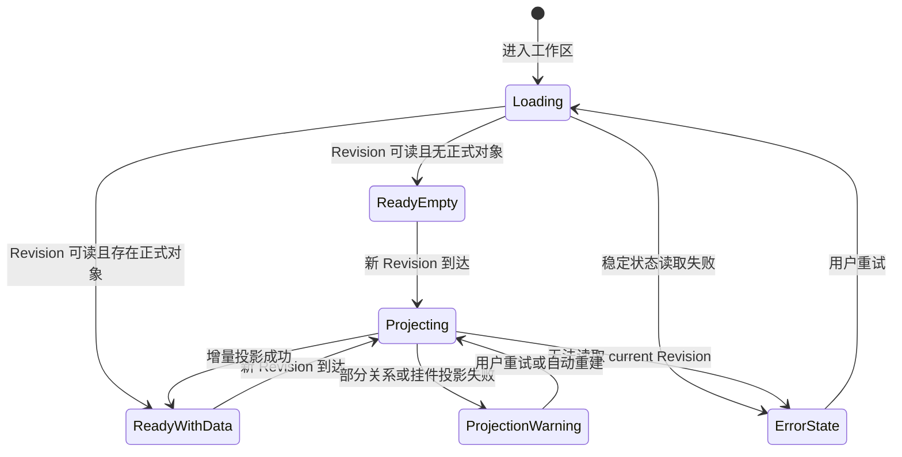

# EvoCanvas 1.0 主画布模块产品需求文档

## 1. 文档信息

| 项目 | 内容 |
| --- | --- |
| 模块名称 | 主画布（Canvas） |
| 文档类型 | 1.0 模块产品需求文档 |
| 对应主 PRD | [EvoCanvas1.0-PRD.md](../EvoCanvas1.0-PRD.md) |
| 对应主 PRD 版本 | V1.6 |
| 模块文档版本 | V1.0 |
| 当前状态 | 从主 PRD 拆分，待实现验证 |
| 修订日期 | 2026-09-09 |

本文档定义 EvoCanvas 主画布的页面结构、栏目语义、显影规则、布局交互、投影数据和验收要求。

主 PRD 是唯一产品真相源；本文档是主 PRD 纳入引用的规范性模块展开。若两者冲突，以主 PRD 为准，并应在同一轮修订中同步修正。

---

## 2. 模块定位

主画布是稳定结构的显影层，不是原始混沌输入的第一承载层，也不是可任意创建形状的自由白板。

它负责：

1. 将 current Workspace Artifact Revision 中的正式对象投影为卡片；
2. 通过栏目、聚类和轻量关系表达当前结构；
3. 承载系统挂件和个人挂件的工作台布局；
4. 提供对象查看、选择、排序、合法迁移和回源入口；
5. 在结构变化后进行增量显影，而不是整图重绘。

它不负责：

1. 保存新的业务事实；
2. 直接确认约束、决定或交接物；
3. 把拖拽位置解释为业务关系；
4. 代替 Primary Pi Session 或 Workspace Artifact。

---

## 3. 模块目标

1. 用户能够同时看到事实、问题、缺口、约束、待决策和交接准备状态。
2. 用户能够快速判断当前整体结构，而不必从长对话中翻找。
3. 用户能够沿来源、澄清、支持、阻塞、冲突和产出关系回看推进链路。
4. 未确认候选不提前显影，避免画布被不稳定内容污染。
5. 布局和挂件状态可以个性化，但不形成新的事实源。

---

## 4. 模块范围

### 4.1 1.0 必须范围

1. 连续画布工作区。
2. 六个语义栏目。
3. `discovery / define / handoff` 轻量阶段映射。
4. 已提交对象的卡片显影。
5. 卡片聚类、选择、详情、排序和合法迁移入口。
6. 六类轻量关系展示。
7. 右侧 AI 助手、底部工具栏和挂件的布局承载。
8. 空状态、加载、降级和投影失败处理。
9. 画布视口、对象位置和挂件布局的个性化持久化。

### 4.2 Out of Scope

1. 无限自由白板和任意图形创作。
2. 用横向无限扩张表达时间轴。
3. 复杂自动布局编辑器。
4. 全局复杂关系图谱和自动依赖推理。
5. 多人光标、实时协同和评论线程。
6. 把 Canvas 坐标、栏目或 Toast 作为稳定事实。

---

## 5. 页面布局

### 5.1 总体结构

工作区由以下区域组成：

1. 左侧全局导航：新对话、工作区、历史、知识库和设置。
2. 中央连续画布：栏目、卡片、关系线和漂移挂件。
3. 右侧 AI 助手：对话塑形、追问、确认和变化说明。
4. 底部工具栏：选择、关系、挂件等工作台操作入口。
5. 常驻系统挂件：项目时间轴和活跃缺口。
6. 内容超出当前视口时优先纵向扩展和滚动；首版不依赖横向无限扩张承载主流程，平移与缩放主要用于聚焦和局部浏览。

### 5.2 视觉层级

从事实权威到纯展示依次为：

```text
Workspace Artifact Revision
        ↓ 确定性投影
正式卡片与关系
        ↓ 派生计算
栏目分组与系统挂件
        ↓ 个性化展示
坐标、折叠、缩放、选中与 Toast
```

下层不得反向覆盖上层。

---

## 6. 栏目与阶段映射

### 6.1 六个栏目

| 栏目 | 主要承载 | 用户要回答的问题 |
| --- | --- | --- |
| 探索发现 | 证据、输入线索、初步观察 | 我们目前看到了什么？ |
| 焦点问题 | 问题卡 | 真正需要解决的问题是什么？ |
| 待澄清项 | 待澄清卡 | 哪些地方还没有讲清楚？ |
| 规则约束 | 约束卡 | 哪些边界已经被固定？ |
| 方案与决策 | 待决策 / 方案承接卡 | 哪些事项需要判断或已经决定？ |
| 落地交接 | 交接物承接卡 | 当前结果是否可以交给下一位人或 AI？ |

栏目只表达主要归属；对象关系和状态仍由正式对象模型决定。

### 6.2 轻量阶段映射

| 阶段 | 对应栏目 | 说明 |
| --- | --- | --- |
| discovery | 探索发现、焦点问题 | 识别输入和问题，不急于固定结论 |
| define | 待澄清项、规则约束、方案与决策 | 处理缺口、边界与必须拍板的事项 |
| handoff | 落地交接 | 汇总稳定结构与仍存未决 |

阶段映射用于视觉分组和当前位置提示，不形成独立可写状态机。

### 6.3 栏目展示规则

1. 栏目之间不使用厚重硬边框切割，保持连续画布感。
2. 栏目标题和背景层级应足够清晰，使用户可以快速定位。
3. 空栏目可以保留轻量占位或在空间不足时隐藏，但不得用大面积说明文案制造信息已完整的错觉。
4. 栏目宽度表达逻辑结构，不表达持续时间或完成比例。
5. 对象跨栏目移动必须遵守 [卡片模块](./cards.md) 的合法迁移规则。

---

## 7. 显影规则

### 7.1 可显影内容

1. 已写入 current Revision 的正式卡片对象。
2. 已写入或可确定性派生的正式关系。
3. 从正式对象状态派生的冲突、阻塞和活跃缺口提示。
4. 从正式状态和用户设置派生的项目时间轴提示。
5. 已确认结构化包版本对应的交接物承接卡。

### 7.2 不可显影内容

1. Primary Pi Session 中未确认的候选。
2. 普通 Assistant 总结或搜索摘要。
3. 工具读取但尚未完成来源完整性检查的内容。
4. 个人挂件中的临时文本。
5. 运行结果未知的结构化提议。

### 7.3 增量显影

1. 新 Revision 只更新受影响的卡片、关系和挂件投影。
2. 未受影响对象的坐标、选中状态和折叠状态尽量保持。
3. 新对象优先出现在所属栏目可见区域，不遮挡当前焦点。
4. 大范围重建时应说明“正在重新构建投影”，但重建本身不产生新 Revision。
5. 投影可以由 current Revision 重建，Canvas 不保存独立业务正文。

---

## 8. 卡片排布与关系展示

### 8.1 排布与聚类

1. 同类卡片在所属栏目内保持稳定聚类。
2. 卡片默认按用户手动顺序、最近变化和阻塞重要性综合展示；具体顺序不得被解释为新的业务优先级。
3. 用户手动排序只修改展示元数据，除非该动作同时包含明确的语义状态迁移。
4. 重新加载后应恢复用户布局；恢复失败时可根据正式对象重新生成默认布局。
5. 长画布应支持平移、缩放和聚焦选中对象。

### 8.2 关系类型

首版支持：

1. 来源于
2. 澄清了
3. 支持
4. 阻塞
5. 冲突于
6. 产出为

关系对象的定义、创建和有效状态由 [卡片模块](./cards.md) 维护。

### 8.3 关系线展示

1. 默认使用轻量线条，避免关系线压过卡片内容。
2. 悬停或选中卡片时，高亮直接关联关系。
3. 关系文本在悬停、选中或详情中展示，不要求全量常驻。
4. 关系过多时优先展示局部关系，允许隐藏非当前焦点线。
5. 关系解析失败时先展示卡片本体，并提供降级提示。

---

## 9. 核心交互

### 9.1 浏览与聚焦

1. 平移和缩放画布。
2. 点击卡片选中并打开详情。
3. 从卡片定位来源、关联卡片或交接版本。
4. 从 Active Todos 定位回源卡。
5. 从 AI 对话中的对象引用聚焦到对应卡片。

### 9.2 直接编辑与迁移

1. 卡片标题和摘要可按 [卡片模块](./cards.md) 的规则原地编辑。
2. 用户可在栏目内排序。
3. 合法跨栏目迁移可以通过拖拽或详情操作触发。
4. 需要语义确认的迁移必须展示变化含义，不能只因坐标越过边界就改变业务状态。
5. 稳定对象的语义编辑仍通过统一提交能力生成 Revision。

### 9.3 挂件操作

1. 通过底部工具栏打开挂件面板。
2. 系统挂件和个人挂件按 [挂件模块](./widgets.md) 执行移动、pin、折叠和关闭。
3. 挂件操作不得修改正式卡片或关系。

---

## 10. 空状态与页面状态

### 10.1 空状态

首次进入无稳定对象的工作区时：

1. 保留六栏目轻量结构或简化工作面提示。
2. 引导用户在右侧输入一句感觉或导入材料。
3. 不展示大量模板或后台导航选项。
4. 不自动生成演示卡片冒充用户数据。

### 10.2 页面状态机



### 10.3 异常要求

| 场景 | 处理要求 |
| --- | --- |
| current Revision 读取失败 | 不展示旧缓存为最新事实；允许普通对话但禁止稳定写入 |
| 卡片投影失败 | 显示投影失败，不删除底层对象 |
| 关系投影失败 | 展示卡片本体，隐藏异常关系并允许重建 |
| 布局数据损坏 | 重建默认布局，不修改业务对象 |
| 挂件投影失败 | 回退到源卡视角，不保留失效 Todo |
| 增量更新冲突 | 重新读取 current Revision，保持未受影响的个性化布局 |

---

## 11. 数据口径

### 11.1 Canvas Projection（画布投影）

画布投影至少包含：

1. 基础 Revision ID。
2. 卡片 ID、类型、状态和所属栏目。
3. 关系 ID、起点、终点、类型和有效状态。
4. 系统挂件引用的对象集合与计算版本。
5. 投影生成时间和投影版本。

投影不复制完整来源正文、Session 对话或独立交接正文。

### 11.2 个性化展示状态

1. 画布平移与缩放。
2. 卡片显示坐标和用户排序。
3. 当前选中对象。
4. 挂件位置、pin、折叠和关闭状态。
5. 临时筛选与局部关系显示状态。

这些状态可以独立保存，但不得影响对象事实、关系事实或交接状态。

---

## 12. 规则集（Rule Set）

| 规则 ID | 规则内容 | 触发条件 | 优先级 | 影响范围 |
| --- | --- | --- | --- | --- |
| CVS-R-001 | Canvas 只投影 current Revision 中的正式对象和确定性派生结果 | 加载或更新画布 | 高 | 事实边界 |
| CVS-R-002 | 未确认候选、普通总结和运行结果未知内容不得显影 | Session 产生候选 | 高 | 信任与展示 |
| CVS-R-003 | 画布坐标、拖拽和排序默认只属于展示元数据 | 用户调整布局 | 高 | 数据模型 |
| CVS-R-004 | 跨栏目迁移必须按对象语义执行，不能由坐标越界自动触发 | 拖拽卡片 | 高 | 交互与状态 |
| CVS-R-005 | 投影更新应增量执行并尽量保留未受影响的用户布局 | 新 Revision 到达 | 中 | 可用性 |
| CVS-R-006 | 关系过多时优先局部展示，关系异常不得阻塞卡片本体 | 关系渲染 | 中 | 可读性 |
| CVS-R-007 | 投影或索引可以从稳定状态重建，重建不得创建新 Revision | 恢复或重建 | 高 | 恢复边界 |
| CVS-R-008 | current Revision 不可确认时不得把旧缓存显示为最新事实 | 稳定读取失败 | 高 | 安全与降级 |
| CVS-R-009 | 系统挂件必须回指正式对象或确定性计算结果 | 挂件显示 | 高 | 事实边界 |

---

## 13. 验收标准

### AC-01 功能正确性

1. 用户能在连续画布中识别六个语义栏目和三段轻量阶段。（CVS-R-001）
2. 新 Revision 到达后，新增或更新对象能在正确栏目显影。（CVS-R-001、CVS-R-005）
3. 用户可以选择卡片、查看详情、定位来源和直接关联对象。（CVS-R-006）
4. 用户可以在栏目内排序，并通过合法路径执行跨栏目迁移。（CVS-R-003、CVS-R-004）

### AC-02 行为一致性

1. 普通 Chat 和未确认候选不会在画布生成正式卡片。（CVS-R-002）
2. 仅拖动卡片位置不会改变对象类型、状态或关系。（CVS-R-003）
3. 新 Revision 的局部变化不会无故重置其他卡片和挂件布局。（CVS-R-005）
4. Active Todos、时间轴等系统挂件均可定位到上游对象或计算依据。（CVS-R-009）
5. 删除布局缓存后，画布可重建且不产生新 Revision。（CVS-R-007）

### AC-03 异常处理一致性

1. 关系解析失败时仍能看到卡片本体，并可触发重建。（CVS-R-006）
2. 布局数据损坏时只重建布局，不丢失或修改正式对象。（CVS-R-007）
3. current Revision 读取失败时，界面不会把旧缓存标成最新状态，也不允许稳定写入。（CVS-R-008）
4. Todo 投影失败时回退到源卡入口，不保留失效的独立 Todo。（CVS-R-009）

---

## 14. 上下游关系

| 模块 | 关系 |
| --- | --- |
| [输入与对话塑形](./input-and-dialogue.md) | 产生经确认的结构变化；选中卡片可作为对话上下文 |
| [卡片](./cards.md) | 定义卡片对象、关系、状态和合法迁移 |
| [挂件](./widgets.md) | 定义系统挂件和个人挂件的显示与交互 |
| [结构化交接](./handoff.md) | 交接物承接卡是交接包版本的只读投影 |
| [项目知识库](./knowledge-base.md) | 知识图谱是独立页面，不嵌入或替代主画布 |

---

## 15. 需求覆盖

| 原主 PRD 内容 | 新落点 | 覆盖状态 |
| --- | --- | --- |
| 原 §7.5 画布显影流程 | §7 | 已覆盖 |
| 原 §8.2 主画布 | §5—§10 | 已覆盖 |
| 原 §8.5 卡片关系展示 | §8 | 已覆盖，关系对象定义由 cards.md 承接 |
| 原 §9.3 关系结构口径 | §8、§11 | 已覆盖 |
| 原 §10 中画布权限与异常 | §2、§10、§12 | 已覆盖 |
| 原 §11.3 画布结构验收 | §13 | 已覆盖 |
