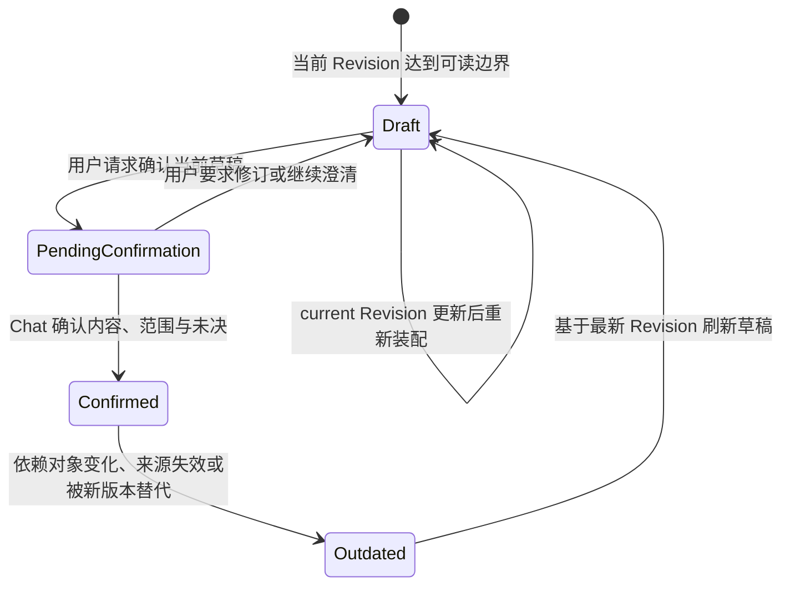
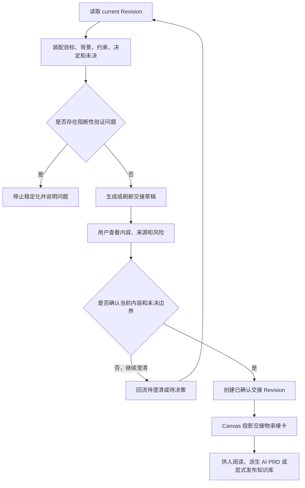

# EvoCanvas 1.0 结构化交接模块产品需求文档

## 1. 文档信息

| 项目 | 内容 |
| --- | --- |
| 模块名称 | 结构化交接（Structured Handoff） |
| 文档类型 | 1.0 模块产品需求文档 |
| 对应主 PRD | [EvoCanvas1.0-PRD.md](../EvoCanvas1.0-PRD.md) |
| 对应主 PRD 版本 | V1.6 |
| 模块文档版本 | V1.0 |
| 当前状态 | 从主 PRD 拆分，待实现验证 |
| 修订日期 | 2026-09-09 |

本文档定义结构化交接物的内容边界、版本模型、生成与确认流程、过时与回流规则、面向 AI 的 PRD 派生和知识库发布关系。

主 PRD 是唯一产品真相源；本文档是主 PRD 纳入引用的规范性模块展开。若两者冲突，以主 PRD 为准，并应在同一轮修订中同步修正。

---

## 2. 模块定位

结构化交接是 EvoCanvas 1.0 的最终产品输出环节，用于把当前已经稳定的目标、来源、约束、决定和未决边界组织成下一位人或下游 AI 可以继续推进的上下文。

结构化交接物：

1. 是当前 Workspace Artifact Revision 的治理视图；
2. 与日常结构化工作包共用同一个 `package_id` 和不可变版本链；
3. 不复制一份可独立修改的第二正文；
4. 可以保留明确、范围清楚且来源可追溯的未决项；
5. 只有用户确认内容、范围和未决边界后，才可作为正式交接依据；
6. 可以进一步派生为面向 AI 的 PRD，但不等于传统完整 PRD 或 machine spec。

---

## 3. 模块目标

### 3.1 用户目标

1. 用户能快速回答“当前到底想清楚了什么”。
2. 接手者无需重读全部聊天即可理解目标、背景、约束和决定。
3. 仍未解决的问题不会被隐藏或伪装成结论。
4. 底层约束变化后，用户能识别旧交接物已经过时。
5. 同一交接物可被人阅读，也可作为下游 AI 的稳定输入。

### 3.2 产品目标

1. 验证 EvoCanvas 是否真正降低需求交接失真。
2. 把“想明白”的结果变成可继续推进的最小稳定上下文。
3. 保持交接视图与 Workspace Artifact 的单一事实链。
4. 建立交接确认、版本、过时、回流和发布的清晰治理边界。

---

## 4. 模块范围

### 4.1 1.0 必须范围

1. 交接草稿生成与刷新。
2. 交接内容的来源和范围检查。
3. 未决问题与待确认决策的显式保留。
4. 用户在 Chat 中确认交接版本。
5. 已确认交接物的只读展示和版本回看。
6. 底层事实变化后的过时判定。
7. 从交接物回流到待澄清或待决策。
8. 面向 AI 的 PRD 派生。
9. 将已确认交接物显式发布为项目知识库来源。

### 4.2 Out of Scope

1. 完整 PRD 编辑器。
2. 自动生成高保真原型。
3. 完整任务拆解和交付编排。
4. 下游 AI 反向参与 EvoCanvas 内部澄清。
5. 未确认交接物自动外发或发布到知识库。
6. 为交接视图维护独立于 Workspace Artifact 的状态账本。
7. 把全部聊天原样导出为交接物。

---

## 5. 交接就绪条件

### 5.1 可生成草稿

当当前主题至少具备以下可读边界时，可以生成交接草稿：

1. 当前目标可以被明确描述。
2. 关键背景输入可以被回指。
3. 已确认约束与已完成决定可以区分。
4. 关键待澄清和待确认决策已经被显式列出。
5. 当前 Revision 可读取且来源验证没有阻断性错误。

“可生成草稿”不等于“可正式交接”。

### 5.2 可正式确认

交接版本正式确认前必须满足：

1. 目标、范围和受众明确。
2. 已确认约束与决定可追溯到生效对象和确认依据。
3. 阻塞性交接的关键缺口已经解决，或由用户明确接受为未决边界。
4. 来源不可用、冲突或警告已经向用户展示。
5. 用户在正常 Chat 中确认当前版本的内容和未决范围。

交接就绪不是简单的卡片数量、置信分或阶段进度计算结果。

---

## 6. 交接物内容结构

每份交接物至少包含：

| 内容模块 | 说明 |
| --- | --- |
| 当前主题与目标 | 当前要解决的问题、目标用户与期望结果 |
| 背景输入摘要 | 支撑当前判断的关键来源，不复制全部原文 |
| 已确认约束 | 已生效且仍适用的边界、规则和口径 |
| 已完成决策 | 已经由用户确认的关键判断及其影响范围 |
| 仍未解决的问题 | 已固定为真实未决、但尚未得到答案的事项 |
| 待确认决策 | 已明确需要拍板但尚未完成确认的事项 |
| 推荐后续动作 | 接手者可以继续执行的下一步建议 |
| 风险与例外 | 来源警告、冲突、条件和明确接受的风险 |
| 关键来源引用 | 指向来源版本、正式对象和确认依据 |
| 版本信息 | package、Revision、交接版本、状态和生成时间 |

### 6.1 内容原则

1. 交接主体来自稳定对象和已确认包版本，不来自自由拼接的聊天摘要。
2. 未决项只在其存在、范围和来源已经被用户固定时进入交接。
3. 未决项不得写成已完成决策；建议不得伪装成已确认约束。
4. 交接内容应该足以继续推进，但不追求包含所有历史细节。
5. 关键事实必须可回到来源或确认记录。

---

## 7. 页面与交互

### 7.1 入口

1. 主画布“落地交接”栏目中的交接物承接卡。
2. 右侧 AI 助手在满足草稿条件时提出“查看交接草稿”。
3. 工作区的交接状态入口。

交接物承接卡的卡面字段和通用交互见 [卡片模块](./cards.md)。

### 7.2 交接详情

详情至少展示：

1. 交接标题、当前状态和版本。
2. 当前目标与背景摘要。
3. 已确认约束、已完成决策和未决事项分组。
4. 推荐后续动作。
5. 风险、来源警告和过时原因。
6. 关键来源与确认记录入口。
7. 与上一版本的变化摘要。
8. 确认、继续澄清、派生 AI PRD、发布到知识库等动作。

### 7.3 核心操作

1. `生成 / 刷新草稿`：基于 current Revision 重新装配交接视图。
2. `继续澄清`：定位到待澄清或待决策，并回到右侧对话。
3. `确认当前版本`：在 Chat 中确认内容、范围和未决边界。
4. `查看来源`：回看正式对象、来源版本和确认依据。
5. `派生 AI PRD`：根据已确认交接版本生成面向下游 Agent 的需求输入。
6. `沉淀到知识库`：把已确认版本显式发布为不可变知识来源。

确认完成后不再询问“是否生成交接卡”；交接物承接卡由确认后的包版本自动投影。

---

## 8. 生命周期

### 8.1 状态

- 草稿中
- 待确认
- 已确认
- 已过时

底层交接治理可以记录 `suspended / invalidated / superseded` 等原因，但 Canvas 统一展示为“已过时”并保留具体原因。

### 8.2 状态流转

### 8.3 原子确认

如果 Assistant 已在 Chat 中完整展示交接内容、影响范围和未决，用户明确确认后，同一次原子提交可以直接形成已确认交接版本，不要求为了经过“待确认”而额外制造中间 Revision。

### 8.4 过时判定

以下情况可以使已确认交接物进入已过时：

1. 其引用的已生效约束被替代或归档。
2. 已完成决策被合法撤回、替代或影响范围变化。
3. 新的高影响冲突或阻塞性未决被确认进入 current Revision。
4. 关键来源失效、被反驳或权限不可用。
5. 新的已确认交接版本替代旧版本。

以下情况不应单独导致过时：

1. Canvas 坐标或排序变化。
2. 普通聊天讨论。
3. 未确认候选变化。
4. 挂件折叠、关闭或时间轴视觉变化。

---

## 9. 生成、确认与回流流程

完成判定：交接版本具有明确 Revision、确认依据、来源和未决边界；接手者不依赖原聊天也能继续推进。

---

## 10. 面向 AI 的 PRD 派生

### 10.1 定位

面向 AI 的 PRD 是从已确认交接物派生的下游输入，不是 EvoCanvas 内部的新的事实源。

### 10.2 最小内容

1. 目标与范围。
2. 用户与核心场景。
3. 已确认约束和决定。
4. 明确的 In Scope / Out of Scope。
5. 仍需下游保留或请求人处理的未决事项。
6. 关键来源引用。
7. 期望交付物和验证要求。
8. 交接版本与内容哈希。

### 10.3 派生规则

1. 只允许从已确认交接版本派生正式 AI PRD。
2. 派生文档必须标明源交接版本，不允许脱离来源后独立覆盖上游事实。
3. 对未决事项不得补写默认答案。
4. 下游 AI 用于实现、评审或任务拆解，不默认参与上游需求收敛。
5. 源交接物过时后，派生文档必须能够被识别为基于旧版本。

---

## 11. 与项目知识库的关系

1. 已确认交接物可以由用户显式发布到 [项目知识库](./knowledge-base.md)。
2. 发布时创建交接物来源快照，再由 LLM Wiki 编译相关页面。
3. 发布成功不等于知识页面全部编译成功。
4. 知识页面更新不得反向修改交接 Revision。
5. 未确认交接物、普通对话和未确认候选不能自动发布。
6. 从知识库重新引入的内容仍只作为来源输入，需要在当前工作区重新判断适用性。

---

## 12. 数据口径

### 12.1 交接引用

交接视图至少引用：

1. `package_id`。
2. current / handoff Revision ID。
3. 交接状态与状态原因。
4. 目标对象、来源、约束、决定和未决对象引用。
5. 确认主体与 Chat Entry 引用。
6. 内容哈希。
7. 创建、确认、过时和替代时间。

### 12.2 单一版本链

1. 交接物不维护独立于 Workspace Artifact 的可写正文。
2. 交接变化通过同一受治理提交能力形成不可变 Revision。
3. Canvas 卡片、只读详情和导出文档都是交接 Revision 的投影或派生。
4. 幂等确认必须返回原有交接版本，不重复创建等价 Revision。

### 12.3 变更摘要

交接版本变化至少说明：

1. 新增、删除或替代了哪些约束和决定。
2. 哪些未决被解决、增加或改变范围。
3. 哪些来源发生变化或失效。
4. 为什么旧版本过时。

---

## 13. 权限与异常

### 13.1 权限

1. 首版当前用户可生成、刷新和确认本工作区交接物。
2. Pi 可以生成交接候选，但不能绕过 Chat 确认把它变成已确认版本。
3. 正式外发、外部写入和知识库发布是独立动作，不因交接已确认自动执行。
4. 下游 AI 不拥有回写当前 Workspace Artifact 的默认权限。

### 13.2 异常处理

| 场景 | 处理要求 |
| --- | --- |
| current Revision 不可读 | 可以继续普通对话，但停止生成或确认交接版本 |
| 来源验证不通过 | 显示来源问题，不把相关内容写成稳定交接事实 |
| 关键未决未列出 | 阻止确认或要求用户明确接受该缺口 |
| 确认依据不完整 | 保留草稿，不创建已确认版本 |
| 版本冲突 | 读取最新 Revision，重新生成受影响部分并要求重新确认 |
| 投影失败 | 保留交接 Revision，提示 Canvas 投影异常 |
| 派生 AI PRD 失败 | 不影响已确认交接版本，允许重试派生 |
| 知识库发布失败 | 保留交接版本和来源快照状态，明确发布未完成 |

---

## 14. 规则集（Rule Set）

| 规则 ID | 规则内容 | 触发条件 | 优先级 | 影响范围 |
| --- | --- | --- | --- | --- |
| HOF-R-001 | 交接物必须与结构化工作包共用同一 package 和不可变 Revision 链 | 生成或更新交接 | 高 | 事实模型 |
| HOF-R-002 | 交接内容必须区分已确认事实、决定、未决和建议 | 装配交接 | 高 | 内容与信任 |
| HOF-R-003 | 未决项只有在存在、范围和来源已被固定时才能进入交接 | 装配未决 | 高 | 治理 |
| HOF-R-004 | 正式交接必须取得对内容、范围和未决边界的有效 Chat 确认 | 确认交接 | 高 | 状态与审计 |
| HOF-R-005 | 底层关键约束、决定或来源变化后，旧交接必须可判定为过时 | current Revision 更新 | 高 | 版本与提示 |
| HOF-R-006 | Canvas 卡片和导出文档只能投影或派生交接 Revision，不能成为第二事实源 | 显示或导出 | 高 | 投影边界 |
| HOF-R-007 | 面向 AI 的 PRD 只能从已确认交接版本派生并标记来源版本 | 派生 AI PRD | 高 | 下游交付 |
| HOF-R-008 | 外发和知识库发布必须由用户显式触发，不继承交接确认权限 | 外部副作用 | 高 | 权限与安全 |
| HOF-R-009 | 关键验证或稳定读取失败时不得生成新的正式交接版本 | 运行异常 | 高 | 安全与恢复 |
| HOF-R-010 | 交接版本必须提供变化摘要和来源回看入口 | 版本生成 | 中 | 可理解性 |

---

## 15. 验收标准

### AC-01 功能正确性

1. 当前主题具备可读边界时，系统可以生成包含目标、背景、约束、决定、未决、后续动作和来源的交接草稿。（HOF-R-001、HOF-R-002）
2. 用户在 Chat 中确认内容和未决边界后，系统生成已确认交接 Revision，并在 Canvas 显示承接卡。（HOF-R-004、HOF-R-006）
3. 已确认交接版本可以派生带源版本标记的面向 AI 的 PRD。（HOF-R-007）
4. 已确认交接版本可以由用户显式发布到项目知识库。（HOF-R-008）

### AC-02 行为一致性

1. 未决事项只在其存在和范围已被确认时进入交接，并保持“未决”身份。（HOF-R-002、HOF-R-003）
2. 普通对话、Canvas 布局变化和未确认候选不会使已确认交接物过时。（HOF-R-005）
3. 关键约束被替代后，旧交接物显示过时原因，且历史版本保持可读。（HOF-R-005）
4. 交接卡、详情和 AI PRD 不会形成可独立修改的第二套事实。（HOF-R-006、HOF-R-007）
5. 每个版本都能查看与上一版本的变化和关键来源。（HOF-R-010）

### AC-03 异常处理一致性

1. current Revision 或关键来源不可读时，不生成新的正式交接版本。（HOF-R-009）
2. 确认只覆盖部分内容时，只提交被确认范围，其余内容继续留在草稿或未决中。（HOF-R-004）
3. Canvas 投影失败时，已确认交接 Revision 不被回滚或复制为临时正文。（HOF-R-006）
4. AI PRD 派生或知识库发布失败时，不影响源交接版本，界面明确显示失败阶段。（HOF-R-007、HOF-R-008）

---

## 16. 上下游关系

| 模块 | 关系 |
| --- | --- |
| [输入与对话塑形](./input-and-dialogue.md) | 生成交接候选、完成 Chat 确认和回流澄清 |
| [主画布](./canvas.md) | 显示落地交接栏目与交接物承接卡 |
| [卡片](./cards.md) | 定义交接物承接卡的视觉投影和通用操作 |
| [挂件](./widgets.md) | 时间轴和 Active Todos 可以提示交接准备度，但不决定交接状态 |
| [项目知识库](./knowledge-base.md) | 接收已确认交接版本的显式发布，并向后续工作区提供知识引用 |

---

## 17. 需求覆盖

| 原主 PRD 内容 | 新落点 | 覆盖状态 |
| --- | --- | --- |
| 原 §7.8 结构化交接物流程 | §5、§8、§9 | 已覆盖 |
| 原 §8.3.11 交接物承接卡 | cards.md §6.6 与本文 §7 | 已覆盖 |
| 原 §9.10 结构化交接物口径 | §6、§12 | 已覆盖 |
| 原 §10.2—§10.3 交接状态与流转 | §8 | 已覆盖 |
| 原 §10.5 交接确认依据 | §5、§8、§13 | 已覆盖 |
| 原 §11.5 结构化交接物验收 | §15 | 已覆盖 |
| 面向 AI 的 PRD 边界 | §10 | 已覆盖 |
| 与 LLM Wiki 的发布关系 | §11 | 已覆盖 |
