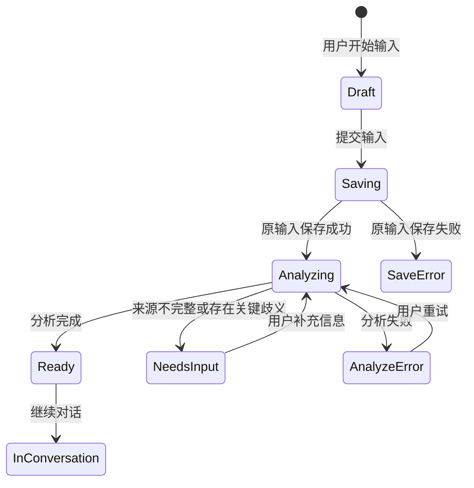
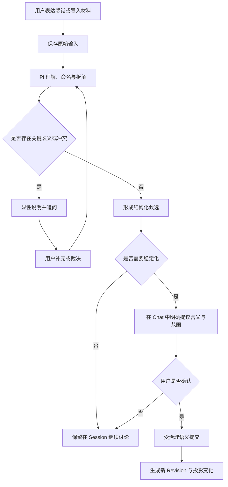

# EvoCanvas 1.0 输入与对话塑形模块产品需求文档

## 1. 文档信息

| 项目 | 内容 |
| --- | --- |
| 模块名称 | 输入与对话塑形（Input & Dialogue Shaping） |
| 文档类型 | 1.0 模块产品需求文档 |
| 对应主 PRD | [EvoCanvas1.0-PRD.md](../EvoCanvas1.0-PRD.md) |
| 对应主 PRD 版本 | V1.6 |
| 模块文档版本 | V1.0 |
| 当前状态 | 从主 PRD 拆分，待实现验证 |
| 修订日期 | 2026-09-09 |

本文档定义感觉接入、输入编译、右侧 AI 助手、Chat 确认依据和结构化变化提议的产品要求。

主 PRD 是唯一产品真相源；本文档是主 PRD 纳入引用的规范性模块展开。若两者冲突，以主 PRD 为准，并应在同一轮修订中同步修正。

---

## 2. 模块定位

输入与对话塑形模块是 EvoCanvas 的第一工作面，负责把尚未成形的感觉、多源材料和后续补充接入同一个 Primary Pi Session，并推进到“可以被治理的结构化候选”。

它不负责直接写 Canvas，也不把聊天顺滑作为最终目标。它的完成标志是：

1. 当前输入被可靠保存并可回看来源；
2. Pi 已经给出可被用户纠正的理解、命名和关键追问；
3. 事实、冲突、问题、约束线索和待决策线索被分层表达；
4. 需要稳定化的语义已经获得明确的 Chat 确认依据；
5. Pi 只通过受治理的语义提交能力提出最小变化，不直接操作 Canvas 投影。

---

## 3. 模块目标

### 3.1 用户目标

1. 用户可以从一句感觉开始，不必先写完整需求或选择模板。
2. 用户可以混合输入聊天、纪要、反馈、文档片段和截图说明，而不必自己先分类整理。
3. 用户能看见 Pi 对当前表达的理解，并及时纠正误解。
4. 用户能优先看到冲突、歧义和缺口，而不是过早得到看似完整的结论。
5. 用户在正常对话中完成确认后，不必再通过第二套确认队列批准同一件事。

### 3.2 产品目标

1. 让 `Vibe Shaping` 成为真实的低压力入口，而不是“换了皮的 PRD 表单”。
2. 让多源输入进入统一的来源与 Session 语境。
3. 让候选、确认和稳定事实保持清晰分层。
4. 让 Pi 的结构化动作可追溯、可验证、可回退。
5. 为卡片、画布、交接物和知识库提供可靠的上游输入。

---

## 4. 模块范围

### 4.1 1.0 必须范围

1. 低压力感觉接入。
2. 多源材料导入和输入类型识别。
3. 输入完整性检查、事实提取、冲突识别和缺口识别。
4. Pi 对当前 vibe 的理解、命名、拆解和追问。
5. 问题、待澄清、约束、待决策和交接候选的对话表达。
6. Chat 确认依据绑定。
7. 最小结构化变化提议与提交结果回显。
8. 普通讨论、候选形成和稳定提交的清晰边界。

### 4.2 Out of Scope

1. 自由白板式原始输入铺陈。
2. 完整文档编辑器。
3. 独立确认任务中心或确认队列。
4. 多个 AI 在同一工作区实时协作。
5. 普通 Chat 直接覆写结构化工作包。
6. 自动把全部聊天沉淀到知识库。
7. 下游 Codex、Claude Code、Antigravity 参与需求收敛。

---

## 5. 感觉接入

### 5.1 入口原则

1. 首屏主动作是表达想法或导入材料，不是“新建 PRD”。
2. 用户不需要先填写稳定项目名称、完整背景、角色和目标。
3. 输入框应允许一句话、一组关键词或较长自然语言。
4. 用户导入材料后仍可继续补充口语化说明。
5. Pi 首次响应应优先复述理解、命名 vibe 和提出高价值追问，不直接生成完整方案。

### 5.2 支持的输入类型

1. 一句尚未成形的感觉或直觉判断。
2. 一段临时想法或方向描述。
3. 会议纪要。
4. 聊天摘录。
5. 用户反馈列表。
6. 数据结论说明。
7. 竞品摘录。
8. 截图与配套说明。
9. 历史文档片段。
10. 语音转写文本。
11. 从项目知识库加入的知识引用快照。

1.0 至少验收前九类核心输入；语音和知识引用按对应能力可用情况纳入集成验收。无法完成多模态解析时必须降级为用户提供的文本说明，不得伪装为已理解图片或音频内容。

---

## 6. 输入编译台

### 6.1 功能说明

输入编译台负责把不同来源的内容整理为统一、可追溯、可继续讨论的输入集合，并生成结构化候选，而不是直接生成最终卡片。

### 6.2 页面字段与组件

| 字段 | 组件 | 说明 |
| --- | --- | --- |
| 输入标题 | Input | 用户可选填；系统可生成临时标题 |
| 输入正文 | Textarea / Editor | 保留用户原始表达，不静默改写 |
| 来源类型 | Select / Auto | 用户可选择，Pi 可建议 |
| 来源文件 | Upload | 支持当前实现可解析的文件 |
| 来源说明 | Input | 记录人物、会议、渠道或背景 |
| 编译方式 | Segmented Control | 并入当前工作区 / 作为新工作区开始 |
| 当前处理状态 | Status | 已保存 / 分析中 / 待补充 / 可继续 / 失败 |
| 编译预览 | Structured Preview | 展示事实、冲突、问题和缺口候选 |
| 继续对话 | Primary Action | 将当前输入带入 Primary Pi Session |

### 6.3 处理规则

1. 原输入必须先保存，再执行解析或模型处理。
2. Pi 应区分原文、确定性提取、推断和建议。
3. 来源不完整、指代不清或解析失败时，保留原文并显式标记。
4. 多份输入存在冲突时并列保留，不静默合并。
5. 自动识别的输入类型可以被用户修正，修正不改变原始内容。
6. 编译预览中的问题、约束和待决策均为候选，不直接写入 Revision。
7. “并入当前工作区”不得覆盖已有对象；“作为新工作区开始”必须建立新的项目工作上下文。

### 6.4 页面状态

---

## 7. 右侧 AI 助手

### 7.1 功能说明

右侧 AI 助手是当前主题持续塑形和推进的主入口，也是当前 Workspace 的 Primary Pi Session 工作面。它通过 `transformContext` 在模型调用前读取当前 Workspace Artifact Revision 的临时工作快照，并按需读取 Skill、历史和来源；不把 Canvas 视觉布局当作事实输入，也不存在独立收敛 Agent、后台阶段调度器或第二条 Assistant 回复链。

### 7.2 页面布局

1. 固定在工作区右侧，与主画布并列。
2. 支持折叠，但折叠不终止正在进行的运行。
3. 对话区展示用户消息、Assistant 回复、工具与提交结果的低噪声摘要。
4. 输入区支持普通对话、补充来源和引用当前选中对象。
5. 当前运行状态、可取消状态和降级状态必须可见。
6. 底部可提供总结、检查一致性、生成问题等快捷动作，但快捷动作仍进入同一正常对话与工具循环。

### 7.3 输入模式

1. 直接对话输入。
2. 粘贴长文本。
3. 粘贴聊天摘录。
4. 粘贴会议纪要片段。
5. 上传截图并补充说明。
6. 引用当前画布卡片继续讨论。
7. 引用项目知识库页面或来源快照。

输入过长时，应提示正在分段理解或要求用户缩小范围，不得静默失败。

### 7.4 核心能力

1. 理解与命名当前 vibe。
2. 复述当前问题和目标。
3. 拆解事实、假设、冲突与缺口。
4. 提出关键澄清问题。
5. 整理候选约束和待决策项。
6. 说明本轮发生的结构变化或未发生变化的原因。
7. 在交接就绪时生成或刷新交接候选。

### 7.5 七类协作动作

1. `理解`：复述用户表达和可能方向。
2. `命名`：为模糊感觉提供可修正的工作名称。
3. `拆解`：区分事实、问题、假设、约束线索和方案线索。
4. `追问`：针对阻塞收敛的高价值缺口提问。
5. `对比`：并列展示冲突信息或多个解释。
6. `收敛`：在依据充分时提出约束、待决策或交接候选。
7. `显影`：引用有效确认，通过受治理提交形成 Revision，再由 Canvas 投影。

“显影”不是 Pi 直接改 Canvas，而是结构提交成功后的产品结果。本节描述对话协作方式，不替代 §10.2 定义的七类结构化基础操作。

---

## 8. 对话塑形与结构收敛

### 8.1 主流程

### 8.2 信任与稳定化边界

可以自动形成但只保留在 Session：

1. 对 vibe 的命名建议。
2. 问题、待澄清、约束和待决策候选。
3. 对冲突、风险和影响范围的推断。
4. 交接内容草稿。
5. 普通自然语言总结。

在来源、身份和完整性检查通过后可以自动收录：

1. 用户主动导入或工具实际读取的来源事实。
2. 从 current Revision 确定性计算的索引、哈希、复核标记和投影元数据。

必须由用户固定后才能进入 Revision：

1. 问题和待澄清项的正式范围。
2. 约束。
3. 待决策、方案和决定。
4. 语义关系的新增、更新、撤回或替代。
5. 交接内容、范围与未决边界。

### 8.3 Chat 确认依据

有效确认至少应绑定：

1. 确认主体。
2. Assistant 的完整提议 Entry。
3. User 的确认或修正 Entry。
4. 基础 Revision。
5. 被确认的对象、关系或交接范围。
6. 内容哈希。
7. 仍保留的未决与例外。

确认规则：

1. “可以”“按这个来”等短确认只有在前一条提议的含义、范围和影响明确时才有效。
2. 用户只确认部分内容时，只提交被确认部分。
3. 用户表达犹豫、条件或例外时，必须保留这些边界。
4. Chat 已经完成有效确认后，不再创建第二套确认任务或重复询问“是否生成卡片”。
5. 外发、外部写入和不可逆副作用仍使用独立动作门禁。

### 8.4 追问规则

以下情况必须优先追问或保留候选：

1. 目标用户、业务目标或适用范围不清楚。
2. 多个来源给出互不兼容的信息。
3. 代词、时间、版本或对象指向不明。
4. 当前信息不足以区分约束与偏好。
5. 用户要求的信息地位与现有确认依据不匹配。
6. 来源不可用、过时或搜索结果存在歧义。

追问应优先选择最能影响后续判断的一项，不用低价值问题打断用户。

---

## 9. 协作协议与变化回显

### 9.1 协作协议

1. Pi 先接住用户表达，再帮助结构化，不要求用户先使用系统术语。
2. 不把上下文不足伪装成结论。
3. 不静默合并冲突来源。
4. 不因模型高置信就绕过用户确认。
5. 普通讨论不改变稳定 Revision。
6. 工具或提交失败时，明确说明“没有改变稳定状态”。
7. 用户直接编辑正式对象时使用同一语义提交能力，不先转成 Chat，也不自动唤起 Pi；Pi 下一轮读取最新 Revision。

### 9.2 变化回显

提交完成后，Assistant 至少说明：

1. 本轮新增、更新、替代或关闭了什么。
2. 哪些候选仍留在 Session，为什么没有显影。
3. 是否仍有冲突或阻塞项。
4. Canvas、Active Todos 或交接状态会发生什么可见变化。

变化摘要是提示，不是新的事实源；用户可从卡片、来源和 Revision 审计回看详情。

---

## 10. 数据与工具边界

### 10.1 输入来源引用

每个进入编译流程的来源至少记录：

1. 来源 ID 与来源类型。
2. 原始内容或不可变内容引用。
3. 来源主体与时间。
4. 项目 / 工作区范围。
5. 完整性与可用状态。
6. 若来自知识库，记录知识引用快照。

### 10.2 结构化变化提议

Pi 不提交整张画布，1.0 只允许提出以下七类结构化基础操作：

1. 新增卡片对象。
2. 更新卡片字段。
3. 改变对象状态。
4. 建立关系。
5. 标记冲突。
6. 关闭问题。
7. 标记进度或更新里程碑。

生成或刷新交接候选由这些正式对象和 current Revision 装配，不新增第八类自由写入操作。

对象 ID、基础 Revision、消息引用、作用范围和幂等键由系统确定性装配或验证。

### 10.3 工具权限

1. 普通 Pi 可以读取当前 Workspace Artifact、来源和授权知识。
2. 稳定写入只能通过受治理的语义提交能力。
3. 知识库发布、外部写入和不可逆动作不包含在普通结构提交权限内。
4. Canvas 坐标、Toast、搜索摘要和挂件投影不得作为稳定提交依据。

---

## 11. 状态、异常与文案

### 11.1 对话运行状态

- 空闲
- 生成中
- 工具读取中
- 等待用户补充
- 提交中
- 已取消
- 运行失败
- 运行结果未知

### 11.2 异常要求

| 场景 | 处理要求 |
| --- | --- |
| 输入保存失败 | 保留本地输入，不开始后续编译，允许重试 |
| 输入解析失败 | 保留原始来源，显示可继续使用文本说明或重试 |
| Pi 不可用 | 明确显示运行时不可用，不伪装为成功回复 |
| 工具读取失败 | 普通对话可按风险降级；稳定写入必须停止 |
| 提交缺少确认 | 候选留在 Session，不生成 Revision |
| 提交版本冲突 | 读取最新 Revision，说明冲突并重新确认受影响范围 |
| 连接中断且结果未知 | 标记运行结果未知，不重复提交，不声称稳定状态已改变 |
| 用户取消 | 停止当前运行，保留已经持久化的用户输入 |

主 Chat 生成回复时展示处理中状态，但不应阻塞用户继续输入或提交 follow-up；follow-up 由 Primary Pi Session 的运行队列承接。

通用文案原则：明确“发生了什么、稳定状态是否改变、用户下一步能做什么”。

---

## 12. 规则集（Rule Set）

| 规则 ID | 规则内容 | 触发条件 | 优先级 | 影响范围 |
| --- | --- | --- | --- | --- |
| IDS-R-001 | 原始用户输入必须在分析前保存并保持可回看 | 用户提交输入 | 高 | 来源与恢复 |
| IDS-R-002 | Pi 必须区分来源事实、推断和建议 | 分析或回复 | 高 | 信任与展示 |
| IDS-R-003 | 冲突、歧义和关键缺口不得静默合并 | 多源输入或范围不清 | 高 | 对话与候选 |
| IDS-R-004 | 问题、约束、决策和交接语义必须取得有效 Chat 确认后才能进入 Revision | 稳定化提交 | 高 | 治理与提交 |
| IDS-R-005 | 普通讨论和未确认候选只保留在 Primary Pi Session | 非稳定化对话 | 高 | Session 边界 |
| IDS-R-006 | Chat 已完成有效确认后不得重复创建确认任务 | 确认依据完整 | 高 | 用户体验 |
| IDS-R-007 | Pi 只提交最小语义操作，不直接写 Canvas 或整包自由覆写 | 结构变化 | 高 | 工具与事实源 |
| IDS-R-008 | 稳定读取失败、版本冲突或运行结果未知时不得继续写入 | 运行异常 | 高 | 安全与恢复 |
| IDS-R-009 | 提交结果必须回显变化、未变化内容和剩余缺口 | 提交结束 | 中 | 可理解性 |
| IDS-R-010 | 知识搜索结果和摘要进入工作区时只具有来源输入地位 | 引入知识 | 高 | 知识复用 |

---

## 13. 验收标准

### AC-01 功能正确性

1. 用户从一句模糊感觉开始时，无需先填写完整需求，Pi 能先复述理解并提出关键追问。（IDS-R-001、IDS-R-002）
2. 前九类核心输入能够进入同一 Session，并保留独立来源引用。（IDS-R-001）
3. 用户确认具体约束或待决策后，系统能绑定 Chat 依据并通过语义提交生成新 Revision。（IDS-R-004）
4. 用户只讨论但未确认时，Canvas 和稳定 Revision 不发生变化。（IDS-R-005）

### AC-02 行为一致性

1. 同一输入中的事实、推断和建议在展示中可被区分。（IDS-R-002）
2. 多来源冲突时，Pi 并列说明差异并追问，不自动选择一方。（IDS-R-003）
3. Chat 已经明确确认后，系统不再出现第二次“是否生成卡片”确认。（IDS-R-006）
4. 提交完成后，用户能看到变化摘要和仍留在 Session 的候选。（IDS-R-009）
5. 知识库结果被加入后，必须重新判断当前适用性，不能直接形成当前约束。（IDS-R-010）

### AC-03 异常处理一致性

1. 输入解析失败时原输入仍可回看，并可重试或继续以文本处理。（IDS-R-001）
2. 缺少确认、基础 Revision 过期或稳定读取失败时，不产生新的稳定 Revision。（IDS-R-004、IDS-R-008）
3. 运行连接中断且结果未知时，界面不声称成功，也不自动重复提交。（IDS-R-008）
4. Canvas 投影失败时，Assistant 可以说明提交结果，但不得用对话摘要替代稳定数据。（IDS-R-007）

---

## 14. 上下游关系

| 模块 | 关系 |
| --- | --- |
| [主画布](./canvas.md) | 只消费成功提交后的 Revision 投影；选中对象可作为对话引用 |
| [卡片](./cards.md) | 承接正式对象类型、状态、迁移与关系 |
| [挂件](./widgets.md) | Active Todos 等挂件只投影正式对象，不读取未确认候选 |
| [结构化交接](./handoff.md) | 承接已确认约束、决定、未决和来源，生成交接候选 |
| [项目知识库](./knowledge-base.md) | 向当前对话提供带版本的知识引用快照；接收显式发布的已确认交接物 |

---

## 15. 需求覆盖

| 原主 PRD 内容 | 新落点 | 覆盖状态 |
| --- | --- | --- |
| 原 §7.2 感觉接入流程 | §5、§8 | 已覆盖 |
| 原 §7.3 对话塑形流程 | §7、§8 | 已覆盖 |
| 原 §7.4 结构收敛流程 | §8 | 已覆盖 |
| 原 §8.1 输入编译台 | §6 | 已覆盖 |
| 原 §8.6 右侧 AI 助手 | §7—§11 | 已覆盖 |
| 原 §9.9 结构化变更集 | §10.2 | 已覆盖 |
| 原 §10.5 确认依据 | §8.3、§10 | 已覆盖 |
| 原 §11.1、§11.2、§11.7 | §13 | 已覆盖 |
