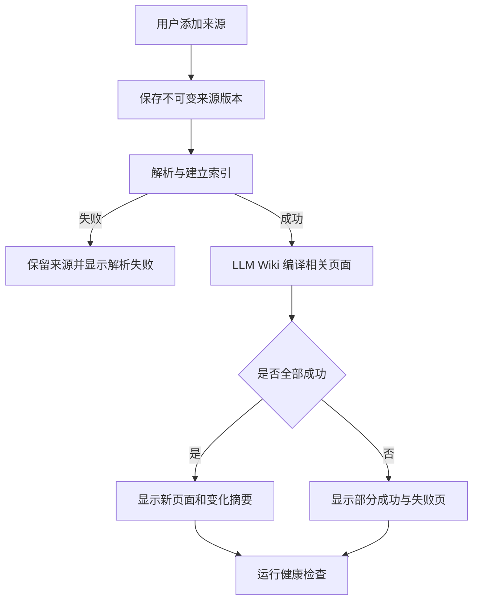
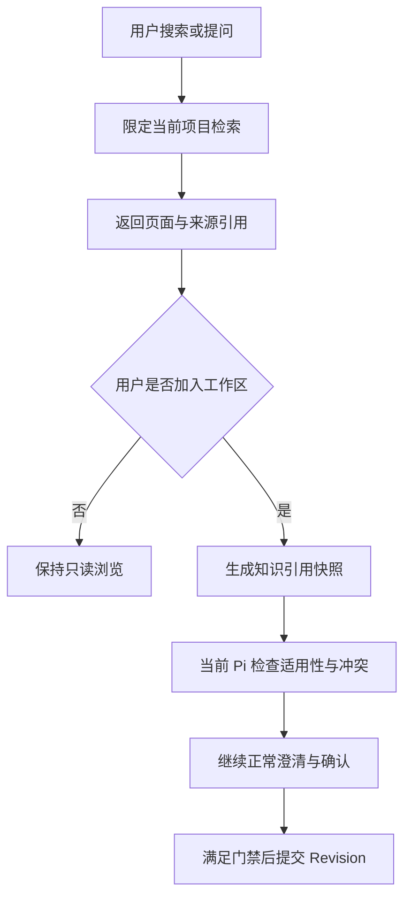
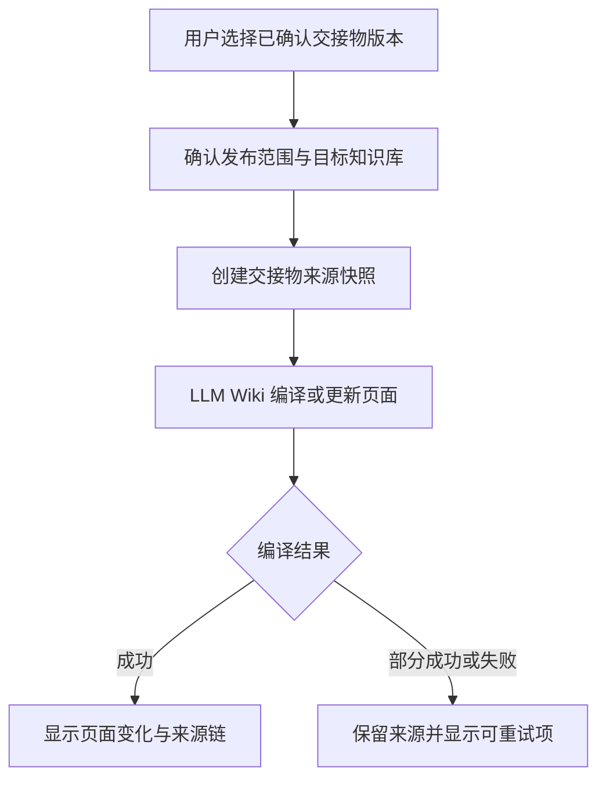
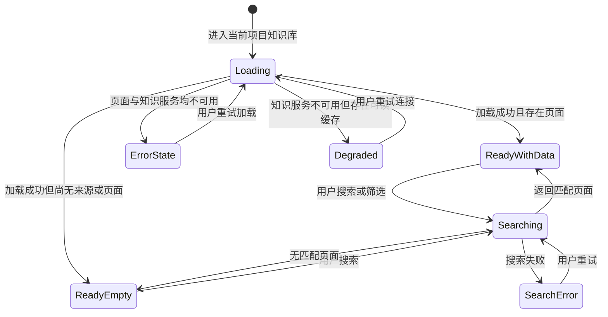

# EvoCanvas 1.0 项目知识库模块产品需求文档

## 1. 文档信息

| 项目 | 内容 |
| --- | --- |
| 模块名称 | 项目知识库（Project Knowledge Base） |
| 文档类型 | 1.0 模块产品需求文档 |
| 对应主 PRD | [EvoCanvas1.0-PRD.md](../EvoCanvas1.0-PRD.md) |
| 对应主 PRD 版本 | V1.6 |
| 模块文档版本 | V1.1 |
| 当前状态 | 产品目标已定义，待 LLM Wiki 集成与真实体验验证 |
| 修订日期 | 2026-09-09 |

本文档承载项目知识库的产品定位、LLM Wiki 集成边界、页面结构、业务流程、数据口径、治理规则与验收标准，是主 PRD 纳入引用的规范性展开。

若本文档与主 PRD 冲突，以主 PRD 为准，并应在同一轮修改中同步修正。

> 实现状态说明：当前仓库已有知识库路由、图谱原型、Mock 条目、候选审批接口和 `GBrainKnowledge` 兼容检索，但这些证据不代表 LLM Wiki 已接入，也不代表本文定义的来源版本、编译、引用快照和健康检查链路已经实现。

---

## 2. 先给结论

EvoCanvas 的知识库不是一个独立的企业 Wiki 产品，而是：

`把项目来源和已确认交接物编译为可追溯知识，再安全带回后续收敛工作的项目级知识层。`

它在产品中的位置是：

```text
项目资料 / 已确认交接物
        ↓ 用户显式纳入
原始来源版本（权威来源）
        ↓ LLM Wiki 编译
Wiki 页面 + 页面链接 + 健康状态（可重建解释层）
        ↓ 用户选择加入工作区
知识引用快照（只读来源输入）
        ↓ EvoCanvas 原有门禁
对话塑形 → 结构收敛 → Revision → Canvas / Handoff
```

因此，知识库可以帮助 Pi 找到历史规则和上下文，但不能直接替 Pi 或用户决定“当前项目应该采用什么”。

---

## 3. 模块目标

### 3.1 用户目标

1. 不必每次重新翻找历史文档，就能定位相关规则、模板、术语、判断和来源。
2. 不只看到一段 AI 摘要，还能回看它来自哪些材料、何时编译、是否存在冲突或陈旧风险。
3. 可以把真正有复用价值的已确认交接物沉淀下来，而不是把全部聊天无差别归档。
4. 可以把历史知识带入新工作区，但仍由当前上下文重新判断其适用性。

### 3.2 产品目标

1. 让 EvoCanvas 在跨会话、跨工作区推进时保留可靠的项目记忆。
2. 通过“编译一次、持续维护”的 Wiki 降低重复检索和重复总结成本。
3. 保持来源、解释、当前事实三层分离，避免知识库成为第二套 Workspace Artifact。
4. 为后续 OKF（Open Knowledge Format，开放知识格式）交接和外部 Agent 消费保留文件化、可链接、可版本化基础。

### 3.3 1.0 验证命题

1. 历史来源能否被编译成比原始文件列表更容易查找和理解的结构。
2. 用户能否从答案或 Wiki 页面快速回到原始来源。
3. 知识复用能否减少重复说明，同时不把旧结论误当成新工作区事实。
4. 冲突、陈旧和缺失来源能否在复用前被发现。

---

## 4. LLM Wiki 选型与集成原则

### 4.1 本文所指的 LLM Wiki

“LLM Wiki”既是一种知识编译模式，也存在多个同名实现。EvoCanvas 1.0 采用以下口径：

1. 产品模式遵循三层设计：`Raw Sources / Wiki / Schema`。
2. 集成参考实现默认选择 [lucasastorian/llmwiki](https://github.com/lucasastorian/llmwiki)。它提供独立 Web、API / MCP、本地与自托管模式、文件解析、交叉链接和图谱能力，更适合被 EvoCanvas 的独立产品界面承接。
3. [microsoft/llmwiki](https://github.com/microsoft/llmwiki) 可作为核心操作和 Schema 设计参考，但其当前主要产品形态是 VS Code 扩展，不作为 EvoCanvas 1.0 的直接界面宿主。
4. EvoCanvas 通过自己的知识后端接口适配 LLM Wiki，不让页面、Pi 或 Workspace Artifact 直接依赖第三方目录结构或工具名。

### 4.2 部署口径

1. 默认使用本地或自托管部署，不把项目资料默认上传到公共托管实例。
2. 本地单机体验可以使用 LLM Wiki 的本地工作区模式。
3. EvoCanvas 服务化部署时，应由 EvoCanvas 管理身份、项目隔离和访问代理；不能直接把无项目边界的 LLM Wiki 文件或 MCP 写能力暴露给浏览器。
4. 每个 EvoCanvas 项目默认绑定一个知识空间；跨项目共享在 1.0 中关闭。

### 4.3 适配边界

EvoCanvas 对外只暴露稳定的产品语义：

| EvoCanvas 能力 | 后端职责 | LLM Wiki 参考能力 |
| --- | --- | --- |
| 添加来源 | 保存来源版本、权限与审计，再触发解析 | 文件导入、目录监听、解析与索引 |
| 编译知识 | 创建编译任务并接收部分成功结果 | 生成 / 更新 Wiki 页面与交叉链接 |
| 搜索知识 | 限定项目范围、裁剪结果、保留来源 | Wiki 查询、页面和来源搜索 |
| 读取详情 | 返回页面版本、来源、反向链接、健康状态 | 页面读取、来源读取、索引元数据 |
| 健康检查 | 统一问题类型和用户处理入口 | Lint、孤立页和无效链接检查 |
| 发布交接物 | 生成不可变来源版本后触发编译 | 将新来源整合进既有 Wiki |

现有 `knowledge.retrieve` 可继续作为 Pi 的只读产品工具名，但底层应迁移到统一知识后端；`GBrainKnowledge` 只作为迁移期兼容实现，不再承担新知识库的事实模型。

### 4.4 编译执行边界

LLM Wiki 提供来源、页面、索引、链接和 MCP 等知识维护能力，但“何时编译、使用哪个模型、能写到哪里”仍由 EvoCanvas 控制。

1. 知识库服务为每次来源导入或用户重编译动作，通过现有 `AgentExecutionPort -> PiRuntimeClient -> Pi Runtime` 启动受限的知识编译运行；不得新增平行 Agent Runtime。
2. 该运行可以读取当前项目的授权来源，并通过 LLM Wiki 写入当前项目的 Wiki 页面、链接和索引。
3. 该运行不向 Primary Pi Session 追加产品对话，也不具有 Workspace Artifact、Canvas 或 Handoff 的提交权限。
4. 编译任务的成功、部分成功、失败和重试记录归知识库运行记录，不成为新的产品事实，也不新增平行确认流。
5. 1.0 的编译由用户动作触发；无人值守定时编译与外部采集留在后续版本。

---

## 5. 三层知识结构

### 5.1 原始来源（Raw Sources）

原始来源是知识编译依据，所有权属于用户或 EvoCanvas。

支持的来源入口：

1. 用户上传或选择的项目资料。
2. 用户手工输入的短记。
3. 用户主动选中的网页或文档摘录。
4. 用户显式发布的已确认结构化交接物版本。

来源规则：

1. 来源版本不可原地改写；内容变化创建新版本。
2. LLM Wiki 只能读取来源，不得静默修改原文。
3. 来源必须记录项目、作者、创建时间、导入方式、内容哈希、原位置和权限状态。
4. 整段聊天、未确认候选、普通 Assistant 回复、Canvas 坐标和个人挂件默认不进入来源层。

### 5.2 编译 Wiki（Wiki）

编译 Wiki 是 LLM 维护的 Markdown 知识页集合。

1. 页面可以根据新来源新增、合并或修订。
2. 页面必须列出支撑它的来源版本。
3. 页面可以建立普通链接和反向链接。
4. 页面是解释与组织层，可以被重建，不等于当前工作区事实。
5. 发现来源冲突时，页面要并列呈现差异或标记“有冲突”，不能只保留一方。

### 5.3 结构规则（Schema）

Schema 规定 Wiki 如何被维护，至少包括：

1. 页面系统类型与目录约定。
2. 标题、摘要、标签、来源引用、更新时间等必填元数据。
3. 页面链接与反向链接规则。
4. 来源不可变、页面可重编译、冲突不静默覆盖等不变量。
5. 编译、查询和健康检查工作流。

Schema 是版本化治理规则，不是普通 Wiki 页面。1.0 由 EvoCanvas 产品规则管理，不在知识库页面中开放自由编辑。

---

## 6. 分类模型

为兼容当前原型和 LLM Wiki，知识页同时使用两个分类维度。

### 6.1 系统类型

| 系统类型 | 说明 |
| --- | --- |
| 来源 | 原始材料入口或来源摘要，不等于 Wiki 结论页 |
| 概念 | 对术语、方法、模式或业务概念的综合说明 |
| 实体 | 对产品、团队、角色、系统、对象等具体实体的说明 |
| 综合 | 跨多个概念或实体形成的主题性说明 |

### 6.2 业务分类

| 业务分类 | 说明 |
| --- | --- |
| 文档 | 背景说明、架构说明、产品说明、操作说明等一般知识 |
| 规则 | 已有来源支撑的约束、口径、安全规则和协作规则 |
| 模板 | 可复用的交接物、PRD、评审或操作模板 |

系统类型回答“这是什么结构的页面”，业务分类回答“用户为什么会找它”。同一页面只能有一个主系统类型，但可有一个主业务分类和多个标签。

---

## 7. 页面与交互设计

### 7.1 统一入口

1. 侧边栏使用书本图标进入当前项目知识库。
2. 如果用户尚未进入具体项目，页面应先要求选择项目，不展示跨项目混合结果。
3. 工作区内的来源详情、交接物详情和知识引用快照均可跳转到对应知识库页面。

### 7.2 顶部工具栏

至少包含：

1. 当前项目名称与知识库说明。
2. 搜索框。
3. `全部 / 概念 / 实体 / 规则 / 模板 / 来源`筛选。
4. 图谱复位或适应视图按钮。
5. “添加来源”主按钮。

当前原型中的“新建知识点”应调整为“添加来源”。用户手写一条知识时，系统先把它保存为短记来源，再由 LLM Wiki 判断应新增还是更新 Wiki 页面。

### 7.3 图谱视图

1. 节点代表 Wiki 页面或来源入口，不能代表 Canvas 卡片。
2. 连线代表 Wiki 链接、来源支撑或页面引用；仅在悬停、选中或详情中显示关系文本，避免大图噪声。
3. 搜索和筛选采用高亮 / 弱化方式，不应直接删除用户当前视野中的上下文。
4. 拖拽坐标只影响个人浏览布局，不改变 Wiki 链接或知识内容。
5. 图谱数据超过单屏可读范围时，优先围绕选中节点展示局部关系，不追求一次绘制全量网络。

### 7.4 详情抽屉

至少展示：

1. 标题、系统类型、业务分类、标签。
2. 摘要与正文预览。
3. 页面版本、最近编译时间、编译方式。
4. 原始来源列表与来源可用状态。
5. 反向链接和关联页面。
6. 健康状态及问题说明。
7. “加入当前工作区”动作。

详情中不得只显示“由 AI 提交于刚刚”这类弱审计信息；必须能够定位到具体页面版本与来源版本。

### 7.5 搜索与问答

1. 搜索覆盖标题、摘要、标签、正文和来源元数据。
2. 结果显示命中片段、页面类型、来源数量、页面版本和健康状态。
3. 问答答案必须附带 Wiki 页面与原始来源引用。
4. 无足够来源时明确显示“依据不足”，并建议补充来源或调整问题。
5. 结果存在冲突或陈旧页面时，在答案正文前显示风险提示。

---

## 8. 核心业务流程

### 8.1 添加来源并编译



完成判定：原始来源已保存，用户能区分编译成功、部分成功或失败，并能查看受影响页面。

### 8.2 搜索知识并加入工作区



完成判定：历史知识被作为可追溯来源带入当前工作区，没有直接变成约束、决定或交接事实。

### 8.3 发布已确认交接物



完成判定：交接物版本与知识来源版本建立单向可追溯关系，历史 Revision 未被反向修改。

---

## 9. 状态与健康模型

### 9.1 来源处理状态

| 状态 | 含义 |
| --- | --- |
| 已保存 | 原始来源版本已持久化，尚未进入索引 |
| 索引中 | 正在解析或建立检索索引 |
| 已编译 | 相关 Wiki 页面编译完成 |
| 编译部分成功 | 至少一个页面成功、至少一个页面失败 |
| 编译失败 | 来源保留，但未得到可用编译结果 |
| 已撤回 | 后续检索不再返回正文，历史引用保留审计状态 |

### 9.2 Wiki 页面健康状态

| 状态 | 判定说明 |
| --- | --- |
| 正常 | 来源可用、链接有效、无已知冲突 |
| 疑似陈旧 | 支撑来源已有更新，但页面尚未完成重编译或复核 |
| 有冲突 | 不同来源对同一判断给出不兼容结论 |
| 来源缺失 | 页面引用的来源不可用、已撤回或无权限 |
| 孤立 | 页面无来源引用或无任何可用入口链接 |

健康状态是派生结果，可以重算，不改变原始来源和工作区事实。

### 9.3 页面状态机



状态说明：

1. `Loading`：正在加载项目知识空间、页面索引与健康摘要。
2. `ReadyWithData`：可浏览图谱、搜索、查看页面并添加来源。
3. `ReadyEmpty`：当前项目尚无知识，展示添加来源引导；搜索无匹配时保留查询词和清空筛选入口。
4. `Degraded`：只读缓存可用，但不能新增来源、编译或取得实时查询结果。
5. `SearchError`：仅本次搜索失败，不清空已有图谱与选中页面。
6. `ErrorState`：页面与缓存均不可用，展示重试入口；不影响用户返回主工作区。

---

## 10. 数据口径

### 10.1 Knowledge Source Version（知识来源版本）

| 字段 | 说明 |
| --- | --- |
| source_id / version_id | 来源及不可变版本标识 |
| project_id | 所属项目 |
| source_type | file / note / excerpt / handoff |
| title | 来源标题 |
| content_hash | 来源内容哈希 |
| created_by / created_at | 作者与创建时间 |
| import_method | 上传、手工短记、工作区发布等 |
| origin_ref | 原文件、Workspace 或 Handoff Revision 引用 |
| availability | 可用 / 无权限 / 已撤回 |

### 10.2 Wiki Page Version（Wiki 页面版本）

| 字段 | 说明 |
| --- | --- |
| page_id / version_id | 页面及版本标识 |
| system_type | concept / entity / synthesis / source |
| business_category | doc / rule / template |
| title / summary | 标题与摘要 |
| body_ref | Markdown 正文位置或内容引用 |
| source_version_refs | 支撑该页的来源版本集合 |
| tags | 用户检索标签 |
| compiled_at | 最近编译时间 |
| health_status | 正常 / 疑似陈旧 / 有冲突 / 来源缺失 / 孤立 |

### 10.3 Knowledge Reference Snapshot（知识引用快照）

| 字段 | 说明 |
| --- | --- |
| snapshot_id | 引用快照标识 |
| workspace_id | 被加入的工作区 |
| page_version_ref | 当时引用的 Wiki 页面版本 |
| source_version_refs | 当时可见的来源版本 |
| query_text | 触发引用的搜索或问题 |
| retrieved_at | 检索与引入时间 |
| health_at_retrieval | 引入时页面健康状态 |
| permission_scope | 引入时生效的项目与访问范围 |

引用快照记录“当时看到了什么”，不记录“当前工作区已经认可了什么”。

---

## 11. 治理、权限与异常

### 11.1 规则集（Rule Set）

| 规则 ID | 规则内容 | 触发条件 | 优先级 | 影响范围 |
| --- | --- | --- | --- | --- |
| KB-R-001 | 原始来源版本不可由 LLM 原地修改 | 来源进入索引或编译 | 高 | 来源与审计 |
| KB-R-002 | 每个 Wiki 页面版本必须引用至少一个可定位来源版本 | 页面创建或更新 | 高 | 编译与详情 |
| KB-R-003 | 搜索摘要、问答答案和 Wiki 页面不得直接写入 Workspace Artifact | 知识被读取或复用 | 高 | Pi 工具与提交 |
| KB-R-004 | 加入工作区前必须生成知识引用快照 | 用户执行加入动作 | 高 | 输入与追溯 |
| KB-R-005 | 发布交接物必须由用户显式触发，且只允许已确认版本 | 工作区向知识库发布 | 高 | 发布与权限 |
| KB-R-006 | 来源冲突不得静默覆盖，必须显示冲突与双方引用 | 新来源改变既有判断 | 高 | 编译与健康 |
| KB-R-007 | 图谱关系、搜索分数和健康状态均为可重建投影 | 投影生成或重建 | 中 | 存储与恢复 |
| KB-R-008 | LLM Wiki 失败不得阻塞主工作区稳定内容读取 | 知识服务降级 | 高 | 可用性 |
| KB-R-009 | Pi 的知识工具默认只读，写入和发布走独立知识服务门禁 | Pi 调用知识能力 | 高 | 工具与安全 |
| KB-R-010 | 所有查询、读取、写入和发布都限定在当前项目知识空间 | 任一知识操作 | 高 | 隔离与权限 |
| KB-R-011 | 编译部分成功时必须分别记录成功页和失败页，并允许只重试失败部分 | 多页面编译出现部分失败 | 中 | 编译与异常 |

### 11.2 权限

1. 1.0 单人模式下，当前用户具有当前项目知识库的读取、添加、发布、重编译和撤回权限。
2. Pi 只具有项目范围内的搜索、页面读取、来源读取和健康状态读取权限。
3. Schema 修改、来源撤回、页面强制覆盖和跨项目移动不通过普通 Pi 对话直接执行。
4. 服务化部署中，EvoCanvas 身份与项目权限必须在调用 LLM Wiki 前校验，不能依赖 LLM Wiki 前端自行兜底。

### 11.3 异常处理

| 场景 | 页面处理 | 稳定状态影响 |
| --- | --- | --- |
| 来源解析失败 | 保留来源，显示失败原因与重试入口 | 不影响 Workspace Artifact |
| 编译部分成功 | 列出成功页与失败页，可重试失败部分 | 不回滚成功来源版本 |
| 搜索失败 | 保留查询词，显示重试入口 | 不影响现有页面与工作区 |
| LLM Wiki 不可用 | 知识库显示降级；缓存内容只读 | 主工作区继续可用 |
| 来源已撤回或无权限 | 隐藏正文，保留引用状态 | 历史快照不被重写 |
| 页面有冲突 | 高亮冲突，展示双方来源 | 不自动修改当前 Revision |
| 页面版本已更新 | 提示存在新版本 | 不静默替换既有快照 |

---

## 12. 非功能要求

1. **项目隔离**：任何查询、索引、页面读取和模型编译不得跨项目泄漏。
2. **可恢复**：`.llmwiki` 一类索引和缓存丢失后，可由来源和 Wiki 页面重建。
3. **可审计**：来源导入、页面编译、交接物发布、知识引入、撤回和 Schema 变更均保留时间、主体与目标范围。
4. **可降级**：知识服务不可用时，主工作区稳定 Revision、Canvas 和 Handoff 仍可读取。
5. **来源安全**：模型调用前执行项目权限和敏感内容边界检查；日志不得复制完整敏感正文。
6. **性能边界**：图谱默认加载当前视口或局部关系；搜索不得依赖全量图谱渲染完成。
7. **备份边界**：备份至少覆盖来源版本、Wiki 页面版本、Schema 和来源关系；索引缓存可以重建。

---

## 13. 验收标准

### AC-01 功能正确性

1. 用户添加短记或受支持文件后，系统先保存来源版本，再显示独立的索引与编译状态。（KB-R-001）
2. 用户可以搜索并打开 Wiki 页面，查看页面版本、来源版本、反向链接和健康状态。（KB-R-002）
3. 用户可以将已确认交接物显式发布为知识来源，并看到编译结果；未确认交接物被拒绝。（KB-R-005）
4. 用户把知识加入工作区后，系统生成知识引用快照，包含页面版本、来源版本、检索时间和健康状态。（KB-R-004）

### AC-02 行为一致性

1. 同一 Wiki 页面更新后，历史工作区中的旧引用快照保持不变，并显示可选的新版本提示。（KB-R-004）
2. 搜索摘要、问答答案或页面正文被加入工作区时，只成为来源输入，不直接形成约束、决定或交接事实。（KB-R-003）
3. 删除图谱坐标或索引缓存后，系统可重建搜索和图谱投影，且不产生新的 Workspace Artifact Revision。（KB-R-007）
4. Pi 的普通工具调用不能发布来源、覆盖页面或修改 Schema。（KB-R-009）
5. 不同项目使用相同搜索词时，只返回各自项目范围内的结果。（KB-R-010）

### AC-03 异常处理一致性

1. 新来源与既有知识冲突时，页面显示“有冲突”并保留双方来源，不自动选择其中一方。（KB-R-006）
2. LLM Wiki 停止或超时时，知识库显示降级，主工作区稳定内容仍可读取和继续对话。（KB-R-008）
3. 来源撤回或权限消失后，新查询不返回正文；历史快照显示来源不可用且不被删除。（KB-R-010）
4. 编译部分成功时，页面明确区分成功页和失败页，并允许只重试失败部分。（KB-R-011）

---

## 14. 1.0 不包含范围

1. 组织级统一知识中心。
2. 跨项目自动共享和继承。
3. 多人共同编辑 Wiki 正文与复杂审核流。
4. 自动将全部聊天、Canvas 卡片或未确认候选写入知识库。
5. 无人值守的夜间自动发布。
6. Chrome Web Clipper、Slack、IM、会议听记等外部采集连接器。
7. 直接嵌入或复刻 LLM Wiki 全部原生前端。
8. 用知识图谱替代 EvoCanvas 主画布或卡片关系。
9. 把 Wiki 页面直接作为结构化交接物或面向 AI 的 PRD。

---

## 15. 实现分期建议

本文分期用于标识文档到实现的建议顺序，不代表当前代码已经完成。

1. **阶段 A：只读接入**
   - 建立 LLM Wiki 适配器；
   - 替换 Mock 列表与 GBrain 兼容检索的主路径；
   - 完成项目范围搜索、页面读取、来源回看和健康状态。
2. **阶段 B：来源与编译**
   - 添加来源、来源版本、编译任务、部分成功和重试；
   - 当前知识库图谱改为真实页面与链接投影。
3. **阶段 C：与工作区双向联动**
   - 知识引用快照加入工作区；
   - 已确认交接物显式发布到知识库；
   - 覆盖权限、冲突、撤回和降级测试。
4. **阶段 D：维护能力**
   - 健康检查、重新编译、陈旧检测、备份与索引重建。

---

## 16. 需求覆盖

| 需求 | 文档落点 | 覆盖状态 |
| --- | --- | --- |
| REQ-001：在 PRD 中正式定义现有知识库 | 主 PRD §5、§6.1、§8.5、§9、§10、§11.4；本文 §2—§15 | 已覆盖 |
| REQ-002：使用 LLM Wiki 搭建知识库 | 本文 §4、§5、§8、§15 | 已覆盖 |
| REQ-003：保留截图中的搜索、分类、图谱、详情和新增入口 | 本文 §7；“新建知识点”收敛为“添加来源” | 已覆盖 |
| REQ-004：不破坏 EvoCanvas 的事实、确认和交接边界 | 主 PRD §5、§9、§10；本文 §2、§5、§11 | 已覆盖 |

---

## 17. 参考资料

1. [LLM Wiki 官方站点](https://llmwiki.app/)
2. [lucasastorian/llmwiki](https://github.com/lucasastorian/llmwiki)
3. [microsoft/llmwiki](https://github.com/microsoft/llmwiki)
4. [EvoCanvas OKF 判断备忘](../EvoCanvas-OKF-Memo（OKF%20判断备忘）.md)
